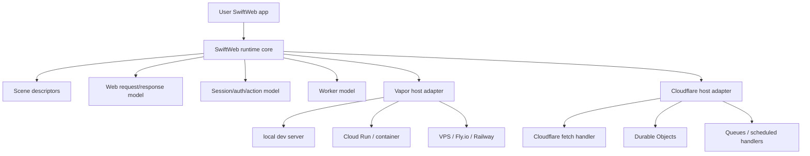
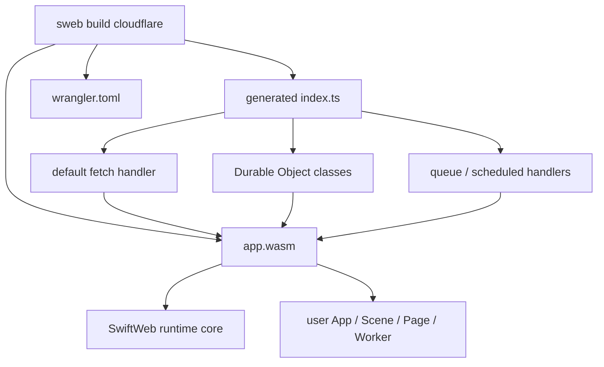
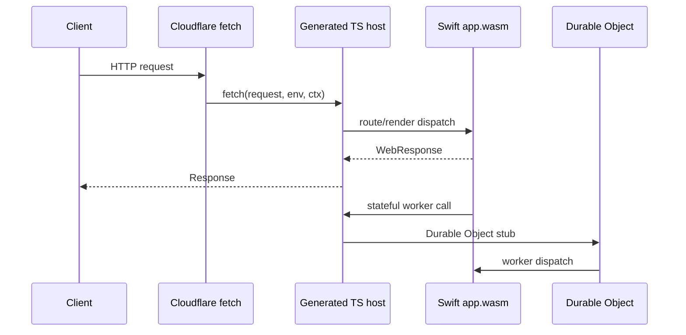
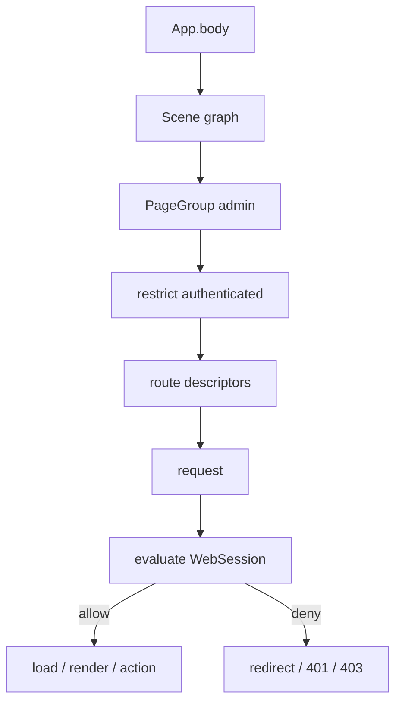
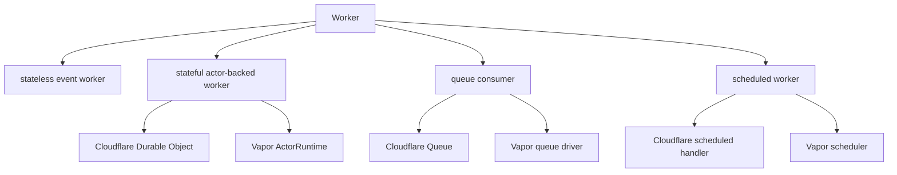
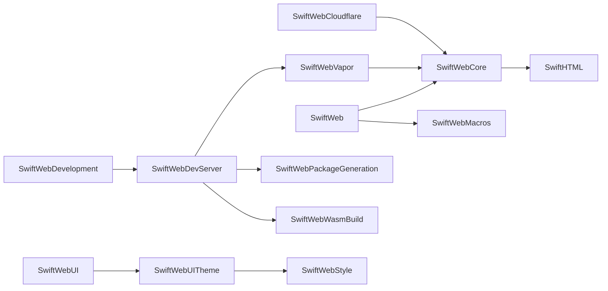
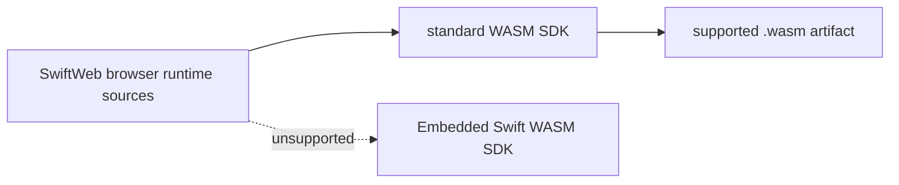

# Platform Host Architecture

This document defines the target architecture for separating SwiftWeb's application model from concrete host runtimes such as Vapor, Cloud Run, and Cloudflare Workers.

## Status

| Field | Value |
|---|---|
| Status | Proposed design direction |
| Decision date | 2026-06-26 |
| Primary goal | Keep `App`, `Scene`, `Page`, session, actions, and workers host-neutral. |
| Secondary goal | Support both container server targets and Cloudflare edge targets from the same user-facing SwiftWeb app model. |
| Implemented now | `Scene`, `PageGroup`, `SwiftWebVapor` host execution, and `@Session` backed by a Vapor session middleware adapter. |
| Current gap | `SwiftWebCore` still imports Vapor and owns route lowering, request/response conversion, middleware support, and runtime asset serving. `.restrict(...)` is not implemented yet and should be added as scene policy data, not as request-scoped `Scene.body` evaluation. |

## Core Decision

SwiftWeb should treat Vapor as a host adapter, not as the core runtime model. The core runtime owns the declarative app graph and host-neutral descriptors. Host adapters lower those descriptors into platform-specific entrypoints.



## Responsibility Split

| Layer | Target product name | Responsibility |
|---|---|---|
| Runtime core | `SwiftWebCore` or `SwiftWebRuntime` | Public app model, scene descriptors, page descriptors, host-neutral request/response, session model, action descriptors, worker descriptors, HTML rendering contracts. |
| Vapor adapter | `SwiftWebVapor` | Vapor `Application`, route registration, middleware, native HTTP server, Cloud Run/container execution, Vapor response conversion, Vapor security integration. |
| Cloudflare adapter | `SwiftWebCloudflare` | Generated TypeScript entrypoint, `fetch` routing, Durable Object class generation, queue/scheduled binding generation, Swift/Wasm dispatch glue, `wrangler.toml` materialization. |
| UI theme | `SwiftWebUITheme` | Host-neutral theme tokens, style system, root stylesheet, colors, materials, and spacing values. |
| UI components | `SwiftWebUI` | SwiftUI-inspired component layer and reusable server/client component primitives. |
| Browser runtime | `SwiftWebUIRuntime` | Browser-side WASM runtime bridge and DOM patching. |
| Actors | `SwiftWebActors` | Actor invocation envelopes and transport-neutral distributed actor support. |
| Tooling facade | `sweb`, `SwiftWebDevelopment` | Command parsing and development-module re-export. |
| Package generation | `SwiftWebPackageGeneration` | Generated server/dev/WASM packages and manifest inspection. |
| Dev server | `SwiftWebDevServer` | Persistent DevHost, HMR, file watching, worker supervision, and development rebuild orchestration. |
| WASM build tooling | `SwiftWebWasmBuild` | WASM toolchain resolution, artifact processing, size reports, and compression sidecars. |
| Storyboard tooling | `SwiftWebStoryboardTooling` | Managed Storyboard package scaffold and launch. |

Platform-specific scaffolding can live outside this repository. `sweb` owns only
the adapter reference contract and preset mapping; adapter repositories own files
such as `Dockerfile`, `wrangler.toml`, generated TypeScript hosts, and deployment
documentation. The template repository contract is defined in
[`PlatformAdapterTemplateContract.md`](PlatformAdapterTemplateContract.md).

## Host Model

SwiftWeb should use one public app model and multiple host lowerings.

| Deploy target | Host adapter | Execution model |
|---|---|---|
| Local development | `SwiftWebVapor` + development hooks | Long-running server process. |
| Cloud Run | `SwiftWebVapor` | Container HTTP server. |
| VPS / Fly.io / Railway | `SwiftWebVapor` | Native process or container server. |
| Cloudflare Workers | `SwiftWebCloudflare` | `fetch(request, env, ctx)` event handler. |
| Cloudflare Durable Objects | `SwiftWebCloudflare` | Generated Durable Object classes that call Swift/Wasm dispatch. |
| Cloudflare Queues / Cron | `SwiftWebCloudflare` | Queue and scheduled event handlers. |

## Cloudflare Placement

SwiftWeb should not run Vapor inside Cloudflare. Cloudflare does not provide a port-listening server process model for Workers or Durable Objects. It provides event handlers. The Cloudflare adapter should generate JavaScript or TypeScript host code that calls a Swift/Wasm module.



Generated output should have this shape:

```text
.swiftweb/generated/cloudflare
├─ src/index.ts
├─ app.wasm
├─ wrangler.toml
└─ package.json
```

The generated TypeScript owns Cloudflare-specific entrypoints and bindings. The Swift/Wasm artifact owns the host-neutral SwiftWeb runtime core plus the user's app code.



## Public App Surface

The user-facing API should stay platform-neutral. It should not expose Vapor, Cloudflare Durable Objects, generated TypeScript, or deployment-specific bindings in the ordinary app body.

```swift
public struct MyApp: App {
    public var body: some Scene {
        PageGroup {
            HomePage()
            AccountPage()
        }

        PageGroup("admin") {
            AdminDashboardPage()
            AdminUsersPage()
        }
        .restrict(.authenticated, redirectTo: "/login")

        Worker(SessionWorker.self)
        Worker(RoomWorker.self)
    }
}
```

| Public concept | Meaning | Vapor lowering | Cloudflare lowering |
|---|---|---|---|
| `App` | Declarative app root. | Builds a Vapor application. | Builds a Worker bundle. |
| `Scene` | App topology: pages, endpoints, policies, and workers. | Route and service descriptors. | Fetch, Durable Object, queue, and scheduled descriptors. |
| `Page` | Server-rendered HTML route. | Vapor route. | Fetch router entry. |
| `PageGroup` | Route grouping and policy scope. | Vapor route group. | Generated router prefix and policy group. |
| `Worker` | Background, event, or stateful runtime unit. | ActorRuntime, queue driver, or scheduler adapter. | Durable Object, queue handler, scheduled handler, or stateless event worker. |
| `@Session` | Request-scoped client session access. | Cookie/session middleware-backed context. | Cookie/session binding plus Worker/Durable Object-backed context. |
| `@Actor` | Client component access to a scoped distributed service object. | ActorRuntime gateway plus `WebActorSystem` transport. | Worker/Durable Object gateway plus the same `@Resolvable` contract. |

Client component actor injection is specified in
[`ActorInjectionDesign.md`](ActorInjectionDesign.md). `@Actor` is a component
surface over Apple's `@Resolvable` generated stub; the host adapter decides how
the invocation envelope reaches the server-side actor.

## Scene And Request-Time Policy

`Scene.body` builds app topology. It should not directly read request-scoped state as a normal Swift `Bool`, because there is no active request while route tables or Cloudflare bundles are built.

Use a request-time policy descriptor instead:

```swift
public var body: some Scene {
    PageGroup("admin") {
        AdminDashboardPage()
    }
    .restrict(.authenticated, redirectTo: "/login")
}
```

`@Session` is valid in request-time surfaces such as pages and actions:

```swift
@Page("/account")
struct AccountPage {
    @Session var session

    func body() -> some HTML {
        if session.isAuthenticated {
            AccountView()
        } else {
            LoginView()
        }
    }
}
```

| Surface | Evaluation time | Session access |
|---|---|---|
| `Scene.body` | App build / host lowering time. | Use policy descriptors such as `.restrict(...)`. |
| `Page.body` | Request time. | Read `@Session` directly. |
| Server action | Request time. | Read and mutate session state directly. |
| Worker method | Event time. | Read session only when passed through an explicit event/request context. |

## Restrict Modifier Contract

`.restrict(...)` is required as the scene-level counterpart to `@Session`. `@Session`
solves request-local rendering and mutation. `.restrict(...)` solves shared route
access policy without making `Scene.body` request-scoped.



Target usage:

```swift
public var body: some Scene {
    PageGroup("admin") {
        AdminDashboardPage()
        AdminUsersPage()
    }
    .restrict(.authenticated, redirectTo: "/login")
}
```

| Contract | Required behavior |
|---|---|
| Attachment surface | Available on `Page`, `PageGroup`, and other route-bearing scenes. |
| Evaluation timing | After route match, before `Page.load`, `Page.body`, streaming setup, upload handling, or action invocation. |
| Inheritance | Parent policy applies to nested scenes; child policies compose with parent policies. |
| Composition | Default composition is conjunctive: every inherited policy must allow the request. |
| Denial modes | Redirect for navigational pages; `401` for unauthenticated API/action requests; `403` for authenticated-but-forbidden requests. |
| Session source | Read `WebSession` from the request context; do not expose raw Vapor or Cloudflare request/session types. |
| Descriptor shape | Store policy as scene metadata so Vapor and Cloudflare adapters can lower the same app graph. |

| Anti-pattern | Replacement |
|---|---|
| Reading `@Session` in `Scene.body`. | Use `.restrict(...)` on the scene graph. |
| Copying auth checks into every page body. | Put the shared policy on `PageGroup`. |
| Returning different app topology per user. | Keep topology stable and branch at request-time policy evaluation. |
| Exposing host request/session objects in policy APIs. | Keep policy APIs on `WebSession` and SwiftWeb-owned request context. |

## Worker Model

`Worker` is the public name. It is intentionally more general than Durable Object, distributed actor, queue consumer, or scheduled job.



The implementation may use actors or distributed actors internally, but the public app body should not require users to name `DistributedObject` or `DurableObject`.

| Worker kind | Core descriptor | Vapor lowering | Cloudflare lowering |
|---|---|---|---|
| Stateless event worker | Event handler descriptor. | In-process service invocation. | Worker event dispatch. |
| Stateful worker | Stable worker identity plus method dispatch. | ActorRuntime service or local actor storage. | Durable Object class and binding. |
| Queue consumer | Queue name and message type descriptor. | Queue driver consumer. | `queue(batch, env, ctx)` handler. |
| Scheduled worker | Schedule descriptor. | Scheduler/cron runner. | `scheduled(controller, env, ctx)` handler. |

## Durable Object Lowering

Stateful workers should lower naturally to Durable Objects on Cloudflare.

```swift
public var body: some Scene {
    Worker(RoomWorker.self)
}
```

The Cloudflare adapter can generate a Durable Object class:

```ts
export class RoomWorkerObject extends DurableObject {
  async fetch(request: Request) {
    return swiftWeb.dispatchWorker("RoomWorker", request, this.ctx, this.env);
  }
}
```

The binding is generated from the worker descriptor:

```toml
[[durable_objects.bindings]]
name = "ROOM_WORKER"
class_name = "RoomWorkerObject"
```

| SwiftWeb concept | Durable Object concept |
|---|---|
| Worker type | Durable Object class. |
| Worker identity | Durable Object ID/name. |
| Worker method dispatch | Durable Object RPC or fetch dispatch. |
| Worker memory | Durable Object instance memory. |
| Worker persistence | Durable Object storage. |
| Worker timer | Durable Object alarm. |
| Worker realtime channel | Durable Object WebSocket support. |

## Platform-Neutral Request Model

The core runtime should expose host-neutral request and response values. Host adapters convert to and from concrete platform types.

```swift
public struct WebRequest: Sendable
public struct WebResponse: Sendable
public struct WebHeaders: Sendable
public struct WebCookies: Sendable
public struct WebSession: Sendable
```

| Current Vapor type in core | Target owner |
|---|---|
| `Vapor.Request` in request context | `SwiftWebVapor` adapter. |
| `Vapor.Response` from page encoding | `SwiftWebVapor` adapter. |
| `RoutesBuilder` route registration | `SwiftWebVapor` lowering. |
| Vapor middleware | `SwiftWebVapor`. |
| Cloudflare `env` and `ctx` | `SwiftWebCloudflare`. |

The runtime core should not expose raw host request objects to pages, actions, sessions, or workers. Advanced host-specific access can be adapter-specific and explicitly imported.

## Package Direction

The target package graph should separate runtime core from host adapters:



| Product | Host-safe for WASM | Notes |
|---|---|---|
| `SwiftWebCore` target state | Target goal: yes. Current state: no. | Must remove Vapor/NIO request-routing dependencies. |
| `SwiftWebVapor` | No. | Native/server/container only. |
| `SwiftWebCloudflare` | Partly. | Generator and host glue are native/tooling; runtime dispatch code is WASM-safe. |
| `SwiftWebUITheme` | Yes. | Host-neutral style values and generated root stylesheet. |
| `SwiftWebUI` | Yes. | Should remain host-neutral. |
| `SwiftWebUIRuntime` | Browser/WASI-specific. | Existing JavaScriptKit path remains browser runtime. |
| `SwiftWebActors` | Yes if transport-neutral. | Host adapters own concrete transport. |
| `SwiftWebDevelopment` | No. | Development facade only. |
| `SwiftWebPackageGeneration` | No. | Local/tooling package materialization only. |
| `SwiftWebDevServer` | No. | Local development server only. |
| `SwiftWebWasmBuild` | No. | Native tooling around SwiftPM and artifact processing. |
| `SwiftWebStoryboardTooling` | No. | Local Storyboard generation and launch only. |

## Foundation Boundary

Runtime targets should avoid full `Foundation` in browser builds. When a file
needs `Data`, `Date`, `UUID`, `URL`, `URLComponents`, or JSON coders, it should
prefer `FoundationEssentials` through `canImport(FoundationEssentials)` and fall
back to full `Foundation` only where the current host toolchain requires it.
Host, server, and local tooling targets may import full `Foundation` when they
need file IO, process execution, regular expressions, or platform services.

| Surface | Foundation policy |
|---|---|
| `SwiftWebUI`, `SwiftWebUIRuntime`, `SwiftWebActors` | Prefer `FoundationEssentials` with a host-toolchain fallback to full `Foundation`. |
| `SwiftWebStyle`, `SwiftWebUITheme` | Prefer no Foundation-family import. |
| `SwiftWebBrowserRuntime` | Split browser descriptors from server asset routes; descriptor-only files should follow the `FoundationEssentials` preference, while Vapor asset routes may use full `Foundation`. |
| `SwiftWebDevServer`, `SwiftWebPackageGeneration`, `SwiftWebWasmBuild`, `sweb` | Full `Foundation` is acceptable because these are native tooling targets. |
| Embedded Swift compiler profile | Not a supported SwiftWeb browser target. Do not add public API or file families for it in this release line. |

This policy also applies to SwiftWeb-owned dependencies. `swift-html` and
`swift-actor-runtime` should use `FoundationEssentials` for their WASI-facing
runtime sources before treating the browser WASM graph as fully Foundation
minimized.

## WASM Support Boundary

SwiftWeb's supported browser compiler profile is standard Swift WASM. Embedded
Swift WASM is outside the public support boundary because the current browser
graph depends on `Distributed`, `Codable`, and Foundation-family capabilities
that the Embedded Swift SDK does not provide.



| Boundary | Correct owner |
|---|---|
| Runtime bridge, bootstrap request, DOM patching, component registration | Standard browser runtime source. |
| Foundation/Codable/Distributed availability differences | Keep inside standard WASM-compatible runtime dependencies. |
| `.wasm` binary inspection, `wasm-opt`, gzip/Brotli sidecars, SDK name resolution | WASM build tooling. |
| Embedded Swift limitations in dependencies | Documented non-goal, not a public runtime profile. |

## Build Commands

Future commands should express host intent directly:

| Command | Output |
|---|---|
| `sweb dev` | Vapor host with development hooks and HMR. |
| `sweb build server --host vapor` | Native/container server suitable for Cloud Run or similar platforms. |
| `sweb build cloudflare` | Cloudflare Worker bundle with generated `index.ts`, `app.wasm`, and `wrangler.toml`. |

## Migration Plan

| Step | Work | Result |
|---:|---|---|
| 1 | Complete host-neutral `WebRequest`, `WebResponse`, headers, cookies, and session descriptors. | Pages/actions can stop depending on raw Vapor request types. |
| 2 | Convert `Page`, `Scene`, endpoint, action, and worker lowering into descriptors. | The core produces topology instead of registering directly into Vapor. |
| 3 | Move Vapor host execution into `SwiftWebVapor`; continue by moving route registration, middleware, and `Response` conversion out of core. | Cloud Run remains supported through the Vapor host adapter. |
| 4 | Move the implemented `@Session` surface onto the descriptor-backed request context and add `.restrict(...)`. | Page/session logic and Scene-level auth policy share the same request-time model. |
| 5 | Add `Worker` descriptors with stateless, stateful, queue, and scheduled kinds. | The public app model can declare runtime units without naming platform backends. |
| 6 | Add `SwiftWebCloudflare` materialization. | `sweb build cloudflare` emits TypeScript host code, `app.wasm`, and bindings. |
| 7 | Lower stateful workers to Durable Objects. | Actor-backed stateful workers work on Cloudflare without exposing Durable Object terminology in the public API. |

## Non-Goals

| Non-goal | Reason |
|---|---|
| Run Vapor inside Cloudflare Workers or Durable Objects. | Cloudflare uses event handlers, not a port-listening server process. |
| Expose `DurableObject` or `DistributedObject` as the app-level public primitive. | `Worker` is the general SwiftWeb concept; host adapters choose the lowering target. |
| Make `Scene.body` request-scoped. | Scene builds app topology; request-time decisions belong to policy descriptors and page/action contexts. |
| Replace host routing with a custom full router for every target. | The core should describe routes; adapters should lower to each host's routing/event model. |
| Expose raw Vapor or Cloudflare request values through `@Session`. | Session should be a stable SwiftWeb contract. |
