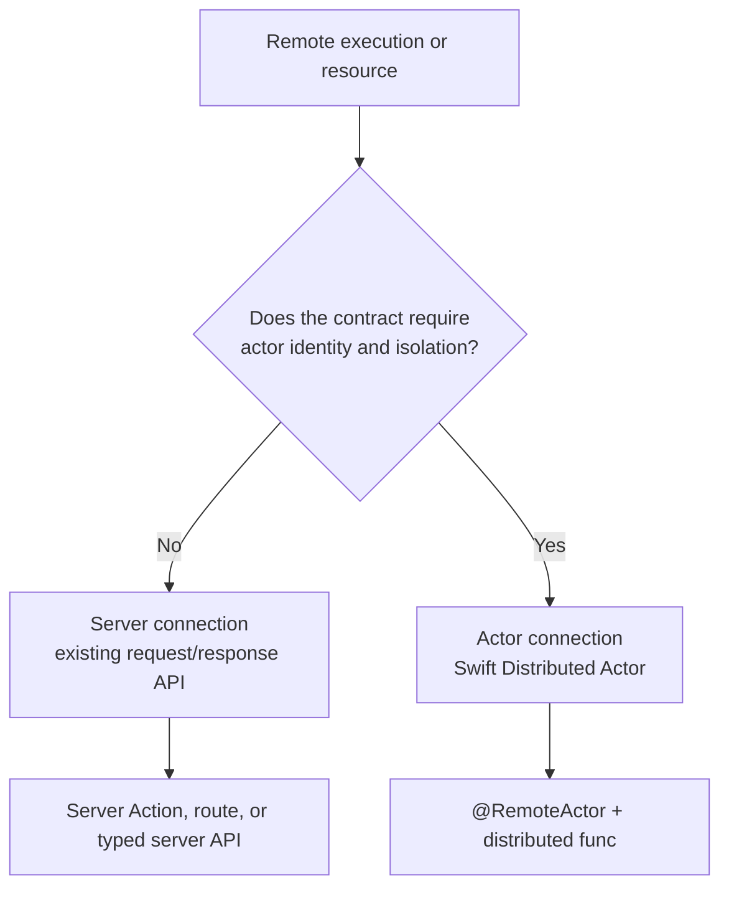
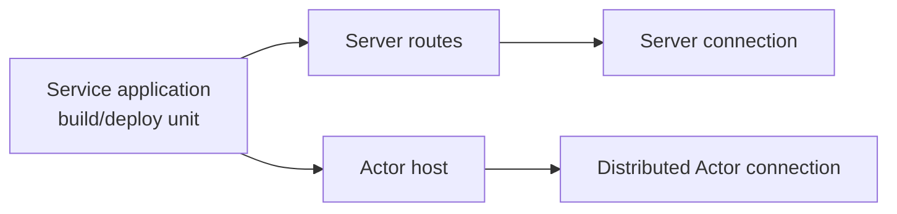
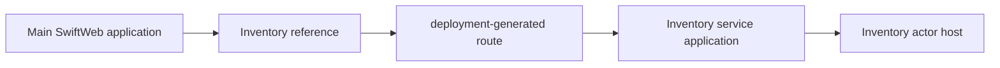
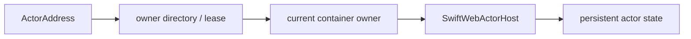
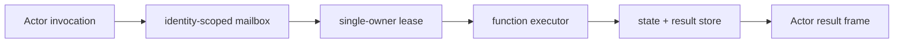
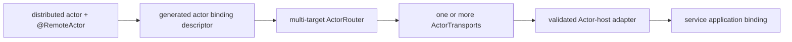

# Remote Connection Architecture

Status: accepted design. Same-application binding and the first
cross-application request/reply binding are implemented. Cloudflare Durable
Objects are the first production adapter for this contract.

Last updated: 2026-08-23.

This document defines how a SwiftWeb application connects to other execution
boundaries. The central decision is that SwiftWeb has two application-facing
connection models:

1. a Server connection for endpoint-scoped request/response APIs; and
2. an Actor connection for identity-scoped state and behavior.

A deployment target is not itself one of these programming models. The same
container, Worker, process, or service application may expose Server routes,
Actor endpoints, or both.

## Decision



The classification follows observable semantics, not vendor or deployment
names.

| Contract property | Server connection | Actor connection |
|---|---|---|
| Addressing | Endpoint or operation | `ActorAddress` type and identity |
| State owner | Not implied | One logical actor owner |
| Ordering | API-specific | Serialized actor admission |
| Activation | API-specific | Actor-system responsibility |
| Invocation surface | Existing server API | Swift `distributed func` |
| Client dependency | Server contract | Concrete distributed actor reference |
| Transport visibility | Hidden by server client/runtime | Hidden by `WebActorSystem` |

SwiftWeb does not add a common `Service` protocol or `@ServiceClient` wrapper
over both models. Doing so would erase the semantic difference without
eliminating it from the implementation.

## Deployment Units Are Orthogonal

The Service application in `sweb.json` is an independently built and deployed
application. It is not a Swift-facing interface and does not imply Actor
semantics.



A platform adapter may therefore provide two distinct capabilities:

| Adapter capability | Responsibility |
|---|---|
| Server hosting | Build, deploy, expose, and bind request/response endpoints |
| Actor hosting | Bind actor frames and satisfy identity, admission, routing, failure, and lifecycle requirements |

Server hosting alone never qualifies an adapter as an Actor host.

## Swift-facing Actor Contract

The application-authored concrete distributed actor remains the only Actor
contract.

```swift
public distributed actor ShoppingCart {
    public typealias ActorSystem = WebActorSystem

    private var items: [Item] = []

    public distributed func add(
        _ item: Item
    ) async throws -> CartSnapshot {
        items.append(item)
        return CartSnapshot(items: items)
    }
}
```

The consuming component receives the concrete actor reference. It does not
receive an endpoint, transport handle, credential, artifact name, or adapter.

```swift
public struct CheckoutPanel: ClientComponent {
    @RemoteActor
    private var cart: ShoppingCart

    public func add(_ item: Item) async throws -> CartSnapshot {
        try await cart.add(item)
    }
}
```

This call surface is invariant across every conforming Actor host. The
deployment determines where the actor lives; the actor declaration does not.

## Location-transparent Binding

`ActorAddress` remains location-free:

```text
ActorAddress
├── ActorTypeID
└── logical identity
```

Transport and endpoint selection remain a separate runtime result:

```text
ActorRoute
├── ActorTransportID
└── ActorEndpoint
```

An endpoint, URL, region, application name, or vendor resource identifier must
not be added to `ActorAddress`. Deployment-generated binding data configures an
`ActorRouter`, which resolves the current route for an address.


Scene binding may continue to provide one concrete actor reference for one
rendering scope. Low-level and virtual-actor code may resolve another identity
through the native Distributed Actor resolution surface. Neither path selects
a transport in application code.

## Connection Examples

### Same application process

Status: implemented.

`ActorScene` binds an existing actor instance, while `ActorGroup` registers a
factory for virtual activation.

```swift
public struct CounterApp: App {
    private let counter = CounterService(actorSystem: .shared)

    public var body: some Scene {
        ActorScene(counter) {
            CounterPage(counterService: counter)
        }
    }
}
```

The client still uses the concrete actor reference:

```swift
public struct CounterClient: ClientComponent {
    @RemoteActor
    private var counter: CounterService
}
```

Local-first resolution may execute the actor in the same process. A remote
reference follows the configured route without changing the call site.

### Separate SwiftWeb application

Status: implemented for a generated Service application binding over a
request/reply `ActorTransport`.

```swift
public distributed actor Inventory {
    public typealias ActorSystem = WebActorSystem

    public distributed func reserve(
        productID: Product.ID,
        quantity: Int
    ) async throws -> Reservation {
        // Host-side implementation
    }
}
```



The service application is independently built and deployed. Its actor schema,
address binding, and route are generated inputs to the client runtime. The
consumer does not construct a second RPC proxy.

The consuming page or scene selects the logical identity in Swift:

```swift
InventoryPage()
    .actor(Inventory.self, identity: "primary")
```

The Service declaration names only the concrete Actor contract:

```json
{
  "actors": [
    {
      "product": "InventoryContract",
      "module": "InventoryContract",
      "type": "Inventory"
    }
  ]
}
```

The deployment adapter supplies a structured route template. It cannot supply
identity or arbitrary Swift source. Generated code combines the type descriptor
and route template, while `.actor(_:identity:)` remains the only application
owner of the logical identity.

### Replicated container host

Status: conforming only with an identity owner.

Cloud Run and ordinary Kubernetes Deployments may run multiple instances and
may terminate or replace any instance. Cloud Run also scales to zero by default,
uses a disposable local filesystem, and permits concurrent requests per
instance. A container endpoint is therefore not an Actor identity.



A conforming adapter must provide one of these ownership strategies:

- deterministic sharding with one active owner for each shard;
- a renewable lease for each active actor identity; or
- a platform primitive that already enforces one logical owner.

Stable Pod network and storage identities supplied by a Kubernetes StatefulSet
do not by themselves assign arbitrary actor identities to one active owner.

References:

- [Cloud Run overview](https://docs.cloud.google.com/run/docs/overview/what-is-cloud-run)
- [Cloud Run container contract](https://docs.cloud.google.com/run/docs/container-contract)
- [Kubernetes StatefulSet](https://kubernetes.io/docs/reference/kubernetes-api/apps/v1/#StatefulSet)

### Browser WebSocket peer

Status: outbound browser calls are implemented; host-initiated calls require an
application-installed route to an authenticated live connection.

A browser tab may host an ephemeral actor whose identity is valid only for the
authenticated channel lifetime.

```swift
public distributed actor BrowserSession {
    public typealias ActorSystem = WebActorSystem

    public distributed func present(
        _ update: DocumentUpdate
    ) async throws {
        // Browser-side implementation
    }
}

public distributed actor DocumentRoom {
    public typealias ActorSystem = WebActorSystem

    public distributed func join(
        _ session: BrowserSession
    ) async throws {
        // Retain the remote actor reference for callbacks.
    }
}
```

This is the accepted Swift surface. The cross-application implementation must
also generate and verify portable encoding for distributed actor references
used as method arguments; that support is not implied by the existing
single-endpoint browser route.

```text
BrowserSession actor
        <==== authenticated WebSocket ====>
DocumentRoom actor
```

Disconnect removes the route. A stale reference fails explicitly; it is not
silently rebound to another tab, device, or session.

### Lambda or function executor

Status: not a direct Actor host.

An AWS Lambda execution environment has no guaranteed stable lifetime, and
multiple function instances may process invocations concurrently. A bare
function therefore cannot claim Actor ownership.

It can execute Actor work when a coordinator provides an identity-scoped
mailbox, ownership lease, deduplication record, state store, and result path.



Long-running work should expose its durable domain lifecycle rather than rely
on one connection remaining open:

```swift
public distributed actor ExportJob {
    public typealias ActorSystem = WebActorSystem

    public distributed func start(
        _ request: ExportRequest
    ) async throws -> ExportStatus {
        // ...
    }

    public distributed func status() async throws -> ExportStatus {
        // ...
    }

    public distributed func cancel() async throws -> ExportStatus {
        // ...
    }
}
```

Reference:
[AWS Lambda execution environment lifecycle](https://docs.aws.amazon.com/lambda/latest/dg/lambda-runtime-environment.html).

### Queue-backed execution

Status: not a drop-in request/reply transport.

At-least-once queues may deliver the same invocation more than once. A queue
adapter must provide:

- `ActorCallID` deduplication;
- ordering per actor identity;
- a bounded result path;
- deadline handling;
- cancellation tombstones or an explicitly weaker cancellation contract; and
- idempotent external side effects beyond the retained deduplication window.

Without those guarantees, the queue remains a Server/infrastructure capability
and is not registered as an ordinary `ActorTransport`.

Reference:
[Amazon SQS at-least-once delivery](https://docs.aws.amazon.com/AWSSimpleQueueService/latest/SQSDeveloperGuide/standard-queues-at-least-once-delivery.html).

### External REST or SaaS API

Status: Server connection by default.

A remote resource identifier such as a billing customer ID does not prove actor
isolation, ordering, cancellation, or ownership. The API remains a Server
connection unless the application deliberately owns an adapter actor.

```swift
public distributed actor BillingAccount {
    public typealias ActorSystem = WebActorSystem

    public distributed func authorize(
        _ payment: Payment
    ) async throws -> Authorization {
        // The host-side actor calls the external billing API.
    }
}
```

Here `BillingAccount` is the Actor. The SaaS API is a resource used by its
host-side implementation. Credentials, provider request formats, and retry
policy remain outside the actor caller.

## Actor-host Admission Contract

An adapter may advertise Actor hosting only when it defines every applicable
row below.

| Area | Required contract |
|---|---|
| Identity | Stable `ActorAddress` interpretation without embedding location |
| Ownership | At most one active logical owner for an address |
| Admission | Serialized actor execution, including cancellation while waiting |
| Routing | Address-to-route resolution and stale-route failure |
| Framing | Bounded compatible `ActorFrame` and payload handling |
| Correlation | Result, duplicate, timeout, and endpoint isolation behavior |
| Cancellation | Explicit best-effort or stronger behavior without cross-call cancellation |
| Activation | Readiness, activation failure, passivation, and restart behavior |
| Durability | Explicit state guarantees; no persistence claim based on process memory |
| Authorization | Authenticated invocation context bound at the adapter boundary |
| Lifecycle | Start rollback, endpoint loss, shutdown admission, and task joining |

The adapter must fail validation or runtime startup when it cannot provide a
required capability. It must not silently lower an Actor binding to a Server
request.

## Confirmed Current Implementation

The following facts are present in the repository:

| Area | Current implementation |
|---|---|
| Actor contract | Concrete `distributed actor` declarations use `WebActorSystem` |
| Address | `ActorAddress` contains only type and logical identity |
| Route | `ActorRoute` contains transport and endpoint |
| Core boundary | `ActorRouter` selects a route and `ActorTransport` moves frames |
| Same-app binding | `ActorScene` binds an instance; `ActorGroup` registers virtual activation |
| Client injection | `@RemoteActor` resolves a concrete actor reference from the rendering scope |
| Browser transport | The default browser actor system uses one binary WebSocket channel |
| Remote scene binding | `Scene` and `PageRoute` expose `.actor(Type.self, identity:)` without a wrapper scene in user code |
| Binding router | `SwiftWebActorBindingRouter` selects exact routes by `ActorAddress` and rejects conflicts |
| Request/reply transport | `SwiftWebRequestReplyActorTransport` carries result frames and reports dispatch before a reply so cancellation can progress |
| Service manifest | Schema version 3 names concrete Actor contracts but does not own their logical identities |
| Adapter manifest | Structured `actorBindings` own host/client route templates and platform configuration; Swift expressions are rejected |
| Cloudflare deployment | The generated request bridge selects a Durable Object with `getByName(identity)` and forwards the same hosted identity to Swift |
| Calendar integration | Page rendering resolves `CalendarDatabaseActor` through `@RemoteActor`; platform branching remains inside repository/runtime composition |

The remaining limitations are equally important:

1. `SwiftWebActorBindingRecord` carries only one `ActorAddress` per concrete
   actor contract in a rendering scope.
2. Cloudflare currently installs the Service binding in the server-side page
   WASM host. A browser-direct Cloudflare `clientRoute` is not advertised.
3. Route templates are materialized at application startup; live route refresh
   and endpoint-loss discovery require an adapter-specific router.
4. Portable distributed actor references passed as method arguments remain a
   separate generated-schema requirement.
5. The generated application verifies compiled schema identity, but a remote
   runtime schema negotiation protocol is not part of this slice.

## Implemented Slice and Remaining Work

Implementation proceeds from the Swift call site backward:



Implemented in this slice:

1. define a generated binding descriptor that keeps actor address and route
   separate;
2. configure one `WebActorSystem` with a router capable of selecting different
   transports and endpoints by actor address or actor type;
3. materialize those route bindings from selected deployment and service
   adapters without exposing them in application Swift code;
4. reject Server-only service artifacts when an Actor contract is declared;
5. propagate missing transport, missing route, identity mismatch, overload,
   cancellation, and shutdown as explicit failures; and
6. preserve the existing Server connection path without wrapping it in Actor
   APIs.

Remaining adapter expansions are live endpoint refresh, browser-direct
Cloudflare routing, and production adapters for leased replicated containers
or coordinated function executors. They do not change the public Swift call
surface.

The first implementation slice uses a separate SwiftWeb Service application,
the binary request/reply actor frame path, and a Cloudflare Durable Object as
the identity owner. Leased replicated containers remain an alternative future
host binding for the same public Actor contract.

## Verification Gates

Cross-application Actor binding is complete only after these behaviors pass on
the actual generated application path:

| Gate | Required evidence |
|---|---|
| Two destinations | Two concrete actor types route to different applications/endpoints in one client runtime |
| Identity isolation | Two identities of one actor type cannot share mutable activation accidentally |
| Wrong route | Missing or stale route throws a typed failure |
| Ordering | Concurrent calls to one identity enter actor execution serially |
| Parallelism | Calls to independent actor identities may progress independently |
| Cancellation | Waiting and in-flight cancellation cannot affect another peer or call |
| Endpoint loss | Only work associated with the failed endpoint is terminated |
| Readiness | Calls before successful host startup fail explicitly |
| Restart | A passivated/restarted actor restores only the durability the adapter claims |
| Schema mismatch | Deployment fails or invocation is rejected before executing an incompatible method |
| Server coexistence | Ordinary Server routes continue to work beside Actor endpoints |

## Non-goals

- Treating every remote API or deployment target as an Actor.
- Replacing Server Actions, HTTP routes, or existing typed Server APIs.
- Adding URLs, credentials, regions, or adapter names to actor declarations.
- Adding a SwiftWeb-owned RPC proxy beside Swift Distributed Actors.
- Making a Service application declaration prove Actor semantics.
- Claiming exactly-once external effects beyond a documented deduplication
  window.

## Related Documents

- [Swift Actor System Design](SwiftActorSystemDesign.md)
- [Actor Injection Design](ActorInjectionDesign.md)
- [Host, Deployment, and Service Adapter Contract](AdapterContract.md)
- [SwiftWebActors runtime overview](../Sources/SwiftWebRuntime/Actors/README.md)
