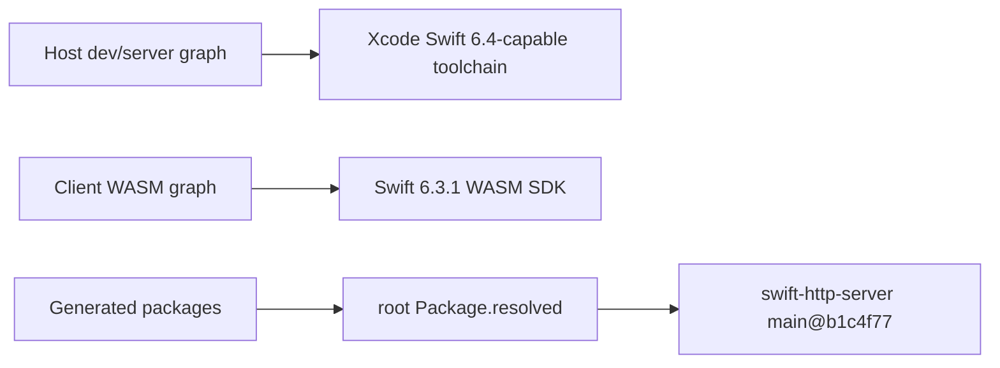
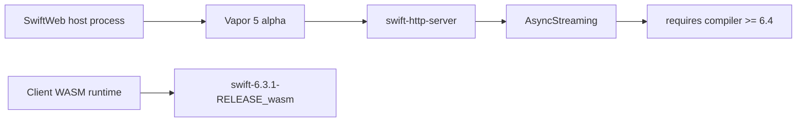

# Swift 6.3 Host Compatibility TODO

## Status

SwiftWeb currently keeps Swift 6.3 as the required toolchain for WASM builds because the
WASM SDK is pinned to `swift-6.3.1-RELEASE_wasm`.

The host-side Vapor 5 development server does not currently resolve with the true Swift 6.3
compiler. Vapor 5 alpha currently depends on `swift-http-server`, which depends on the
source-unstable `AsyncStreaming` APIs from `swift-async-algorithms`.

Those `AsyncStreaming` sources are guarded by `compiler(>=6.4)` upstream. Removing that
guard is not a valid fix: the Swift 6.3 compiler cannot compile the current source-unstable
API surface.

Vapor's current package manifest requires `swift-http-server` with `branch: "main"`.
SwiftWeb therefore cannot direct-pin that package with a revision requirement in
`Package.swift` without creating a SwiftPM requirement conflict. The current stabilization
uses the same branch requirement as Vapor and relies on `Package.resolved` to pin a
known-compatible revision.

Known-compatible lock set:

| Package | Requirement Shape | Locked Revision |
|---|---|---|
| `swift-http-server` | `branch: "main"` | `b1c4f775dfbdc74800c0f29fda79c8984a5e9073` |
| `swift-http-api-proposal` | direct revision | `d58fd6fa157e08bff44aa360ff83ebd424783392` |
| `async-http-client` | direct revision | `393104434ea57710f2469036e816672fe15e8212` |

The generated dev/server packages must inherit the root `Package.resolved` when an app
package has no lockfile. Otherwise Storyboard and minimal skeleton projects resolve
`swift-http-server` branch `main` to the latest upstream commit, which is currently not
compatible with the pinned Vapor revision.

## Local Verification

| Date | Command | Result |
|---|---|---|
| 2026-06-19 | `swift package resolve` with Swift 6.3.1 | Fails because `swift-http-server@b1c4f77` declares Swift tools version 6.4. |
| 2026-06-19 | `xcrun swift package resolve` with Xcode 27 beta / Swift 6.4 | Passes and keeps `swift-http-server main@b1c4f77`. |
| 2026-06-19 | `SWIFTWEB_CORE_ONLY=1 swift package resolve` with Swift 6.3.1 | Passes, because the core/WASM-only package graph excludes Vapor's host HTTP stack. |

This means the current stable policy is a toolchain split:

## Current Compatibility Shape

## TODO

Resolve the host-side Swift 6.3 compatibility before claiming end-to-end Swift 6.3
stability.

Next investigation:

| Item | Requirement |
|---|---|
| Vapor revision audit | Check whether there is a Vapor 5 / `swift-http-server` / `swift-async-algorithms` revision set that compiles with the true Swift 6.3 compiler. |
| Dependency lock inheritance | Keep generated dev/server packages on the same Vapor HTTP lock set as the root package unless the app provides its own lockfile. |
| Guard policy | Keep upstream `compiler(>=6.4)` guards intact unless the guarded source is no longer needed by the selected dependency revision. |
| Proof command | Record the exact dependency revisions and the Swift 6.3 build command used to prove compatibility. |

Acceptable resolution paths:

| Path | Requirement |
|---|---|
| Upstream compatible release | Vapor 5 and its HTTP stack publish revisions that build with Swift 6.3. |
| Host/WASM toolchain split | The dev host explicitly uses a Swift 6.4-capable host compiler while WASM remains pinned to Swift 6.3. |
| Alternative host server | SwiftWeb replaces the host-only HTTP layer with a Swift 6.3-compatible implementation without changing the public Vapor lowering contract. |

Non-solutions:

| Approach | Reason |
|---|---|
| Lowering only `swift-tools-version` | The source still uses APIs guarded for `compiler(>=6.4)`. |
| Removing `compiler(>=6.4)` guards | Swift 6.3 fails on the current `AsyncStreaming` noncopyable container API surface. |
| Treating Xcode 6.4 builds as Swift 6.3 proof | That validates the host with a different compiler and does not prove the pinned Swift 6.3 toolchain. |

## Verification Required

Before this TODO can be closed:

1. `swift build --product sweb` must run under the selected host toolchain policy.
2. The policy must be documented as either true Swift 6.3 host support or explicit host/WASM split support.
3. Browser E2E must exercise Storyboard/dev HMR with the documented policy.
4. The E2E report must record both host Swift version and WASM Swift SDK.
