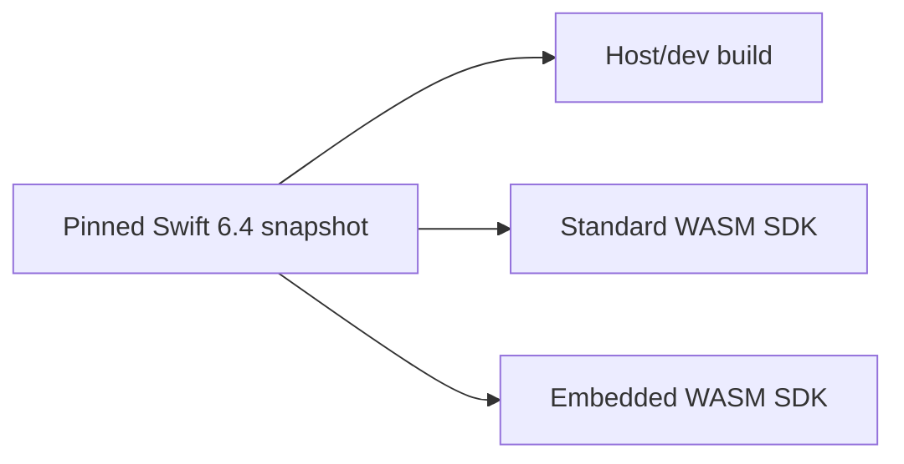

# Swift 6.4 Toolchain Migration

## Status

Completed on 2026-07-25.

SwiftWeb now uses one pinned Swift 6.4 development snapshot for host, standard
WASM, and Embedded WASM development:

| Artifact | Pinned identifier |
|---|---|
| Toolchain | `swift-6.4.x-DEVELOPMENT-SNAPSHOT-2026-07-17-a` |
| Swiftly selector | `6.4-snapshot-2026-07-17` |
| Standard WASM SDK | `swift-6.4.x-DEVELOPMENT-SNAPSHOT-2026-07-17-a_wasm` |
| Embedded WASM SDK | `swift-6.4.x-DEVELOPMENT-SNAPSHOT-2026-07-17-a_wasm-embedded` |



## Local Setup

Use the toolchain executable itself. Do not point WASM builds at
`~/.swiftly/bin/swift`; the shim directory does not contain the matching
`wasm-ld`.

```bash
export SWIFT_WEB_TOOLCHAIN_BIN="$HOME/Library/Developer/Toolchains/swift-6.4.x-DEVELOPMENT-SNAPSHOT-2026-07-17-a.xctoolchain/usr/bin"
export SWIFT_WEB_HOST_SWIFT="$SWIFT_WEB_TOOLCHAIN_BIN/swift"
export SWIFT_WEB_WASM_SWIFT="$SWIFT_WEB_TOOLCHAIN_BIN/swift"
export SWIFT_WEB_WASM_TOOLCHAIN_BIN="$SWIFT_WEB_TOOLCHAIN_BIN"
export SWIFT_WEB_WASM_SDK="swift-6.4.x-DEVELOPMENT-SNAPSHOT-2026-07-17-a_wasm"
```

Verify the compiler, linker, and both SDK registrations as one contract:

```bash
"$SWIFT_WEB_HOST_SWIFT" --version
test -x "$SWIFT_WEB_WASM_TOOLCHAIN_BIN/wasm-ld"
"$SWIFT_WEB_WASM_SWIFT" sdk list | \
  rg 'swift-6.4.x-DEVELOPMENT-SNAPSHOT-2026-07-17-a_wasm(-embedded)?'
```

Expected compiler identity:

```text
Apple Swift version 6.4-dev
Swift commit: 9517428e7f4b63e
Target: arm64-apple-macosx27.0.0
```

## Decision

The previous Swift 6.3.1 WASM / Swift 6.4 host split is retired. Swift 6.4
provides matching standard and Embedded WASM SDKs, so toolchain compatibility no
longer requires separate compiler versions.

Manifest evaluation still supports reduced dependency graphs for generated WASM
packages. That branching now isolates host-only HTTP dependencies and macro
tooling; it is not a compiler-version workaround.

SwiftPM 6.4 writes SDK build products under
`<scratch>/out/Products/<Configuration>-webassembly-<architecture>`. Artifact
resolution supports that layout while retaining the earlier
triple/configuration layout.

```text
.swiftweb/generated/.build/wasm/
└─ out/Products/Release-webassembly-wasm32/
   ├─ <product>.wasm
   ├─ <product>.wasm.size.json
   ├─ <product>.wasm.compression.json
   ├─ <product>.wasm.gz
   └─ <product>.wasm.br
```

Generated WASM manifests also define `SWIFTWEB_ACTORS` on the copied
`SwiftWebActors` target. Without that target-specific setting, the actor
transport declarations are compiled out even though the package itself
successfully resolves.

## Validation Commands

Validate the repository manifest in each supported dependency-graph mode:

```bash
"$SWIFT_WEB_HOST_SWIFT" package dump-package
SWIFTWEB_CORE_ONLY=1 "$SWIFT_WEB_HOST_SWIFT" package dump-package
SWIFTWEB_DO=1 "$SWIFT_WEB_HOST_SWIFT" package dump-package
```

Build the host CLI with the exact snapshot:

```bash
"$SWIFT_WEB_HOST_SWIFT" build --product sweb
```

Build and post-process a real browser runtime:

```bash
"$SWIFT_WEB_HOST_SWIFT" run sweb build \
  --package-path Examples/CounterApp \
  --wasm \
  --swift-sdk "$SWIFT_WEB_WASM_SDK" \
  -c release
```

The production command is complete only after it reports the final WASM,
size-report, gzip, and Brotli outputs. A successful SwiftPM compile alone does
not prove that artifact discovery or post-processing works.

Repository tests use `xcodebuild test` with Xcode's Swift 6.4 toolchain.
Selecting this development snapshot through `TOOLCHAINS` currently fails while
linking the package manifest with `posix_spawn failed`; exact-snapshot compiler
and WASM verification therefore use the direct executable above.

## Validation Evidence

The 2026-07-25 migration was verified through the implementation path:

| Check | Result |
|---|---|
| Full, `SWIFTWEB_CORE_ONLY`, and `SWIFTWEB_DO` manifest evaluation | Passed with tools version 6.4 |
| Exact-snapshot `sweb` host build | Passed |
| Generated package materialization suite | 7 tests passed |
| SwiftPM WASM artifact resolver suite | 5 tests passed |
| CounterApp standard WASM compile and link | Passed |
| Production artifact strip, report, gzip, and Brotli processing | Passed |

The verified CounterApp artifact sizes were:

| Artifact | Bytes |
|---|---:|
| Linker output before production processing | 30,718,126 |
| Final WASM | 10,379,905 |
| gzip | 3,645,494 |
| Brotli | 2,634,441 |

## Version Contract

Toolchain, SDK, target triple, and Embedded platform implementation are treated
as one versioned contract. A build must fail explicitly when the pinned artifacts
are unavailable; it must not silently select Swift 6.3 or a different Swift 6.4
snapshot.

When the baseline advances, update these surfaces together:

1. `Package.swift` tools version and `.swift-version`.
2. `SwiftWebWasmToolchain.defaultSwiftSDKName`.
3. Generated manifest templates and project scaffolds.
4. Example packages, E2E defaults, tests, and user documentation.
5. Host, standard WASM, and Embedded WASM compile/link verification records.

The `.swift-version` selector documents the required Swiftly version. On a
machine where that selector is not installed through Swiftly, the shim may
reject it even when the matching `.xctoolchain` already exists. Repository
commands remain deterministic by using `SWIFT_WEB_HOST_SWIFT` and
`SWIFT_WEB_WASM_SWIFT`.

## Historical Context

Before this migration, Swift 6.3.1 was the newest installed toolchain with a
matching WASM SDK, while the host HTTP dependency graph required Swift tools
6.4. The repository used `SWIFTWEB_CORE_ONLY` and host-toolchain overrides to
cross that resolution boundary. The matching 2026-07-17 Swift 6.4 toolchain and
WASM SDK pair removes that version mismatch.
