# Swift Actor System Design

Status: accepted architecture; the primary source paths are implemented. Native
behavioral verification and standard/Embedded WASM compilation and linking pass
on the pinned baseline. Browser and board/RTOS runtime execution remain open.

Last updated: 2026-08-18.

This document defines the target architecture for `swift-actor-system` and its
integration with SwiftWeb. The central decision is that a Swift
`distributed actor` declaration is the single source of truth for the actor's
contract, local implementation, identity, and remote reference. The new system
must preserve that programming model on Native Swift and standard WASM, and
project the same call surface onto generated actor twins for Embedded Swift.

The design does not introduce application-facing contract annotations,
implementation annotations, service protocols, transport handles, or a second
RPC programming model.

## Document Contract

This document is both the architecture decision and the completion contract for
`swift-actor-system`. Statements are classified as follows:

| Classification | Meaning |
|---|---|
| Confirmed current fact | Traced to an implementation, test, manifest, or generated-package path in this repository |
| Accepted target design | The complete architecture that the implementation must converge on |
| Required change | A concrete delta between the current repository and the accepted design |
| Verification gate | Observable behavior required before the implementation may be reported complete |

Source declarations and parser diagnostics alone do not satisfy a verification
gate. Native, standard WASM, and Embedded WASM compilation, linking, and
target-appropriate runtime behavior remain required where the verification
matrix marks them as required.

The implementation must preserve these invariants:

1. The application-authored `distributed actor` is the only actor contract.
2. Application code invokes an actor through the same `try await` method surface
   on every profile.
3. No actor method, generated twin, or SwiftWeb binding chooses a transport.
4. Transport differences end at `ActorTransport`; identity, frames, codecs,
   correlation, timeout, cancellation, and system errors remain common.
5. Native Codable and Embedded generated codecs implement one schema-controlled
   wire representation.
6. Shared logical state uses the same isolation contract on Native, standard
   WASM, and Embedded.
7. Unsupported capabilities fail explicitly; they never produce a placeholder
   success value or silent legacy fallback.

## Decision Summary

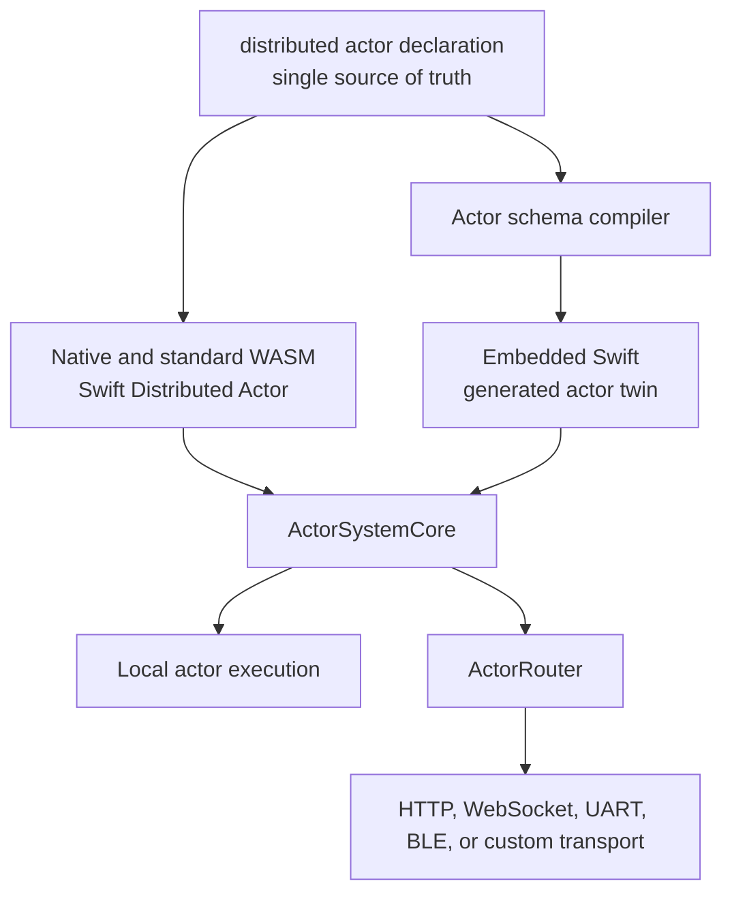

The accepted decisions are:

1. Create a new `swift-actor-system` package rather than turning
   `swift-actor-runtime` into two conditionally compiled runtimes.
2. Use the concrete distributed actor type as the application contract.
3. Use the Swift compiler's Distributed Actor implementation on Native and
   standard WASM.
4. Generate a semantic actor twin for Embedded Swift, where `Distributed` and
   `Codable` are unavailable.
5. Put identity, routing, call correlation, transport lifecycle, portable wire
   framing, and portable codec primitives in a Foundation-free core.
6. Treat transport as a frame delivery capability, not as an RPC API.
7. Keep SwiftWeb scene binding, authorization, virtual activation,
   passivation, persistence, reminders, and remote state in SwiftWeb.
8. Retain `swift-actor-runtime` only through an explicit compatibility layer
   during migration.

### Alternatives not selected

| Alternative | Decision | Reason |
|---|---|---|
| Add transport traits directly to `swift-actor-runtime` | Rejected as the target architecture | It preserves the old RPC/Codable/Distributed dependency center and creates divergent conditional runtimes |
| Make RPC a pluggable application API | Rejected | Actors would still author and reason about a transport-shaped request API |
| Introduce service protocols plus implementation annotations | Rejected | It creates a second contract, duplicates the Distributed Actor method surface, and weakens compiler integration |
| Parse or hash `RemoteCallTarget.identifier` at runtime | Rejected | The identifier is compiler-owned and not a stable wire contract |
| Use reflection for Embedded discovery | Rejected | Embedded does not provide the required runtime capabilities and failures would occur too late |
| Reuse JSON as the common wire protocol | Rejected | It retains Foundation/Codable runtime requirements and cannot provide the bounded zero-copy-oriented Embedded path |
| Generate a separate backing actor for each Embedded twin | Rejected | It changes actor identity, isolation, reentrancy, state ownership, and `whenLocal` semantics |

`ActorTransport` is still a protocol so links remain replaceable, but it is an
internal delivery boundary. This is different from exposing transport-specific
RPC to application actor code.

## Current State

SwiftWeb now contains two explicitly separated paths:

1. the new concrete-actor binary path, where `WebActorSystem` is a thin
   `DistributedActorSystem` facade over `SwiftActorSystem`, and
   `SwiftWebActorHost` owns authorization, activation, persistence,
   passivation, reminders, and remote-state lifecycle; and
2. the deprecated `LegacyActors` trait, where `LegacyWebActorSystem`, legacy
   resolver protocols, and JSON request/response envelopes remain available
   during migration without entering an `Actors`-only runtime graph.

The standard Native/WASM authoring requirement remains `Codable & Sendable`
because it is the Swift compiler's serialization requirement for the
Distributed Actor adapter. Codable is no longer the transport or wire-protocol
abstraction. `ActorSystemCore` carries owned binary frames and portable values
without Foundation, Codable, Distributed, HTTP, or WebSocket dependencies.

The pinned Embedded Swift SDK does not provide the required `Distributed` and
Codable surface. The generator therefore projects the same authored
distributed actor into an ordinary Embedded actor twin and generated codecs.
SwiftWeb's materializer selects `ActorSystemDistributed` for standard WASM and
`ActorSystemEmbedded` for Embedded WASM, mirrors only the selected runtime
sources, and installs the profile-generated actor source set.

The generated Embedded manifest intentionally omits `SWIFTWEB_ACTORS` and
`SWIFTWEB_LEGACY_ACTORS`. Under that profile `WebActorSystem` is an alias for
`EmbeddedActorSystem`; legacy types and endpoints are absent rather than
compiled as successful stand-ins. Embedded therefore cannot import or fall
back to `ActorRuntime`.

These source-level facts are supplemented by the dated verification record
below. Compilation and linking evidence is not treated as browser or board
runtime evidence.

### Confirmed implementation status

The repository contains the local package at `Packages/swift-actor-system`, and
SwiftWeb selects it from the new concrete-actor path. The remaining distinction
is between source implementation and verified behavior.

| Area | Confirmed current fact | State required for completion |
|---|---|---|
| Core | Binary frames, portable value primitives, local-first routing, pending-call correlation, bounded inbound scheduling, cancellation, timeout, and shutdown source implementations exist | Compile, link, and behavioral verification on all required profiles |
| Distributed | `SwiftActorSystem` implements the compiler-facing `DistributedActorSystem` adapter and generated type registrations; a source-level execution fixture captures the compiler-emitted target and routes a real remote actor call through Core | Compile and run that fixture on Native and standard WASM |
| Embedded | `EmbeddedActorSystem` and generated ordinary-actor twins exist in source | Generated host and client twins must compile, link, and exchange fixture-identical payloads on Embedded WASM |
| Build support | Exact compiler-target extraction, target-environment probing, and toolchain fingerprinting exist outside the source/schema generator | Verify extraction and target-environment fixtures with the pinned compiler and SDK |
| Generation | Source scanning, reachable portable-type analysis, canonical cross-module value identities, schema reconciliation, four profile generators, schema moves, digest-owned staged output, declaration-level source projection, dependency-first client-module projection, linked dependency-schema discovery, profile-safe conformance validation, and transactional dependency-bootstrap traversal consume explicit toolchain and target-environment inputs | Verify generated artifacts and diamond dependency behavior on compiled modules |
| Compatibility | The legacy JSON gateway is isolated in `ActorSystemCompatibility` | Route legacy traffic only through an explicit legacy endpoint or content type |
| SwiftWeb runtime | `WebActorSystem`, `SwiftWebActorHost`, binary HTTP endpoint/client, concrete bindings, persistence, passivation, reminders, remote state, lifecycle ownership, a native NIO WebSocket host, and standard/Embedded browser binary channels exist as separate source paths | Verify the exact success/failure/race behavior on the compiled production paths |
| WASM package generation | The generated manifest selects and mirrors `ActorSystemDistributed` or `ActorSystemEmbedded` by profile, installs projected actor sources, and both generated runtime profiles compile and link with the pinned snapshot | Execute the linked artifacts in their browser environments and verify transport behavior |
| Embedded materialization | The CLI validates the selected profile against the matching SDK name, materializes an Embedded client package, injects the required Unicode data archive, and completes the generated Embedded WASM plus native server production build; `actor-system project --profile embeddedHost` emits host twins | Run the Embedded browser artifact end to end; provide and verify the board/RTOS-specific host transport when that deployment role is enabled |

Verification was repeated on 2026-08-18 with
`swift-6.4.x-DEVELOPMENT-SNAPSHOT-2026-08-14-a`, macOS toolchain identifier
`org.swift.64202608141a`, compiler commit `424cae54c1a10da`, and the matching
standard and Embedded WASM SDKs:

| Verified scope | Result |
|---|---|
| `Packages/swift-actor-system` build and behavioral suites | 139 of 139 tests passed |
| Root package default `Actors` build and behavioral suites | 589 of 589 tests passed |
| Root package explicit `LegacyActors` build and `SwiftWebTests` | 324 of 324 tests passed; expected compatibility deprecation warnings remain |
| Core shutdown, cancellation, callback re-entry, and ownership suite repetition | 35 of 35 tests passed in each of three consecutive runs |
| Concrete CounterApp standard WASM materialization and final link | Passed with `swift-6.4.x-DEVELOPMENT-SNAPSHOT-2026-08-14-a_wasm` |
| Concrete CounterApp Embedded WASM materialization and final link | Passed with `swift-6.4.x-DEVELOPMENT-SNAPSHOT-2026-08-14-a_wasm-embedded`; all 13 runtime ABI exports are present |
| Legacy existential actor input on the new binary preparation path | Rejected with a typed generation failure and exit status 66; the prior generated package remained intact |

Browser execution and a board/RTOS host remain separate runtime verification
steps; compile and link success is not treated as proof of those semantics.

The current-fact audit is traceable to these primary repository paths:

| Fact area | Primary implementation path | Behavioral specification path |
|---|---|---|
| Core lifecycle and invocation | `Packages/swift-actor-system/Sources/ActorSystemCore/ActorSystemCore.swift` | `Packages/swift-actor-system/Tests/ActorSystemCoreTests` |
| Frame and payload formats | `Packages/swift-actor-system/Sources/ActorSystemCore/ActorFrameCodec.swift`, `ActorPayloadCodec.swift` | `Packages/swift-actor-system/Tests/ActorSystemCoreTests` |
| Distributed adapter | `Packages/swift-actor-system/Sources/ActorSystemDistributed/SwiftActorSystem.swift` | `Packages/swift-actor-system/Tests/ActorSystemDistributedTests/DistributedActorExecutionTests.swift` and the remaining `ActorSystemDistributedTests` fixtures |
| Embedded runtime and twins | `Packages/swift-actor-system/Sources/ActorSystemEmbedded`, `Sources/ActorSystemGeneration/ActorSourceGenerator.swift` | `Packages/swift-actor-system/Tests/ActorSystemEmbeddedTests`, `ActorSystemGenerationTests` |
| Schema and source projection | `Packages/swift-actor-system/Sources/ActorSystemGeneration` | `ActorSchemaGenerationTests.swift`, `ActorSourceProjectorTests.swift` |
| Compiler mapping and target environment | `Packages/swift-actor-system/Sources/ActorSystemBuildSupport` | `Packages/swift-actor-system/Tests/ActorSystemBuildSupportTests` |
| Legacy gateway | `Packages/swift-actor-system/Sources/ActorSystemCompatibility` | `Packages/swift-actor-system/Tests/ActorSystemCompatibilityTests` |
| Current SwiftWeb host behavior | `Sources/SwiftWebRuntime/Actors/WebActorSystem.swift`, `SwiftWebActorHost.swift`, `SwiftWebRequestReplyActorTransport.swift`, `Core/App/ActorFrameInvocationEndpoint.swift`, `Sources/SwiftWebHTTPServer/Host/SwiftWebNIOHTTPServer.swift` | `Tests/SwiftWebTests/SwiftWebActorSystemTests.swift`, `SwiftWebRequestReplyActorTransportTests.swift`, `SwiftWebHTTPServerHostTests.swift`, `SwiftWebHostActorBinaryChannelTests.swift` |
| Current browser binary behavior | `Sources/SwiftWebBrowser/ClientRuntime/BrowserSwiftWebActorBinaryChannel.swift`, `ClientRuntimeBridge.swift` | Standard and Embedded browser runtime verification remains required |
| Current SwiftWeb generated WASM path | `Sources/SwiftWebDevelopment/PackageGeneration/SwiftWebGeneratedPackageMaterializer.swift`, `WasmPackageManifestFormat.swift`, `WasmRuntimeSourceMirror.swift` | `Tests/SwiftWebTests/SwiftWebGeneratedPackageMaterializerTests.swift` |

### Current package and execution boundary

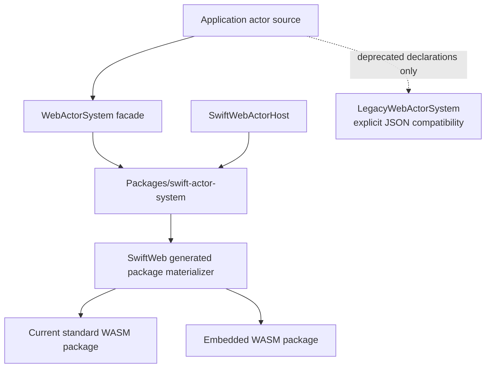

## Design Goals

The system must provide all of the following:

- A `distributed actor` declaration is the only application-authored contract.
- Actor method calls use `try await actor.method(...)` on every profile.
- Actor resolution uses `Actor.resolve(id:using:)` on every profile.
- Actor code does not import or select a transport.
- Native and Embedded peers use the same actor identity, method identity,
  schema, payload encoding, result encoding, and system error model.
- Native and standard WASM continue using the compiler-generated Distributed
  Actor thunks and `executeDistributedTarget`.
- Embedded actor twins preserve remote-reference behavior and local actor
  isolation without importing `Distributed` or `Codable`.
- Actor arguments and results that use synthesized Codable layouts remain
  portable to Embedded through generated codecs.
- Shared mutable runtime state uses the same `Mutex` or actor isolation contract
  on Native, standard WASM, and Embedded.
- Unsupported schemas and capabilities fail explicitly during generation,
  startup, or invocation.

## Non-Goals

The first version will not provide:

- A replacement actor language unrelated to Swift Distributed Actors.
- Application-facing `ActorContract` or `ActorImplementation` annotations.
- Automatic retries or exactly-once execution semantics.
- Transparent portability for arbitrary custom Codable implementations.
- Portable generic distributed methods.
- Transparent source replacement in arbitrary SwiftPM build graphs that do not
  allow the integrator to select generated source sets.
- Reflection-based contract discovery on Embedded Swift.

## Application Authoring Model

### Actor declaration

The concrete distributed actor is the contract and implementation.

```swift
import Distributed
import SwiftWeb

public distributed actor Counter {
    public typealias ActorSystem = WebActorSystem

    private var value: Int = 0

    public distributed func currentValue() async throws -> Int {
        value
    }

    public distributed func increment(by amount: Int) async throws -> Int {
        value += amount
        return value
    }
}
```

There is no separately authored service protocol and no implementation
annotation.

### Direct resolution

```swift
let counter = try Counter.resolve(
    id: Counter.ID(type: Counter.actorTypeID, name: "main"),
    using: actorSystem
)

let value = try await counter.increment(by: 1)
```

The generator adds a metadata-only conformance used by generic framework APIs:

```swift
public protocol ActorSchemaIdentifiable: Sendable {
    static var actorTypeDescriptor: ActorTypeDescriptor { get }
}

public protocol ActorSystemReference: ActorSchemaIdentifiable {
    associatedtype ActorSystem: Sendable

    var id: ActorAddress { get }
    var actorSystem: ActorSystem { get }

    static func resolve(
        id: ActorAddress,
        using actorSystem: ActorSystem
    ) throws -> Self
}

extension Counter: ActorSystemReference {
    public static var actorTypeDescriptor: ActorTypeDescriptor {
        CounterActorSchema.descriptor
    }
}
```

This is generated runtime metadata, not an application-authored service
protocol. `ActorGroup`, `.actor(...)`, and `@RemoteActor` may use it to obtain
the stable actor type ID and schema fingerprint without reflection or an
annotation. Method declarations remain exclusively on the concrete actor.

### SwiftWeb injection

`@RemoteActor` remains an optional SwiftWeb injection convenience. It resolves
the concrete actor type instead of an `@Resolvable` protocol existential.

```swift
public struct CounterClient: ClientComponent {
    @RemoteActor
    private var counter: Counter

    public func increment() async throws -> Int {
        try await counter.increment(by: 1)
    }
}
```

`@RemoteActor` is not a wire contract, proxy declaration, or transport
selection mechanism. It only obtains an actor reference from the current
SwiftWeb scene binding scope.

### SwiftWeb export

```swift
public var body: some Scene {
    CounterPage()
        .actor(counter)

    ActorGroup {
        Counter(actorSystem: $0)
    }
}
```

`.actor(counter)` exports a bound actor instance. `ActorGroup` defines a
virtual actor factory that activates one local instance per actor identity.
During scene lowering, `ActorGroup` reads the generated
`SwiftActorSystemBootstrapProvider` conformance from its concrete actor type
and installs that bootstrap before the app runtime starts and seals the actor
system. This ordering also covers applications launched directly through
`App.run()` instead of the generated server launcher; deferred virtual
activation never becomes the first registration attempt after startup.

## Platform Projection

| Profile | Compiled actor form | Local execution | Remote invocation |
|---|---|---|---|
| Native host | Original `distributed actor` | `executeDistributedTarget` | Compiler-generated thunk |
| Standard WASM client | Generated Distributed Actor client projection | Unavailable | Compiler-generated thunk |
| Embedded host | Generated ordinary actor twin | Generated isolated local helper | Generated nonisolated thunk |
| Embedded client | Generated remote-only actor twin | Unavailable | Generated nonisolated thunk |

Client projections contain the public actor identity and distributed method
surface, but do not contain server state, server-only methods, local method
bodies, secrets, or server-only dependencies. Generated client and registration
imports are reconstructed from the actor-system runtime modules and linked
dependency schemas; they are not copied wholesale from the canonical host
source.

## Package Architecture

```text
swift-actor-system
├── ActorSystemCore
├── ActorSystemDistributed
├── ActorSystemEmbedded
├── ActorSystemGeneration
├── ActorSystemBuildSupport
├── ActorSystemCompatibility
└── ActorSystemTestSupport
```

The dependency direction is fixed:

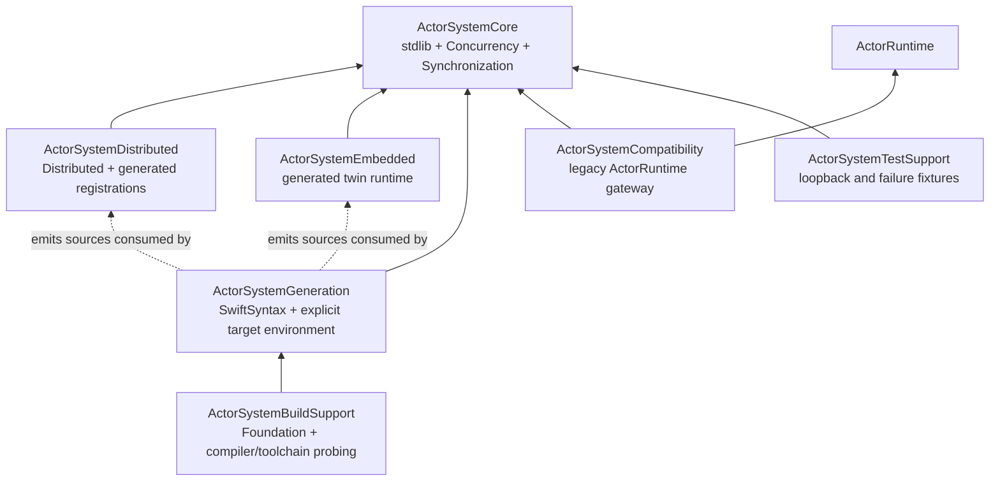

`ActorSystemCore` never depends upward. `ActorSystemGeneration` is a pure
consumer of an explicit compiler target environment and never launches a
compiler or `Process`. `ActorSystemBuildSupport` owns compiler/toolchain
probing and depends downward on Generation. Neither tooling target is linked
into a deployed actor runtime. `ActorSystemCompatibility` is the only package
target that may import `ActorRuntime`.

SwiftWeb's `Actors` trait links only the binary runtime path. The separate
`LegacyActors` trait enables `ActorSystemCompatibility`, legacy JSON types, and
legacy endpoints, and implies `Actors`. No source outside
`ActorSystemCompatibility` imports `ActorRuntime` directly.

| Package target | Creates state | Retains state | Lifetime | Failure boundary |
|---|---|---|---|---|
| `ActorSystemCore` | Lifecycle, call IDs, pending calls, inbound work | Directory, transports, pending continuations | `start()` through `shutdown()` | Stable `ActorSystemError` and frame outcomes |
| `ActorSystemDistributed` | Codec/type registries, local actor registrations | Real local distributed actors | Adapter lifetime | Distributed invocation or decoding failure |
| `ActorSystemEmbedded` | Generated instance registrations | Local actor twins | Embedded system lifetime | Stable system error or explicit portable result value |
| `ActorSystemGeneration` | Source/schema model and staged output | No runtime state | One generation transaction | `ActorGenerationError`; no partial success |
| `ActorSystemBuildSupport` | Compiler target mappings, target environment, and toolchain fingerprint | No runtime state | One build-integration invocation | Typed toolchain or compiler-output failure |
| `ActorSystemCompatibility` | Legacy request correlation | Legacy calls until response/cancel | Gateway lifetime | Explicit legacy response failure |

### ActorSystemCore

`ActorSystemCore` depends only on the Swift standard library, Swift
Concurrency, and Synchronization. It is compiled for every supported profile.

It owns:

- actor and method identity value types;
- call and response frame types;
- local target directory;
- local-first route selection;
- outbound route lookup;
- pending call correlation;
- inbound response correlation;
- transport lifecycle;
- bounded inbound scheduling;
- cancellation and shutdown coordination;
- portable binary wire primitives;
- stable system error codes.

It does not import Foundation, Distributed, Codable, SwiftSyntax, HTTP, or
WebSocket modules.

### ActorSystemDistributed

`ActorSystemDistributed` depends on `ActorSystemCore` and `Distributed`. It
provides the concrete `DistributedActorSystem` adapter, deferred invocation
argument recording, binary Codable encoding and decoding, result handling, and
wrappers that execute local actors through `executeDistributedTarget`.

### ActorSystemEmbedded

`ActorSystemEmbedded` depends only on `ActorSystemCore`. It provides the
runtime support required by generated actor twins, typed generated dispatchers,
local and remote actor location tracking, Embedded resolution, and generated
payload codecs.

### ActorSystemGeneration

`ActorSystemGeneration` is deterministic source/schema tooling. It depends on
SwiftSyntax and consumes an `ActorGenerationTargetEnvironment`, compiler target
mapping provider, and toolchain fingerprint supplied by its integrator. It
scans canonical actor sources, builds the actor schema graph, verifies Embedded
portability, reconciles mappings supplied by BuildSupport, updates the
checked-in schema lock, and emits profile-specific Swift sources. It does not
import Foundation for process execution or inspect the generator host.

SwiftSyntax and generator dependencies never enter Native application,
standard WASM, or Embedded artifacts.

### ActorSystemBuildSupport

`ActorSystemBuildSupport` is the build-integration boundary. It launches the
exact pinned compiler, extracts opaque Distributed Actor target identifiers,
loads compiler target information, probes supported conditional capabilities,
and computes the toolchain fingerprint. `ActorSystemTool` and
`SwiftWebPackageGeneration` depend on BuildSupport; Generation and runtime
targets do not depend back on it. The dependency direction is therefore
`ActorSystemBuildSupport -> ActorSystemGeneration -> ActorSystemCore`.

### ActorSystemCompatibility

`ActorSystemCompatibility` contains the legacy JSON envelope bridge. It is the
only new module allowed to depend on the old `ActorRuntime` product.

### ActorSystemTestSupport

`ActorSystemTestSupport` provides deterministic identity generators, loopback
transports, controllable clocks and deadlines, frame fixtures, failure-injection
transports, and shared codec fixtures.

### Public API to implementation mapping

| Public contract | Concrete implementation | Required behavioral coverage |
|---|---|---|
| `ActorSystemCore.start/invoke/receive/shutdown` | `ActorSystemCore` | Lifecycle, local/remote parity, receive races, transport closure |
| `ActorTransport` | SwiftWeb HTTP/WebSocket adapters and target-specific adapters | Start rollback, owned frames, send failure, stream completion |
| `ActorRouter` | SwiftWeb route/discovery adapter | Local-first routing, missing route, wrong transport |
| `ActorInvocationTarget` | Distributed target wrapper or generated Embedded dispatcher | Schema validation, method absence, typed success/failure |
| `ActorInboundInvocationInterceptor` | `SwiftWebActorHost` | Authorization, activation single-flight, persistence ordering, exactly-one execution |
| `SwiftActorSystem` | Distributed compiler adapter | Real compiler thunk and `executeDistributedTarget` execution |
| `EmbeddedActorSystem` | Generated actor twins and dispatchers | Same call surface, isolation, local/remote behavior |
| `ActorSystemCompiler` | Host generator CLI and SwiftWeb materializer integration | Deterministic schema, exact aliases, source replacement, rollback |
| `LegacyJSONActorGateway` | Explicit legacy endpoint adapter | JSON compatibility without fallback into the new binary path |

## Core Runtime API

The following declarations describe the intended API responsibilities. Exact
spelling may change during implementation without changing the architecture.

```swift
public final class ActorSystemCore: Sendable {
    public init(
        directory: ActorDirectory,
        router: any ActorRouter,
        transports: [ActorTransportID: any ActorTransport],
        configuration: ActorSystemConfiguration
    )

    public func start() async throws

    public func invoke(
        _ invocation: ActorInvocation,
        options: ActorCallOptions
    ) async throws -> ActorInvocationResult

    public func receive(_ frame: ActorInboundFrame) async

    public func shutdown() async
}
```

### Actor directory

`ActorDirectory` maps an `ActorAddress` to a type-erased local invocation
target. It owns strong references to registered local targets until explicit
unregistration, passivation, or system shutdown.

```swift
public protocol ActorInvocationTarget: Sendable {
    var address: ActorAddress { get }
    var descriptor: ActorTypeDescriptor { get }

    func invoke(
        _ invocation: ActorInvocation,
        context: ActorInvocationContext
    ) async throws -> ActorInvocationResult
}
```

Native targets wrap a real `DistributedActor`. Embedded targets use a generated
dispatcher associated with the actor twin.

### Router

```swift
public protocol ActorRouter: Sendable {
    func route(to recipient: ActorAddress) async throws -> ActorRoute
}
```

The router may perform asynchronous discovery. It is called only after the
local target and local activation path have failed to resolve the recipient.

Inbound invocations are never forwarded to another peer by default. A gateway
that forwards invocations must be an explicit host policy, not a core fallback.

### Transport

```swift
public protocol ActorTransport: Sendable {
    var incoming: AsyncThrowingStream<ActorInboundFrame, Error> { get }

    func start() async throws

    func send(
        _ frame: ActorFrame,
        to endpoint: ActorEndpoint
    ) async throws

    func shutdown() async
}
```

The system, not the transport, owns request-response correlation. A transport
only starts its link, emits received frames, sends owned frames, and shuts down
its resources.

A transport that multiplexes independently failing endpoints additionally
implements `ActorEndpointLifecycleReportingTransport`. Core installs one
endpoint-termination handler before starting that transport and clears it before
shutdown. A termination fails only pending calls whose transport and endpoint
both match, cancels inbound work from that endpoint, and removes its retained
deduplication results. A single-endpoint transport continues to report closure
by terminating `incoming`; it does not need this capability. Stream termination
fails pending calls and cancels inbound work for that transport before its
consumer task is released.

Pending result correlation checks `(transport, endpoint, callID)`, not only the
call ID. Inbound cancellation and duplicate suppression use the same tuple.
Consequently, one authenticated WebSocket connection cannot complete, cancel,
or collide with another connection's call even if it supplies the same session
and sequence values.

Each transport has one system-owned consumer for `incoming`. `shutdown()` must
finish the stream and unblock the consumer. A transport must not retry an actor
invocation without an explicit higher-level idempotency contract.

`ActorInboundFrame.metadata` is bounded, local host metadata supplied by the
receiving adapter. It is not part of the portable actor payload, is never
forwarded by Core, and cannot be trusted merely because it is present. A
SwiftWeb adapter derives authorization metadata from its authenticated request
or connection context; it does not copy an unauthenticated peer-supplied
principal field into the host context.

### Configuration and bootstrap

Runtime construction is explicit and happens once per process or client
runtime. Transport selection is a bootstrap concern, never an actor concern.

```swift
let configuration = ActorSystemConfiguration(
    sessionIdentitySource: sessionIdentitySource,
    maximumInFlightCalls: 1_024,
    maximumConcurrentInboundCalls: 64,
    maximumRetainedInboundResults: 4_096,
    maximumTransportEndpoints: 1_024,
    maximumFrameBytes: 1_048_576,
    maximumPayloadBytes: 1_000_000,
    maximumIdentityBytes: 4_096,
    maximumNestingDepth: 64,
    maximumCollectionElements: 100_000,
    inboundInterceptor: actorHost
)

let system = try WebActorSystem(
    generatedBootstrap: AppActorBootstrap.self,
    router: router,
    transports: transports,
    configuration: configuration
)
```

`AppActorBootstrap` is generated. It registers descriptors, compiler target
aliases, Native codecs, result codecs, and actor factories. An application
must not manually repeat method IDs or wire layouts.

Every generated Native or standard-WASM actor type also conforms to
`SwiftActorSystemBootstrapProvider`. `assignID` and `resolve(id:as:)` use that
conformance to install the module bootstrap idempotently before the first local
or remote identity is materialized. This closes the ordering gap for actors
created or resolved during application
initialization without exposing transport selection to the actor. Generated
SwiftWeb host launchers additionally install the application bootstrap into
`WebActorSystem.shared` before constructing `App`, then idempotently install it
into the concrete `app.actorSystem`. During ordinary scene lowering,
`ActorGroup` also asks the system facade to install the concrete actor type's
generated bootstrap before it registers the deferred activation factory. This
is required because a virtual actor may not be constructed until after startup;
the same ordering therefore holds for direct `App.run()` launchers. Actor
creation after system startup reuses the already-installed bootstrap; it does
not reopen the sealed registration phase.

Bootstrap validation fails before `start()` when any of the following is true:

- two actor types, methods, fields, cases, compiler aliases, or codec types use
  the same authoritative identity;
- one bootstrap's declared descriptors differ from its actual actor
  registrations, or a declared method value type has no registered codec;
- a required dependency schema is missing;
- a host factory is absent for a type exported by `ActorGroup`;
- an actor address is registered twice; or
- a transport ID or required session identity is invalid.

The runtime does not infer the compiler commit that is executing it. It only
requires every installed distributed-actor registration to use one mutually
consistent alias-table fingerprint. The pinned build and materialization layer
is authoritative for comparing the generated fingerprint with the selected
compiler/toolchain artifact before compiling the generated package. Runtime
mutual consistency and build-time compiler identity are separate guarantees;
neither is presented as a substitute for the other.

### Distributed facade used by SwiftWeb

The accepted SwiftWeb `WebActorSystem` is a thin
`DistributedActorSystem` facade over `ActorSystemDistributed.SwiftActorSystem`.
It owns no HTTP, WebSocket, activation, persistence, authorization, passivation,
reminder, or scene state.

```text
distributed actor declaration
    -> WebActorSystem compiler-facing conformance
        -> SwiftActorSystem generated registration and codec registry
            -> ActorSystemCore
```

The facade delegates these compiler requirements without changing their
semantics:

| Compiler-facing operation | Delegated responsibility |
|---|---|
| `assignID` | Idempotently install the generated bootstrap when provided, then generate an `ActorAddress` for the registered actor type |
| `actorReady` | Atomically register the actor reference and invocation target |
| `resignID` | Atomically unregister and release outside the lock |
| `resolve` | Idempotently install the generated bootstrap when provided, then return an existing local actor or allow the compiler to construct a remote reference |
| `makeInvocationEncoder` | Record arguments for one generated method descriptor |
| `remoteCall` / `remoteCallVoid` | Map the opaque compiler target, encode once, and invoke Core |
| `invokeHandlerOnReturn` | Decode arguments, execute `executeDistributedTarget`, and encode the outcome |

The facade exists to preserve the application declaration
`typealias ActorSystem = WebActorSystem`. It is not a second runtime and may not
fork codec, routing, timeout, or correlation behavior from `SwiftActorSystem`.

### Registration invariants

Local registration is a single logical transaction across the strong actor
store and `ActorDirectory`:

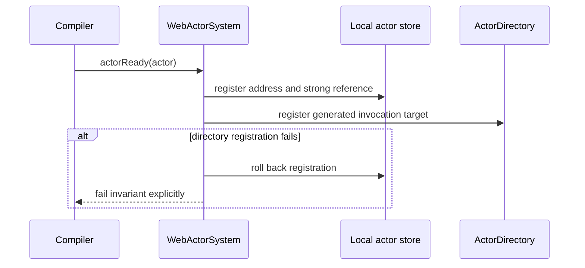

Unregistration removes both entries under the same synchronization boundary,
then releases removed references after leaving the critical section. Embedded
registration follows the same transaction with its generated instance store.

## Outbound Invocation

### Native and standard WASM

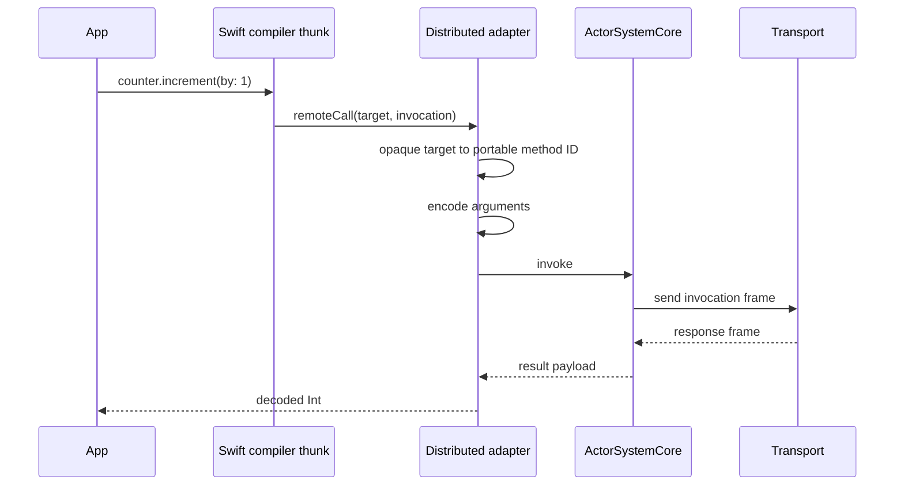

The invocation encoder records argument values without immediately producing
one `Data` allocation per argument. `remoteCall` knows the concrete actor type
and compiler target, selects the generated method descriptor, and encodes all
arguments into one owned payload buffer.

### Embedded

The generated method already knows the actor type ID, method ID, argument
layout, result layout, and error layout. It encodes directly into the same
portable payload format and calls `ActorSystemCore.invoke`.

### Local and remote semantic parity

Local-first routing is an optimization, not a different invocation contract.
Both branches allocate a call ID, validate the same descriptor and schema
fingerprint, apply the same configured timeout, surface cancellation as
`ActorSystemError.cancelled`, and validate the result payload limit.

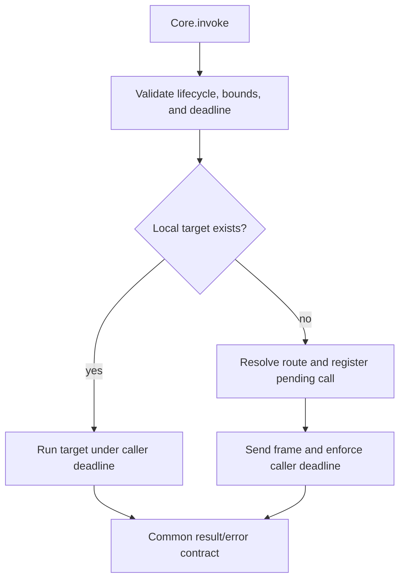

A local timeout is allowed to return before an uncooperative operation stops;
the operation task is cancelled and its late completion is ignored. A remote
timeout additionally sends a best-effort cancellation frame. Neither branch
turns a timeout or cancellation into a successful empty result.

## Inbound Invocation

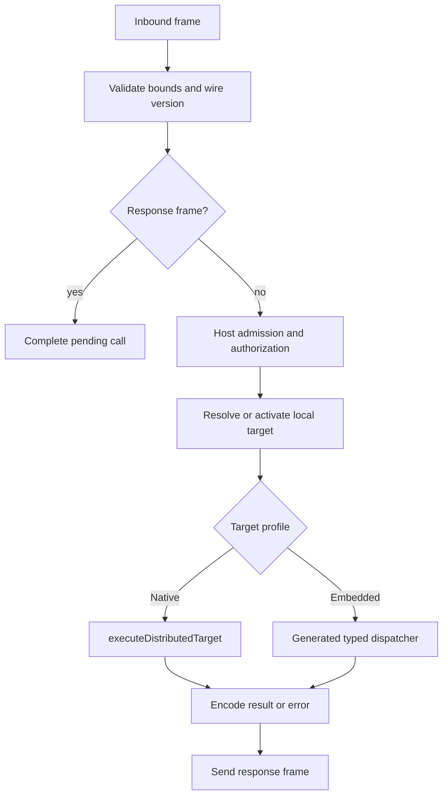

The core validates and correlates frames. The host owns authorization and
activation. The resolved invocation target owns profile-specific method
execution.

`ActorInvocationExecution` is a single-use capability passed to the inbound
interceptor. A host may authorize, activate, restore, invoke, save, and perform
post-invocation work around it, but it may execute the actor method at most
once. Calling the execution capability twice is an explicit runtime invariant
failure, not a duplicate actor call.

Inbound duplicate tracking uses the composite key
`(ActorTransportID, ActorEndpoint, ActorCallID)`. A call ID is scoped to one
transport endpoint; the same numeric session and sequence received on two
connections of one multiplexed transport must not coalesce or cancel each
other.

| Duplicate state | Behavior |
|---|---|
| First invocation | Starts one bounded inbound task |
| Duplicate while active | Joins the active outcome and receives the same reply |
| Duplicate in retained window | Replays the retained outcome without executing the actor |
| Duplicate after eviction | May execute again; exactly-once is not claimed |
| Cancel from another transport or endpoint | Does not cancel the original call |

The retained window is bounded. Overload is an explicit `overloaded` result;
the scheduler must not create unbounded detached work.

## Compiler Target Mapping

Swift `RemoteCallTarget.identifier` is opaque. Its textual representation is
not a stable protocol and may evolve with the compiler. The runtime must not
derive a portable method identity by parsing, demangling, reimplementing Swift
mangling, or hashing a guessed source spelling.

The schema compiler must produce a verified mapping between:

- the compiler-emitted opaque target identifier;
- the stable portable actor method ID; and
- the generated Embedded dispatcher entry.

The canonical method signature includes the method name, external parameter
labels and types, result type, `sync`/`async` effect, and whether the method uses
the supported untyped `throws` effect. A portable actor contract rejects typed
`throws(E)` before schema reconciliation. A closed application error type `E`
cannot also represent transport, timeout, cancellation, decoding, and lifecycle
failures raised by the actor system; silently widening only the Embedded
projection would make the authored API profile-dependent. Applications that
need a typed business failure model it as an explicit portable result value.
Default argument expressions are authoring convenience and do not change the
wire identity. Standard WASM and Embedded client projections reproduce the
supported declaration effects exactly.

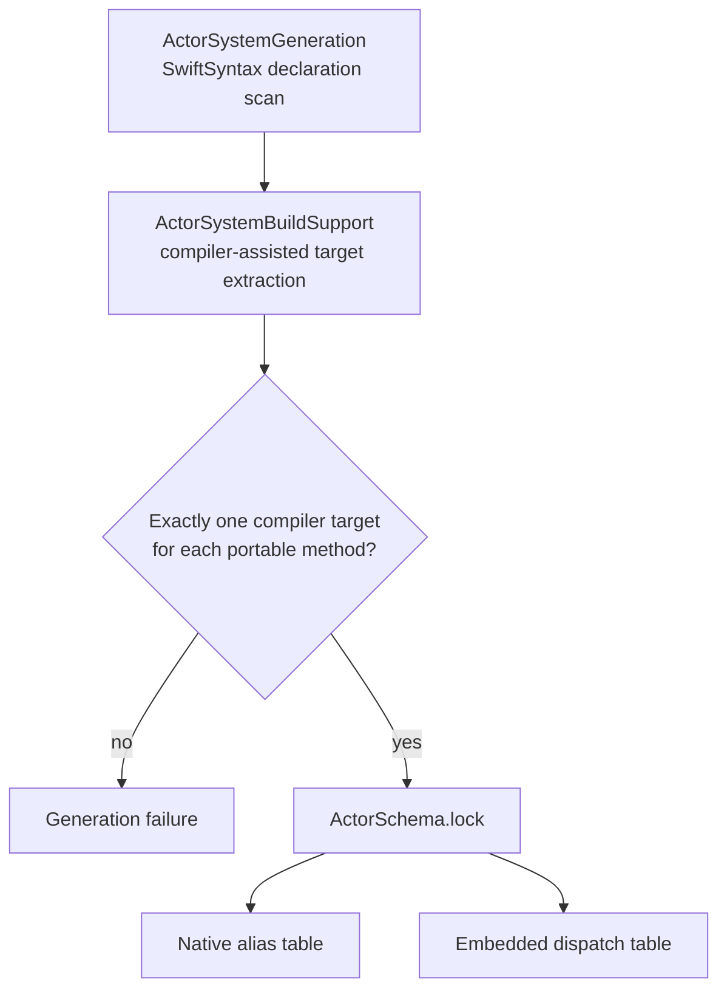

Compiler-assisted extraction must use the exact pinned toolchain. The initial
implementation gate is to prove a stable extraction path from compiler-emitted
SIL or metadata. If the compiler does not expose a sufficiently reliable path,
the implementation must stop and pursue an upstream compiler metadata feature.
It must not introduce a heuristic fallback.

The SIL extractor follows the generated probe's `function_ref` graph in
breadth-first order and stops at the first reachable function level containing
a `DistributedActorSystem.remoteCall` or `remoteCallVoid` requirement. The
opaque target literal must be unique across that level. This accounts for the
normal non-inlined shape where the probe calls a compiler-generated distributed
method thunk; inspecting only the probe body is not a valid extraction path.

## Actor Schema Lock

`ActorSchema.lock` is a checked-in generated artifact. Stable wire identities
live in the lock rather than source annotations.

It records:

- format version;
- package identity;
- module, source spelling, and fully qualified canonical value-type identity;
- stable 128-bit actor type IDs;
- stable 64-bit actor method IDs;
- stable field and enum case IDs;
- method argument, result, and error layouts;
- compiler target aliases by toolchain fingerprint;
- actor schema fingerprints;
- reserved IDs that must not be reused.

The initial ID may be derived deterministically, but after it is committed the
lock is authoritative. Renaming or moving an actor uses a schema command that
moves the existing lock entry.

```text
actor-system schema move \
    CounterApp.Counter \
    CounterApp.RenamedCounter
```

This command preserves identity only for a rename inside the module owned by
the lock. A cross-module ownership transfer requires coordinated changes to the
source and destination locks and is not performed by the single-lock command.

Automatic structural rename guessing is not authoritative because two actors
may have the same shape. Ambiguous moves fail and require an explicit command.

The schema tool exposes explicit identity-preserving operations for actor,
value, field, and enum-case moves. A move changes the source symbol path while
retaining the authoritative ID. Removed IDs are moved into the corresponding
reserved set and may never be allocated again.

```text
actor-system schema move <old-actor> <new-actor>
actor-system schema move-value <old-value> <new-value>
actor-system schema move-field --type <value> <old-field> <new-field>
actor-system schema move-case --type <value> <old-case> <new-case>
actor-system schema move-actor-field --actor <actor> <old-field> <new-field>
```

Dependency value references resolve by fully qualified schema name. A leaf name
may be used only when exactly one dependency schema exports it; ambiguity is a
generation error.

Source-level `id` and `version` annotations are not part of the application
API. Wire protocol version, actor schema fingerprint, actor type identity, and
application release version are separate concepts.

## Source Generation Pipeline

The generator performs these stages:

1. Parse source files and find explicit `distributed actor` declarations.
2. Find their `distributed func` declarations and public initializers.
3. Reject typed throws and build the reachable graph of argument and result
   value types.
4. Load actor schema manifests exported by dependency modules.
5. Ask `ActorSystemBuildSupport` to resolve compiler target aliases and the
   authoritative target environment with the exact pinned compiler and SDK.
6. Reconcile declarations with `ActorSchema.lock`.
7. Validate portable value layouts for profiles that include Embedded.
8. Generate common descriptors and codecs.
9. Generate role-specific Native, standard client, Embedded host, or Embedded
   client sources.
10. Fail before target compilation if any required mapping or portable schema
    is incomplete.

When a module temporarily contains both new and legacy distributed actors,
authoritative generation selects the concrete actor system explicitly:

```text
actor-system generate ... \
  --include-actor-system WebActorSystem \
  --actor-system-type SwiftWebActors.WebActorSystem
```

This selection uses the actor's own `typealias ActorSystem`; it does not add an
actor-contract annotation or infer the contract from inheritance.

The generated layout is conceptually:

```text
Generated
├── ActorSchema.generated.swift
├── ActorTargetAliases.generated.swift
├── ActorCodecs.generated.swift
├── Native
│   └── ActorDescriptors.generated.swift
├── StandardClient
│   └── Counter.client.generated.swift
├── EmbeddedHost
│   └── Counter.host.generated.swift
└── EmbeddedClient
    └── Counter.client.generated.swift
```

SwiftWeb can provide transparent source selection because it already
materializes separate server, development, and WASM packages. The Embedded
package must compile generated projections instead of the original source that
imports `Distributed`.

### Generated bootstrap and source manifest

Generation emits a manifest in addition to Swift sources. The manifest is the
transaction boundary between `ActorSystemGeneration` and SwiftWeb package
materialization.

```text
ActorGeneratedManifest
├── schema format and fingerprint
├── toolchain fingerprint
├── generation profile
├── input source digests
├── generated file paths and digests
├── declarations replaced in each input file
├── dependency schema fingerprints
└── generated bootstrap symbol
```

The generated directory is owned exclusively by the generator. Before a
replacement, every existing file must be listed by the previous manifest and
must not be a symlink. A stray manual file or digest mismatch fails generation
instead of deleting unknown content. Sources and `ActorSchema.lock` are staged,
validated, and committed as one recoverable transaction. A stable journal is
written before either live root moves. A thrown commit restores the previous
generated set, while the next materialization either restores a prepared
transaction or finalizes an installed transaction after process interruption.
Reusable SwiftPM state moves only after both new roots are installed, so cache
transfer cannot create a mixed source generation. The generated root owns the
shared `--scratch-path` used by server and WASM builds; its `.build` and
`.swiftpm` directories survive every successful materialization and SwiftPM
invalidates individual build nodes when a generated manifest or source changes.
Package-local state is transferred only when that package manifest is unchanged.

`AppActorBootstrap` has profile-specific implementations with a common role:

| Profile | Bootstrap content |
|---|---|
| Native host | Actor descriptors, exact compiler aliases, Codable-backed portable codecs, and host factories |
| Standard client | Actor descriptors, exact compiler aliases, generated Codable value declarations, codecs, and remote-only client declarations |
| Embedded host | Actor/value twins, generated codecs, schema-bound dispatchers, and host factories |
| Embedded client | Actor/value twins, generated codecs and remote-only resolution; no host state or method bodies |

Each module emits actor registrations only for actors owned by that module. Its
bootstrap also registers the exact boundary codecs used by those actors,
including constructed container types. Dependency schemas participate in
validation, canonical type resolution, and generated bootstrap dependencies;
dependency actor registrations are not copied into the dependent module.

The standard WASM resolver source emits a registration-only aggregate bootstrap.
It lists the application bootstrap when one exists plus every reachable
dependency-module bootstrap, but owns no actor descriptor or implementation.
This covers applications that bind only an imported actor and declare no local
actor. Runtime traversal still performs dependency-first, identity-idempotent
registration at the single transactional system boundary.

`SwiftActorSystem` traverses the generated bootstrap dependency DAG in stable
dependency-first order. It installs each bootstrap object and logical
`package:module` identity once, treats an identical Swift type/type-ID codec
registration as idempotent, rejects conflicting identities, and rolls codec,
actor-type, and installed-bootstrap registries back together if any registration
fails. Before each bootstrap is committed, the runtime requires its declared
actor descriptor set to match exactly the actor registrations performed by that
bootstrap, including descriptor contents, and requires a registered codec for
every parameter, result, and error type ID referenced by those descriptors.
An incomplete bootstrap therefore fails during registration rather than during
its first invocation. A transaction flag gates system registration, actor
construction, and resolution while the synchronous bootstrap body and rollback run outside the
mutex; only visibility state transitions occur inside the critical section.
System APIs therefore cannot observe a partial bootstrap, and no external
bootstrap callback executes while the registration mutex is held. Bootstrap
bodies are pure registration operations; nested modules are declared through
`dependencies` rather than installed from a bootstrap body. SwiftWeb delegates
directly to this single linearization point instead of maintaining a second
installation registry. This provides deterministic behavior for diamond
dependencies; a concurrent registration attempt fails explicitly as
`overloaded` and may retry.

An `ActorDistributedCodecRegistry` supplied to a system is logically
system-owned for mutation. Callers register through `SwiftActorSystem` and do
not read or mutate that registry concurrently with bootstrap installation;
standalone registry use remains supported when no system owns it. This prevents
an external registry reference from bypassing the bootstrap visibility gate.

SwiftWeb discovers dependency schemas from imported actor modules before each
profile projection. It traverses transitive local package dependencies and
resolved checkout roots, and reads only the following contract locations:

```text
<package>/ActorSchema.lock
<package>/ActorSchemas/*.lock
<package>/Sources/<Target>/ActorSchema.lock
```

Schemas are selected by the actor source's imported module names. Identical
duplicates are idempotent; different schemas exporting the same imported module
are a generation failure. Missing schemas remain an explicit portability failure
when an actor signature references a value outside the local portable value set.
A package may export more than one actor schema module; uniqueness is enforced
at the Swift module boundary, while canonical value identities and type IDs are
checked across all selected modules.

### SwiftWeb source projection

The materializer invokes a declaration-aware projector when the application
target contains distributed actors. It generates and installs the Native host
bootstrap in the application target, and consumes either the standard client or
Embedded client projection in the generated WASM package. The implemented path
is:

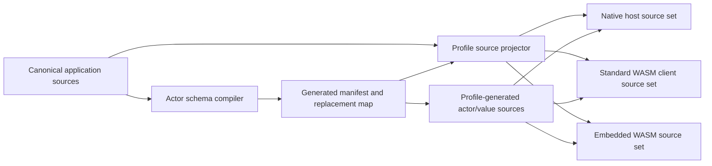

Projection occurs at declaration granularity, not by blindly dropping a whole
file. This permits an actor source file to contain unrelated portable
declarations while still guaranteeing that the original Distributed-only actor
and generated twin are never compiled together. The projector must:

1. remove only declarations listed as replaced by the generated manifest;
2. preserve unrelated declarations and profile-safe imports;
3. reject declarations whose server-only dependency would leak into a client
   projection;
4. verify that every removed actor or reachable value has exactly one generated
   replacement; and
5. verify that no original `Distributed` import or distributed actor declaration
   remains in an Embedded source set.

Conditional source is validated before discovery: portable actor and reachable
value declarations inside `#if` are rejected because their wire identity cannot
vary by build configuration. The remaining conditional compilation is resolved
before actor discovery, portable-value closure analysis, import discovery, and
source projection. The resolver uses the selected generation profile as build
configuration, including
`hasFeature(Embedded)`, WASI target facts, `SWIFTWEB_ACTORS`, and the exact set
of modules made available by the generated package. Imports from inactive
branches cannot create dependency edges. An unknown condition is a typed
generation error instead of being guessed. `embeddedHost` rejects target
queries until its projection request carries an explicit board/RTOS target
description.

Actor discovery and client source copying use different source sets. Discovery
reads every canonical application-target source, including server-only
directories, and selects only actors whose declared actor system is
`WebActorSystem`. The WASM copier still admits only client-safe application
files; remote-only actor and portable-value declarations are installed from
generated sources even when their canonical declarations live in a server-only
file. Legacy actors whose actor system is `LegacyWebActorSystem` remain usable
only in an explicitly `LegacyActors`-enabled host build. Generated standard and
Embedded WASM runtimes reject legacy actor bindings before rendering because
their manifests intentionally contain neither the compatibility module nor the
legacy runtime.

Standard clients replace reachable portable values with generated `Codable`
declarations as well as replacing actors. Embedded clients generate the same
wire fields and cases without Codable. Client value projections intentionally
omit non-wire member bodies, so a helper or secret implementation attached to a
server value declaration is not copied into either client artifact.
Stored-field and actor-parameter defaults are preserved only when their syntax
is a self-contained scalar or collection literal. Calls, member lookup, string
interpolation, and other expressions that could depend on Foundation or a
host-only declaration fail generation explicitly.
An unavailable dependency import is removed when every non-import declaration
in that file is replaced. If an unrelated declaration remains beside such an
import, projection fails and requires the declarations to be split rather than
guessing whether the dependency is client-safe. Embedded projection may always
remove `Distributed` and `ActorSystemDistributed` after their generated actor
declarations are removed because those modules supplied only the replaced actor
syntax and runtime surface; retained declarations are still validated against
the Embedded source contract.

Projection also rejects a checked-in application schema that still owns actors
when discovery finds no matching canonical actor declarations. Removing the
last actor therefore requires authoritative schema reconciliation just like any
other contract change; materialization does not silently clear generated files
while leaving stale reusable identity history.

Authoritative generation rejects top-level extensions of a portable
distributed actor or reachable portable value: members must be declared in the
original type body so host-state/value projection and client isolation are
complete. As defense in depth for an older replacement manifest, client
projection also removes extensions of a replaced actor rather than copying
their implementation bodies.

The generated package manifest selects products as follows:

| Generated package | Required actor products | Forbidden actor dependency |
|---|---|---|
| Server / development host | `ActorSystemCore`, `ActorSystemDistributed`, SwiftWeb host adapter | Direct application use of `ActorRuntime` |
| Standard WASM | `ActorSystemCore`, `ActorSystemDistributed` | `ActorRuntime`, `ActorSystemCompatibility`, or a legacy resolver |
| Embedded WASM | `ActorSystemCore`, `ActorSystemEmbedded` | `Distributed`, `Codable`, Foundation-only runtime state, `ActorRuntime` |

The materializer filters `Package.resolved` for dependencies used by each
generated package. Normal standard and Embedded generated packages contain no
`swift-actor-runtime`, `ActorRuntime`, or `ActorSystemCompatibility` dependency.
Legacy compatibility is a separately trait-selected host boundary and is not
materialized into either generated client profile.

Imported actor modules are indexed from their exported schema contracts and
projected in dependency-first order. The generated WASM package contains one
source target per reachable actor module. Each target combines its generated
descriptors, values, codecs, actor clients, and bootstrap with only the
dependency module's manifest-owned, profile-projected client declarations.
`Actions`, `Routes`, `App.swift`, prior generated output, inactive host branches,
actor implementation bodies, and server-only imports are excluded. Active
imports in the retained client declarations extend the transitive actor-schema
DAG and become direct SwiftPM target dependencies; an import is never considered
available unless the generated target declares the matching dependency. The
application client target depends on the reachable projected actor modules,
while generated module targets also express their schema dependency edges.
Bootstrap references are module-qualified, and target names plus their generated
manifest declaration names are checked for collisions before files are
installed. A missing source target, conflicting module schema, dependency cycle,
unknown client module, or generated-target collision is a generation error.

An application with no `ClientComponent` declarations has no browser runtime.
Materialization therefore validates and installs only the native host actor
projection, emits an empty WASM package, and does not resolve a WASM SDK, project
client actors, or mirror application sources into a client target. Server-only
imports and dependencies remain owned by the native application target.

A general SwiftPM build tool plugin cannot be assumed to remove an original
source file from its target's compilation. General SwiftPM support therefore
requires an explicit source-set integration or future compiler support. The
first supported integration is SwiftWeb's generated package pipeline.

## Embedded Actor Twin

An Embedded host twin is conceptually generated as follows:

```swift
public actor Counter {
    public typealias ID = ActorAddress
    public typealias ActorSystem = EmbeddedActorSystem

    public nonisolated let id: ID
    public nonisolated let actorSystem: ActorSystem
    private nonisolated let location: ActorLocation

    public static func resolve(
        id: ID,
        using actorSystem: ActorSystem
    ) throws -> Counter

    public nonisolated func increment(
        by amount: Int
    ) async throws -> Int {
        switch location {
        case .remote:
            return try await actorSystem.invoke(
                actor: id,
                method: Self.incrementMethodID,
                argument: amount
            )
        case .local:
            return try await incrementLocally(by: amount)
        }
    }

    private func incrementLocally(
        by amount: Int
    ) async throws -> Int {
        value += amount
        return value
    }
}
```

The public generated remote method is `nonisolated` so a remote reference does
not serialize outgoing calls through an otherwise unnecessary local actor
executor. For a local instance, the public method enters an actor-isolated local
helper containing the original method body.

The generator also provides Embedded equivalents for `id`, `actorSystem`,
`resolve(id:using:)`, identity hashing, and `whenLocal`. The generated type does
not claim conformance to `DistributedActor`, because that protocol is not
available on Embedded Swift.

The public twin is itself the isolated local actor. Generation must not add a
second hidden backing actor because that would change identity, isolation,
`whenLocal`, reentrancy, and state lifetime. Host state is stored only on a local
instance; a remote reference has no initialized host state.

```text
Embedded Counter instance
├── common: id, actorSystem, location
├── local only: generated State and isolated local method bodies
└── remote only: no State; public method encodes and invokes Core
```

Initializer projection preserves application initialization statements while
replacing the Distributed-specific actor-system assignment and generated
registration mechanics. Unsupported property wrappers, observers, `lazy`,
`weak`, `unowned`, unsafe nonisolated state, or other semantics that cannot be
projected exactly cause generation failure. Generated backing for a canonical
stored `let` accepts exactly one initialization assignment and rejects a later
assignment explicitly; it is never silently weakened to mutable state.

`whenLocal` receives the isolated generated actor, so application code observes
the same isolation boundary as a local Distributed Actor. A remote reference
returns the unavailable/local-absence result defined by the projection; it does
not materialize a fake local instance.

Remote-only client twins do not expose usable local initializers. Attempting to
configure a remote-only projection as a local host is a generation or startup
error, not a trapping local method body presented as a supported path.

## Serialization Model

### Native Codable path

The Native adapter retains:

```swift
public typealias SerializationRequirement = Codable & Sendable
```

It replaces JSON with a schema-aware `ActorBinaryEncoder` and
`ActorBinaryDecoder`. Codable is the Native authoring contract, not the wire
format.

### Embedded generated path

Embedded codecs are generated directly from the same stored-property and enum
case schema. They do not conform to or invoke Codable.

```text
Native Codable value
    -> ActorBinaryEncoder
        -> portable payload

Embedded value
    -> generated codec
        -> portable payload
```

For every reachable application value, the Embedded source set contains a
semantic value twin with the same public type name, stored fields, enum cases,
and profile-safe members. The original Codable declaration is removed from the
Embedded projection. Codec conformance is generated separately so the value's
application-facing shape is not polluted with transport methods.

```text
Canonical Native source
  struct IncrementRequest: Codable, Sendable
      -> schema field IDs and wire types
          -> Embedded value twin: struct IncrementRequest: Sendable
          -> generated ActorPortableValue codec extension
```

Reachability begins at distributed method parameters, results, and typed
errors, then recursively follows stored fields and associated values. An
unrelated Codable type in the same module is neither rejected nor emitted
unless it becomes reachable from an actor contract.

### Portable value set

The first portable profile supports:

- `Bool`;
- fixed-width signed and unsigned integers;
- `Int` and `UInt`, represented as checked 64-bit wire values;
- `Float` and `Double` using IEEE 754 bit patterns;
- UTF-8 `String`;
- byte buffers;
- `Optional`;
- `Array`;
- `Dictionary` with portable key and value types;
- stored-property structs;
- associated-value enums; and
- nested combinations of these types.

The first portable profile rejects:

- generic distributed methods;
- variadic, attributed, or ownership-modified distributed parameters whose
  declaration cannot be reproduced identically by every profile;
- closures;
- metatypes;
- class reference graphs;
- arbitrary existentials;
- reflection-dependent values;
- custom Codable implementations that cannot be represented by the generated
  structural codec;
- custom protocol conformances that cannot be reproduced by both the canonical
  type and its Embedded twin; explicitly authored `ActorPortableValue`
  conformance is also rejected because the generated codec owns that witness;
  and
- dependency types whose module does not export an actor schema manifest.

No unsupported value is converted to an empty payload, textual description, or
default value.

### Evolution rules

| Schema change | Compatibility rule |
|---|---|
| Add optional or defaulted field | Compatible |
| Rename field while retaining field ID | Compatible |
| Add method | Compatible |
| Add enum case | Receiver reports unknown case unless it supports tolerant handling |
| Change field type | Breaking |
| Add required field without default | Breaking |
| Change method signature | New method ID |
| Remove method | Old caller receives `targetUnavailable` |
| Remove field or case | ID becomes reserved and is never reused |

Explicit actor renames preserve the actor type ID only within the Swift module
owned by that `ActorSchema.lock`. Moving an actor to another module is a schema
ownership transfer between two locks and is rejected by the single-lock
`schema move` command; it must not produce an actor entry whose module differs
from its containing lock.

The actor schema fingerprint represents the reachable wire layout, not the
source text and not the number of available methods. Compatible field additions
and identity-preserving renames retain the fingerprint. A wire-breaking value
layout change produces a new fingerprint. Adding or removing a method does not
change the actor fingerprint because method dispatch is already keyed by stable
`ActorMethodID`; an old call to a removed method receives `targetUnavailable`.

```text
actor fingerprint
    = stable digest(
        actor type ID,
        reachable value type IDs,
        field/case IDs and wire types,
        compatibility-relevant defaults
      )
```

## Identity Model

```swift
public struct ActorAddress: Hashable, Sendable {
    public let type: ActorTypeID
    public let identity: String
}
```

The system does not encode actor identity as a parseable
`"<reflected-type>:<name>"` string.

| Identity | Purpose |
|---|---|
| `ActorTypeID` | Stable 128-bit actor type identity |
| `ActorAddress.identity` | Logical actor identity such as `"main"` or a user ID |
| `ActorMethodID` | Stable 64-bit method identity |
| `ActorCallID` | Per-invocation correlation identity |
| `ActorSchemaFingerprint` | Compatibility check for one actor schema |

`ActorCallID` consists of a transport session identity and monotonic sequence.
It does not require Foundation `UUID`. A connectionless or Embedded transport
must provide a valid session identity source during startup; absence is a typed
startup failure rather than a constant fallback.

## Wire Protocol

The initial binary frame uses this structure:

| Field | Size | Meaning |
|---|---:|---|
| Magic | 4 bytes | `SACT` |
| Wire version | 2 bytes | Frame protocol version |
| Kind | 1 byte | invoke, result, cancel, or hello |
| Flags | 1 byte | Reserved; must be zero in version 1 |
| Header length | 2 bytes | Bounded header byte count |
| Payload length | 4 bytes | Bounded payload byte count |
| Call ID | 16 bytes | Session and sequence |
| Actor type ID | 16 bytes | Invocation frames |
| Actor identity | Variable | Length-prefixed UTF-8 |
| Method ID | 8 bytes | Invocation frames |
| Schema fingerprint | 16 bytes | Invocation frames |
| Payload | Variable | Arguments, result, or error |

The wire format does not contain `Date`, `UUID`, Swift reflection names, Swift
mangled target strings, `Data`, HTTP fields, or transport-specific addresses.
Compiler target strings remain local descriptor aliases and are translated at
the Distributed adapter boundary.

Deadlines are transmitted as remaining duration rather than wall-clock time.

Version 1 requires an exact frame wire version and zero flags. A `hello` frame
may be used by a connection-oriented transport as an early compatibility
preflight, but an invocation decoder never relaxes version validation because a
hello was observed. Connectionless transports may rely on their configured
version contract and do not require an extra request-response handshake.

Decoders validate:

- maximum frame and payload length;
- integer overflow;
- field range and wire type;
- maximum nesting depth;
- maximum collection element count;
- duplicate fields;
- required fields;
- schema fingerprint;
- known frame kind; and
- supported wire version.

An owned input buffer crosses asynchronous boundaries. Synchronous decoding
uses ranges or views into that owner and avoids rematerializing intermediate
arrays and strings. A borrowed view never escapes its owning buffer's lifetime.

## Invocation Semantics

| Concern | Version 1 contract |
|---|---|
| Routing | Local target first, then explicit outbound router |
| Inbound forwarding | Disabled by default |
| Retry | No automatic actor invocation retry |
| Delivery | At-most-once within a live session and retained deduplication window |
| Exactly-once | Not guaranteed |
| Cancellation | Best-effort cancel frame and local task cancellation |
| Timeout | Caller deadline; remaining duration may be propagated |
| Ordering | No ordering stronger than Swift actor isolation |
| Backpressure | Bounded in-flight calls and bounded inbound scheduling |
| Reconnect | Outstanding invocations are failed, not automatically replayed |
| Partial endpoint loss | Fail and cancel only work correlated to that endpoint |

Applications that need replay or retry must define an idempotency key and
domain-level duplicate handling.

## Error Contract

```swift
public enum ActorSystemError: Error, Sendable {
    case notStarted
    case shuttingDown
    case invalidFrame(ActorProtocolViolation)
    case unsupportedWireVersion(UInt16)
    case schemaMismatch(ActorSchemaMismatch)
    case actorNotFound(ActorAddress)
    case targetUnavailable(ActorMethodID)
    case unauthorized
    case activationFailed
    case encodingFailed
    case decodingFailed
    case routeNotFound(ActorAddress)
    case transportUnavailable(ActorTransportID)
    case transportClosed
    case timeout
    case cancelled
    case overloaded
    case remoteFailure(ActorRemoteFailure)
    case sessionIdentityUnavailable
    case callSequenceExhausted
    case alreadyStarted
}
```

System errors use stable numeric wire codes. An error thrown by an untyped
application method becomes an explicit `ActorRemoteFailure`; it is never
reported as a successful result. A business failure that must retain a closed
portable type is represented in the declared result value rather than in a
typed throws clause.
`ActorSystemError` remains defined in the profile-neutral Core module and gains
the `DistributedActorSystemError` marker only in `ActorSystemDistributed`.

Application failures and system failures are separate frame outcomes:

| Outcome | Wire identity | Decoder behavior |
|---|---|---|
| Success | Success outcome plus result payload | Decode the declared result type |
| System failure | Stable `ActorSystemErrorCode` plus bounded structured metadata | Reconstruct the stable system failure |
| Untyped application failure | `remoteFailure` system code | Expose only policy-approved public metadata |

Portable actor declarations using typed throws are generation errors in every
profile. This is a contract validation failure, not a fallback to untyped
throws in one projection.

Remote failures do not expose server reflection names, private type names,
stack traces, or arbitrary debug descriptions unless an explicit development
diagnostics policy enables separate debug metadata.

## Runtime Ownership and Concurrency

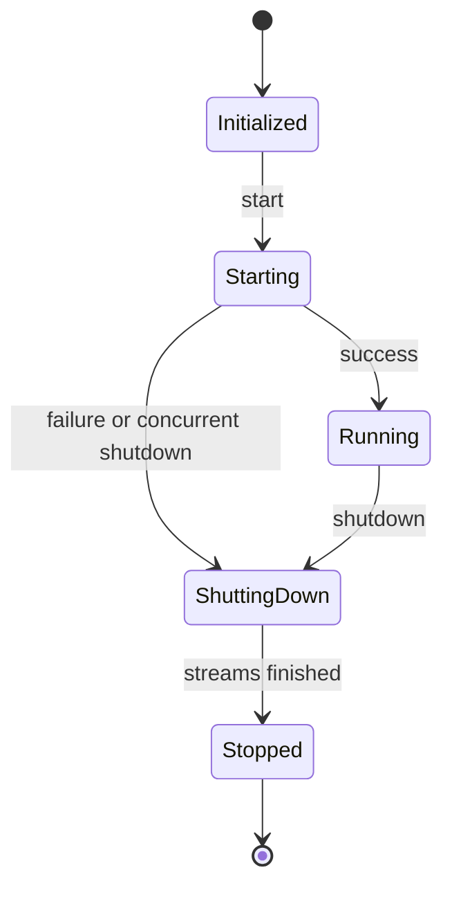

A successful `start()` is idempotent at facade boundaries. A failed start is
terminal for that system instance: every installed endpoint handler is cleared,
partially started transports are stopped in reverse order, pending and inbound
work are failed, and local targets are released. Retrying requires constructing
a new system with fresh transport instances. Returning to `initialized` after
calling terminal `shutdown()` on a transport would advertise a restartability
contract the transport cannot satisfy.

| Logical state | Storage owner | Isolation | Lifetime |
|---|---|---|---|
| System lifecycle | `ActorSystemCore` | `Mutex<LifecycleState>` | System lifetime |
| Local directory | `ActorDirectory` | `Mutex<DirectoryState>` | System lifetime |
| Pending calls | `PendingCallRegistry` | `Mutex<PendingCallState>` | Start through shutdown |
| Outbound send tasks | `ActorOutboundTaskRegistry` | `Mutex` plus per-task start gate | Send admission through completion/close/shutdown |
| Local/deadline operation tasks | `ActorInvocationTaskRegistry` | `Mutex` plus per-task start gate | Invocation admission through actual operation completion/shutdown |
| Call sequence | `ActorCallIDGenerator` | Atomic or Mutex | Transport session |
| Activation tasks | Host activation coordinator | Actor isolation | Host lifetime |
| Inbound work | Bounded scheduler | Actor isolation | Start through shutdown |
| Transport connection state | Concrete transport | Mutex or actor | Transport lifetime |

The implementation review matrix must map each logical state across profiles.
The accepted matrix is:

| Logical state | Native storage / isolation | Standard WASM storage / isolation | Embedded WASM storage / isolation | Read and mutation entry points | Shutdown / release |
|---|---|---|---|---|---|
| Core lifecycle | `Mutex<LifecycleState>` | Same | Same | `start`, `requireRunning`, `shutdown` | Idempotent transition to stopped |
| Directory | `Mutex<DirectoryState>` | Same | Same | `register`, `target`, `unregister`, `removeAll` | Remove all targets; release after lock |
| Pending calls | `Mutex<PendingCallState>` | Same | Same | register, complete, fail, fail-by-transport-and-endpoint | Fail exactly once and cancel timers |
| Outbound sends | `2 × maximumInFlightCalls` `Mutex` registry plus start gates | Same | Same | invocation/control admission, finish, endpoint close | Stop admission and cancel; close transports to unblock I/O; then join |
| Local/deadline operations | Core-owned `Mutex` registry plus start gates | Same | Same | local start, inbound deadline start, actual completion, shutdown | Retain cancellation-noncooperative work until completion; shutdown cannot complete while registered actor code remains |
| Call sequence | `Mutex<CallIDState>` or one verified atomic contract | Same | Same | activate once, monotonic `next` | Session ends with system |
| Inbound scheduler | actor isolation | Same | Same | submit, cancel, finish, bounded replay, shutdown | Cancel and join active/replay tasks; clear retained outcomes |
| Generated bootstrap registration | `Mutex<RegistrationState>` plus serialized first-use installation | Same | Not compiled | explicit registration, generated-provider lookup during `assignID` / `resolve`, or `ActorGroup` scene lowering before deferred activation | Seal before start; retain immutable registrations for system lifetime |
| Distributed local actors | `Mutex`-coordinated strong store | Same where hosting is supported | Not compiled | `actorReady`, `resolveLocal`, `resignID` | Release outside the lock |
| Embedded instances | Not compiled | Not compiled | `Mutex`-coordinated strong store | generated register, resolve, unregister | Release outside the lock |
| SwiftWeb activation graph | host actor isolation | host/client role dependent | host actor isolation where supported | authorize, activate, restore, invoke, save | Stop reminders, passivate, clear factories |
| SwiftWeb remote state | Host actor plus per-property bounded publication queue | Client consumes only | Host activation is not claimed | synchronous update, coalesced publish, async unbind | Drain publish before publisher finish |
| Transport state | Concrete adapter actor or `Mutex` | Same contract | Same contract or isolated interrupt bridge | start, receive queue, send, shutdown | Finish stream and unblock Core consumer |
| Browser WebSocket channel | Not compiled | Actor-isolated lifecycle plus bounded `AsyncThrowingStream`; `MainActor` owns JavaScript objects | Same | synchronous bounded callback yield, actor-isolated start/send/stop | Finish stream, detach callbacks, close socket |

No `hasFeature(Embedded)` branch may replace any “Same” entry with a raw
mutable stored property, no-op lock, weaker `Sendable` contract, or unchecked
owner/view lifetime.

The same storage and isolation primitive is used on Native, standard WASM, and
Embedded. `hasFeature(Embedded)` must not replace a mutex-protected state with a
raw mutable state.

No mutex critical section may contain:

- `await`;
- transport I/O;
- filesystem or persistence I/O;
- an external callback;
- continuation resume; or
- actor or event emission.

Pending continuations complete exactly once through a successful response,
remote failure, local cancellation, timeout, transport failure, or shutdown.
Shutdown is asynchronous and idempotent. It stops accepting new calls, cancels
inbound work, fails pending calls, shuts down transports, finishes incoming
streams, unregisters local targets, and releases actor references outside
mutexes.

Shutdown uses a two-phase ownership contract: **begin** records and starts one
framework-owned terminal task, while **join** waits for that task to finish.
Core-owned local, inbound, outbound, and endpoint-callback tasks carry a shared
`TaskLocal` owner identity. A shutdown requested from one of those tasks begins
terminal work and returns so the caller can leave its registry; an external
caller joins the same terminal task. Facades and the SwiftWeb host preserve the
same rule. This is required because cancellation is cooperative: excluding the
current task from a snapshot would let work escape shutdown, while joining the
current task would deadlock.

Transport endpoint callbacks execute in a separately owned callback task.
Awaiting the transport callback acknowledges registry admission only; the
transport consumer never owns or joins the accepted cleanup. Inline callback
delivery from `ActorTransport.send` therefore returns to the send task before
endpoint cleanup cancels and joins matching work. Host
invocations and reminder deliveries use the corresponding host owner identity,
so authorization, actor methods, reminder handlers, and reminder-store callbacks
may begin host shutdown without making the drain waiter depend on itself.

ISR and DMA callbacks are transport adapter boundaries. They place descriptors
or bytes into a target-appropriate bounded queue or SPSC ring. Core processing
begins only after task or thread context consumes that queue.

## SwiftWeb Responsibility Boundary

| `swift-actor-system` | SwiftWeb |
|---|---|
| Actor identity | Scene binding |
| Invocation and result frame | `@RemoteActor` injection |
| Portable codecs | `.actor` and `ActorGroup` |
| Local target directory | `EnvironmentValues` propagation |
| Pending call correlation | Actor authorization policy |
| Router SPI | Virtual activation policy |
| Transport SPI | Passivation |
| System lifecycle | `ActorStorage` and persistence |
| Schema descriptors | Reminders |
| Distributed adapter | `RemoteState` publishing |
| Embedded twin support | HTTP and WebSocket adapters |

SwiftWeb-specific behavior moves from the facade implementation into a
`SwiftWebActorHost`, while `WebActorSystem` remains the single owner that
composes the host with its Core-backed implementation. `AppRuntime` owns the
application use-lifetime of the facade; it does not reach through the facade to
sequence host internals.

```text
AppRuntime
└── WebActorSystem
    ├── ActorSystemCore
    └── SwiftWebActorHost
        ├── scene bindings
        ├── authorization
        ├── activation
        ├── persistence
        ├── passivation
        ├── reminders
        └── remote state

LegacyActors only:
AppRuntime
└── LegacyWebActorSystem (explicit compatibility lifetime)
```

The SwiftWeb inbound execution order remains:

```text
validate frame
-> authorize
-> resolve or activate
-> restore persistent state
-> run activated hook when required
-> invoke actor method
-> save persistent state
-> encode response
-> perform passivation work outside locks
```

A persistence save failure fails the invocation. It is not converted to a
successful response.

Virtual activation is address-preserving. The host places the requested
`ActorAddress` in one activation-scoped `TaskLocal`; the SwiftWeb identity
source consumes that address before delegating ordinary actor construction to
the user-supplied fallback source. Native and Embedded host construction use
the same rule. A factory must verify that the created actor's ID is exactly the
requested address; a mismatch is passivated immediately and reported as
`activationFailed` rather than entering the active-actor directory under a
false key.

### `SwiftWebActorHost` contract

`SwiftWebActorHost` conforms to `ActorInboundInvocationInterceptor`. It owns
SwiftWeb policy and invokes the single-use execution capability supplied by
Core exactly once.

```swift
public actor SwiftWebActorHost: ActorInboundInvocationInterceptor {
    public func intercept(
        _ invocation: ActorInvocation,
        context: ActorInvocationContext,
        execution: ActorInvocationExecution
    ) async throws -> ActorInvocationResult

    public func register(_ factory: SwiftWebActorFactory) throws
    public func unregister(actorType: ActorTypeID)
    public func shutdown() async
}
```

The exact public spelling may evolve, but the ownership and order may not.

| Host state | Owner | Key | Isolation | Completion rule |
|---|---|---|---|---|
| Scene bindings | SwiftWeb rendering scope | Scene/binding identity | Existing scene isolation | Removed with scope |
| Authorization policy | Host | Actor type and method | Host actor | Must complete before activation |
| Actor factories | Host | `ActorTypeID` | Host actor | Duplicate registration fails |
| Activation single-flight | Host | `ActorAddress` | Host actor | One construction per address |
| Persistent state | `ActorStorage` implementation | `ActorAddress` | Storage contract | Restore before invocation; save after success |
| Passivation policy | Host | `ActorAddress` | Host actor | Unregister before releasing actor |
| Reminder registrations | Host/reminder backend | `ActorAddress` and reminder ID | Host actor/backend | Cancel or transfer during shutdown |
| Remote state publishers | Host | Actor address and state key | Existing publisher isolation | Finish subscribers during passivation/shutdown |

The inbound host algorithm is:

1. Decode transport metadata into a bounded `SwiftWebActorInvocationContext`.
2. Authorize actor type, identity, method, origin, and application principal.
3. Resolve an exported local actor or join/start activation for the exact
   address before claiming the execution capability.
4. During activation, create the actor using its generated factory, restore
   persistent state, register it atomically, and run the activated hook.
5. Call the execution capability exactly once.
6. Persist successful state changes before returning the result.
7. Schedule passivation and external callbacks after leaving isolation or lock
   scopes that protect runtime state.

The per-actor invocation gate is cancellation-aware. A cancelled waiter is
removed from the queue and fails with `ActorSystemError.cancelled`; if
cancellation races with ownership transfer, the waiter releases the acquired
gate before failing. The host also releases the matching pending-invocation
reservation when gate acquisition fails, so cancellation cannot execute later,
leak admission capacity, or keep an actor permanently busy.
The host bounds the combined in-flight invocation and reminder-delivery count,
which also bounds the aggregate population of per-actor gate waiters. Metadata
decoding uses the Core-validated buffer length as its total bound and preserves
the adapter's 1,024-byte per-field limit instead of imposing a conflicting
fixed total size.

The reminder-store contract owns asynchronous `shutdown()`. Host shutdown first
detaches the store so newly retained reminder handles fail explicitly, then
cancels and joins the store's pending delivery tasks before actor passivation.
The in-process implementation has a fixed pending-task bound; rescheduling may
temporarily retain the cancelled generation until its task exits, and admission
fails with `ActorSystemError.overloaded` rather than exceeding that bound.

Each `@RemoteState` property owns a bounded publication queue. A synchronous
write may leave one publish executing and one latest value pending; additional
writes coalesce into that latest value because this is state replication, not
an event stream. Passivation removes the binding, drains both slots, and only
then calls the publisher's actor-level `finish`, so a late untracked publish
cannot appear after subscriber completion.

Authorization, restore, activation, invocation, and save failures remain
distinct typed failures. A failure never falls through to another transport or
the legacy JSON path.

Factories registered by `ActorGroup` may retain the system facade for the host
lifetime. `WebActorSystem.requestShutdown()` therefore stops host admission,
requests Core and transport termination, and only then finalizes host actors,
factories, reminders, state publishers, and policies. The facade's termination
ticket completes only after this whole sequence. `AppRuntime` requests and joins
that opaque ticket. When the explicit `LegacyActors` trait is enabled, it also
aggregates the separately owned legacy system ticket. Correctness does not
depend on `deinit`.

Shutdown persistence is a failure-bearing contract. All active actors are
offered passivation and all owned resources are released even when a save
fails, but the shared termination ticket reports the first persistence failure.
A successful shutdown therefore means required state saves completed; a failed
shutdown still means terminal cleanup was attempted for every owned resource.

### `AppRuntime` lifecycle

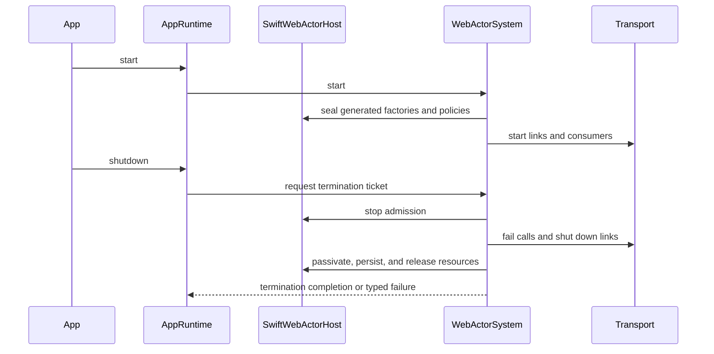

`start()` and `shutdown()` are asynchronous. Repeated `start()` after successful
startup and repeated `shutdown()` are idempotent at the `AppRuntime` boundary.
A failed start performs terminal cleanup; the same runtime is not restarted. A
partial transport start is rolled back in reverse order. The runtime does not
serve actor endpoints until the generated bootstrap, host policy, session
identity, and every required transport have started successfully.

Host-neutral WebSocket close-handler registration is asynchronous. If closure
already occurred, registration awaits immediate handler delivery rather than
creating an unowned callback task that could outlive the connection scope.

On the Native host, `HTTPServerAppInstallation` owns the listener task rather
than requiring its caller to retain and cancel an unrelated task handle.
`shutdown()` first cancels and joins that listener scope, then stops the
rendered app and its actor runtime. Caller cancellation of `serve()` also
cancels the owned listener task. Repeated `serve()` calls fail explicitly.

### SwiftWeb transport adapters

SwiftWeb transport adapters translate bytes and connection metadata; they do
not know Codable argument types, actor implementations, or request-response
correlation semantics.

| Adapter | Endpoint representation | Incoming metadata | Reply behavior |
|---|---|---|---|
| HTTP server | Bounded logical peer token | Authenticated request context encoded in bounded host metadata | `(endpoint, callID)` selects one duplicate waiter response at a time |
| HTTP client/fetch | Remote URL/route token | Client transport metadata | Response bytes enter the same transport stream as a result frame |
| WebSocket | Connection/session token | Authenticated connection context | Frames are sent on the selected live connection |
| UART/BLE/custom | Driver-specific stable endpoint token | Target-specific bounded metadata | Adapter queue delivers an owned frame to the device link |

The native WebSocket path is one production path, not a second actor protocol:

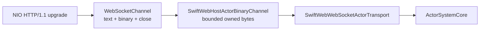

`SwiftWebNIOHTTPServer` performs RFC 6455 negotiation on the same listener as
ordinary HTTP routes. HTTP and WebSocket matchers are distinct, so a GET route
and an upgrade route may intentionally share a path. Fragment aggregation and
message size are bounded before bytes enter SwiftWeb. `NIOWebSocketChannel`
owns control-frame handling, UTF-8 validation, binary delivery, close
notification, and outbound backpressure. The host-neutral
`WebSocketChannel` exposes text and binary operations; actor code sees neither.

The actor endpoint at `/_swiftweb/actors/socket` validates the request origin,
loads the request session, assigns a unique connection endpoint, and encodes
the authenticated principal, session, remote address, and peer identifier into
bounded trusted metadata. The transport binds replies to that exact endpoint.
The live endpoint/consumer registry is bounded by
`maximumTransportEndpoints`; a connection beyond that bound fails as
`overloaded` before a channel task is installed.
Malformed, oversized, terminated, or overflowed channels fail explicitly and
are detached; they are never retried over HTTP or interpreted as legacy JSON.

The HTTP adapter uses two bounded identities. Its current SwiftWeb binding
derives the stable cancellation identity from principal and server session; a
host with tenant isolation must add its trusted tenant identifier to that
identity. The authorization identity uses the complete trusted invocation
metadata, including network context. Peer identities, authorization identities,
and metadata are rejected at the adapter boundary before queue admission when
they exceed the configured identity bound. The
latter maps equivalent requests to the same active Core endpoint, so replay
deduplication never bypasses a changed authorization context. The former maps a
cancellation back to every matching active endpoint even when an ordinary HTTP
connection change alters its network metadata. A different principal/session
cannot borrow those endpoints. The request transport
retains multiple response continuations for duplicate waiters, cancels the
underlying invocation only when its last waiter is cancelled, and evicts only
inactive peer registrations when its bounded endpoint cache is full. Cache
eviction ends that transport-level deduplication window; exactly-once execution
outside the retained window is not claimed.

Task cancellation is ordered against request admission. If an invocation frame
was accepted by the inbound stream, cancellation is emitted only after that
frame and only when the last waiter has left. If admission failed or cancellation
won before the invocation was emitted, the transport resumes the waiter with a
typed failure without emitting a cancellation frame that could affect another
request reusing the same call ID.

Core timeout completion similarly removes and resumes the pending call without
cancelling the timeout task itself. That task remains uncancelled while it waits
for invocation admission and emits the best-effort cancellation frame in send
order.

The multiplexer assigns a monotonic registration generation to every attached
channel. Consumer tasks, decoded inbound frames, and termination callbacks must
match both endpoint and generation before mutating channel state. This prevents
a late close from an old socket from removing or injecting bytes into a newer
socket that reused the same endpoint token. A start or attach operation also
rechecks phase and generation after every channel-level suspension; concurrent
shutdown is terminal and cannot resurrect the transport as running.
Endpoint termination is delivered to Core before the corresponding consumer
task is cancelled. The notification runs in an independently owned task, while
the consumer remains in the transport registry until notification and channel
cleanup finish; concurrent shutdown therefore cancels and joins it instead of
orphaning cleanup. This prevents cancellation from interrupting failure
propagation to the pending-call and inbound-work registries.

Replies always use the endpoint carried by the inbound frame. A new,
host-initiated call to a browser actor requires an application-installed
`ActorRouter` that maps that actor address to an authenticated live connection
endpoint. The default host router rejects such calls; the runtime never guesses
a connection from a principal, session, or actor identity. Disconnect removes
the endpoint from the transport, so a stale application route fails explicitly.
This keeps multi-tab and multi-device connection selection in host policy rather
than embedding it in the wire protocol.

The standard and Embedded browser profiles use
`BrowserSwiftWebActorBinaryChannel`. JavaScript `ArrayBuffer` ownership is
confined to a `MainActor` driver, copied once at the JS/WASM boundary into an
owned `ActorByteBuffer`, then delivered through the same bounded channel
contract as Native. The synchronous JavaScript message callback yields directly
into that bounded stream; it does not create one unbounded actor-hop task per
frame. Explicit shutdown clears JavaScript callbacks and closes
the socket; lifecycle correctness does not depend on `weak`, `unowned`, or
`deinit`. Open/close races resolve to either a running channel or a typed start
failure, and a full inbound queue fails as `overloaded` rather than being
reported as an ordinary disconnect. The former text/JSON browser channel is
compiled only for the non-Embedded compatibility path.

Generated client modules export `swiftweb_shutdown` and
`swiftweb_shutdown_status`. The synchronous shutdown export starts the owned
async cleanup and reports `pending`; JavaScript polls the status export until
the actor system, transport, socket callbacks, and retiring component runtimes
have actually finished. Navigation bootstrap swaps new component runtimes in
only after their bootstrap succeeds and then shuts down the superseded runtimes.
HMR retains the previous WASM instance until the whole replacement batch
commits, awaits its terminal status, and only then releases the old instance and
JavaScriptKit runtime. Failed staging shuts down only the new instances and
restores the still-running previous generation.

All byte-oriented adapters use `ActorFrameCodec` at their boundary:

```text
network or device bytes
    -> frame bounds validation and decode
        -> ActorInboundFrame
            -> ActorSystemCore.receive
                -> ActorTransport.send
                    -> frame encode
                        -> network or device bytes
```

The new binary endpoint uses a distinct media type such as
`application/vnd.swift-actor-frame`. The existing JSON invocation endpoint is
owned by `ActorSystemCompatibility`; content negotiation must never silently
reinterpret malformed binary input as a legacy JSON call.

### Embedded host projection and lifecycle

Embedded host generation and transport installation are deliberately separate:

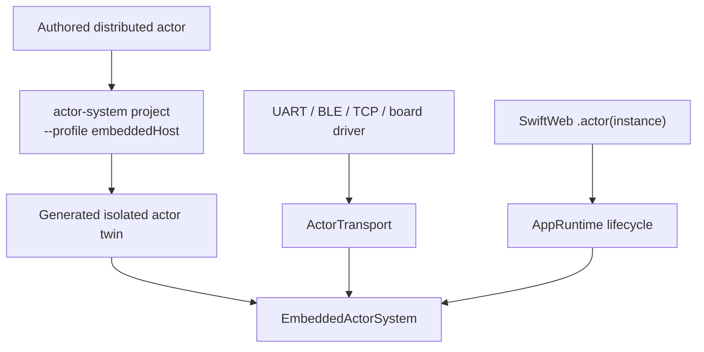

An Embedded host twin registers its concrete local instance and generated
invocation target with the supplied `EmbeddedActorSystem`. A SwiftWeb
`ActorScene` marks the actor runtime as required; `AppRuntime` starts the
system before serving work and shuts it down explicitly. The application may
provide that configured system through `App.actorSystem`, preserving the same
application-facing actor method surface while a board package selects its
`ActorTransport`.

SwiftWeb virtual activation (`ActorGroup`, persistence, passivation, and
reminders) depends on the Native `SwiftWebActorHost` and is not claimed for an
arbitrary Embedded board. An Embedded deployment hosts explicitly constructed
generated actors unless it supplies a target-specific host policy layer. The
absence of that layer is an explicit capability boundary, not a no-op factory
or a fallback to the legacy runtime.

## Legacy Compatibility

`swift-actor-runtime` remains available during migration, but it is no longer
the architectural core.

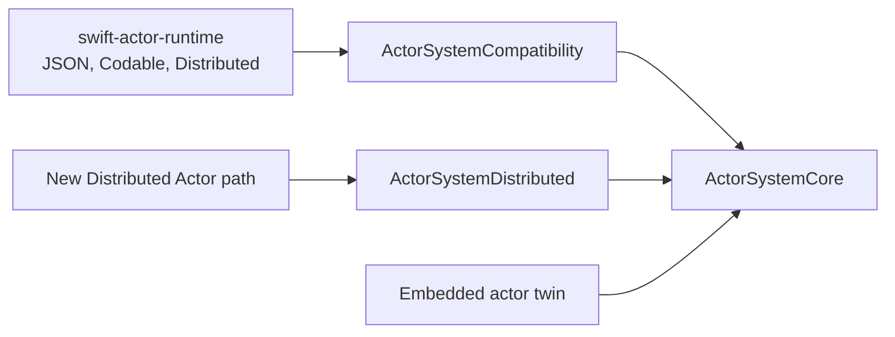

Compatibility rules are:

- Compatibility is enabled only by the explicit `LegacyActors` trait; enabling
  `Actors` alone never links `ActorSystemCompatibility` or `ActorRuntime`.
- Existing `@Resolvable` and `@ResolvableActor` applications keep using the
  legacy host path during the migration window by enabling `LegacyActors`.
- Generated standard and Embedded WASM clients reject legacy protocol
  existential bindings with a typed materialization error. Browser clients must
  migrate `@RemoteActor` properties to the concrete distributed actor type.
- `LegacyWebActorSystem` has one admission state and one in-flight drain. Its
  terminal request rejects new invocation, activation, and registration work,
  joins admitted work, gracefully passivates active virtual actors, persists
  their state, and then releases registries and references.
- A legacy reminder store is installed with explicit `owned` or `borrowed`
  resource ownership. Shutdown cancels and joins only an owned store; both
  registrations are detached from the stopped system. The legacy transport is
  borrowed because the compatibility protocol has no lifecycle requirement.
- Legacy shutdown persistence failures are retained on the shared termination
  ticket after best-effort passivation and complete resource release; they are
  not converted into success.
- New concrete actor bindings use the new descriptor and binary frame path.
- New resolution failure does not silently fall back to a legacy resolver.
- Legacy JSON and new binary frames use distinct endpoints or content types.
- The compatibility gateway has explicit pending-call and inbound-buffer
  bounds, rejects oversized identity, argument, payload, and metadata fields
  before descriptor lookup, validates each reply endpoint, and emits
  cancellation only after the corresponding invocation entered Core.
- Legacy support is deprecated only after the new Native, standard WASM, and
  Embedded execution paths pass behavioral verification.
- Removal occurs in a later major release with a documented migration window.

## SwiftWeb Migration Plan

| Phase | Change | Source status | Completion condition |
|---|---|---|---|
| 0 | Compiler target extraction | Present | Every fixture maps one source method to one opaque compiler target under the pinned toolchain |
| 1 | Implement `ActorSystemCore` | Present | Loopback success, failure, cancellation, overload, duplicate, deadline, and shutdown behavior pass |
| 2 | Add Distributed adapter | Present | A real concrete distributed actor executes remotely through compiler thunks and Core |
| 3 | Add portable binary codec | Present | Native fixtures round-trip, reject invalid input, and match Embedded bytes |
| 4 | Change injection to concrete actor types | Present with legacy coexistence | `@RemoteActor var counter: Counter` resolves and invokes without legacy fallback |
| 5 | Generate standard WASM client projections | Present | Browser client invokes without server implementation code |
| 6 | Generate Embedded actor twins | Client and host generators present | Embedded client and host compile, link, and communicate bidirectionally |
| 7 | Move SwiftWeb host policies out of `WebActorSystem` | Present | Authorization, activation, persistence, passivation, reminders, and state behavior pass on the new path |
| 8 | Add legacy gateway | Present | Old JSON callers work only through the explicit compatibility path |
| 9 | Deprecate legacy declaration macros | Partial | Migration precedence and the later removal release are documented |

The SwiftWeb implementation delta is mapped by responsibility, not by a
mechanical rename:

| Current area | Implemented source change | Remaining verification or delta | Preserved behavior |
|---|---|---|---|
| `SwiftWebRuntime/Actors/WebActorSystem.swift` | Facade owns and composes `SwiftActorSystem` with `SwiftWebActorHost`, including Host → Core → Host shutdown ordering | Compiler-thunk and direct facade lifecycle tests | Compiler-facing actor semantics and one host owner |
| `Core/App/AppRuntime.swift` | Owns the facade application lifetime and, only with `LegacyActors`, aggregates the explicit compatibility system termination | Prove admission drain and partial-start rollback | Application runtime lifecycle without host-internal reach-through |
| Actor invocation endpoints | Added bounded binary endpoint and explicit legacy JSON endpoint | Prove content-type isolation and malformed-frame behavior | Request authentication and explicit failures |
| `Core/App/ActorGroup.swift` | Registers concrete factories by `ActorTypeID` | Prove activation single-flight, transient scope, LRU, and passivation races | One virtual actor per logical identity |
| Scene rendering/binding | Binds concrete references and generated address descriptors | Prove nested scope precedence and duplicate handling | Environment propagation and `.actor(...)` behavior |
| `@RemoteActor` expansion | Resolves a concrete `ActorSystemReference` | Compile generated expansion on standard and Embedded WASM | Transport-independent property access |
| WebSocket actor transport | Native NIO and standard/Embedded browser adapters use the generic binary channel; the actor socket installs bounded authenticated metadata and the legacy JSON channel remains separate | Compile and run binary echo, actor invocation, overload, malformed-frame, close, and reconnect fixtures | Authenticated connection selection |
| Persistent actor storage | Uses stable `ActorAddress`-derived persistence keys on the new host | Migration strategy for existing legacy keys and failure/race tests | Restore/save ordering and failure contract |
| Generated WASM manifest | Selects `ActorSystemDistributed` or `ActorSystemEmbedded` | Build/link artifact audit | Existing generated-package isolation |
| WASM source mirror | Applies declaration replacement and installs digest-owned generated sources | Verify no forbidden declaration/import survives Embedded projection | Preservation of unrelated application sources |
| Generated actor resolver registry | Installs generated bootstrap and concrete address resolvers; SwiftWeb discovers imported schemas across transitive local dependencies and resolved checkouts; generated bootstrap types declare dependency bootstraps and runtime registration traverses them transactionally | Prove compiled diamond-module registration | Deterministic client registration |

During migration, old and new endpoints may coexist. A binding or request is
classified once at its explicit entry point; it cannot fall back from the new
path to the old path after resolution, authorization, decoding, or invocation
fails.

The new path removes these requirements:

- `@Resolvable` service protocols;
- `@ResolvableActor(Protocol.self)`;
- compiler-generated `$Protocol` registries as SwiftWeb's primary binding
  representation; and
- reflection strings as actor contract keys.

## Verification Matrix

| Behavior | Native | Standard WASM | Embedded WASM |
|---|---:|---:|---:|
| Actor declaration or generated projection compiles | Required | Required | Required |
| Target alias mapping | Required | Required | Generated mapping |
| Local invocation | Required | Client projection does not host | Required for host twin |
| Remote invocation | Required | Required | Required |
| Portable codec fixture parity | Required | Required | Required |
| Typed throws rejected before generation | Required | Required | Required |
| Untyped application failure maps to `remoteFailure` | Required | Required | Required |
| System error parity | Required | Required | Required |
| Cancellation | Required | Required | Required |
| Timeout | Required | Required | Required |
| Duplicate call handling | Required | Required | Required |
| Shutdown race | Required | Required | Required |
| Concurrent directory access | Required | Required | Required |
| Callback re-entry | Required | Required | Required |
| Actor release outside lock | Required | Required | Required |
| Authorization failure | Required for SwiftWeb host | Required | Transport and host dependent |
| Activation single-flight | Required | Required | Required for host twin |
| Persistence save failure | Required for SwiftWeb host | Host dependent | Capability dependent |
| Compile and link with pinned SDK | Required | Required | Required |
| Runtime execution on target | Required | Browser runtime | Required where target execution is available |

Codec verification uses the same checked-in byte fixtures on all three
profiles. Host tests perform differential checks between Codable binary encoding
and generated Embedded encoding. Invalid lengths, overflow, truncated frames,
unknown fields, schema mismatches, and unsupported versions require explicit
failure assertions.

Synchronization verification covers simultaneous reads and writes, response
versus cancellation races, shutdown versus receive races, transport callback
re-entry, actor unregistration, and owner release. Host-supported sanitizer
runs supplement target-specific compile, link, and runtime tests.

## Implementation Gates

The architecture is accepted, but implementation must not be reported complete
until every gate below is resolved. “Source present” means an implementation
path exists but does not satisfy the gate by itself.

| Gate | Current evidence | Completion evidence |
|---|---|---|
| Exact compiler target extraction | Source and fixtures exist for controlled SIL extraction with no guessed fallback | Generated mapping from the pinned toolchain compiles and dispatches every fixture method |
| Core protocol and lifecycle | Core source implements frames, routing, scheduling, timeout, cancellation, and shutdown | Native, standard WASM, and Embedded compile/link plus success/failure/race behavior |
| Distributed execution | Adapter, codec registry, alias table, registrations, and `DistributedActorExecutionTests` source fixture exist; the fixture captures the compiler-emitted target rather than guessing it | The fixture compiles and a real concrete distributed actor executes remotely through compiler thunks and `executeDistributedTarget` on Native and standard WASM |
| Source-set selection | Profile generators, manifest selection, runtime-source mirroring, and declaration-level projection exist | Generated package proves original Distributed-only declarations are absent from Embedded compilation and only profile-valid actor products are linked |
| Actor twin semantics | Host/client twin source generation exists | Remote calls avoid the local executor; local calls preserve isolation and initializer/state semantics |
| Codec parity | Common primitive codec and generated codec source exist | Native Codable and Embedded generated codecs match the same checked-in byte fixtures |
| Client projection isolation | Client profile generation exists | Artifact/source audit proves no server state, local method body, secret, or server dependency is included |
| Dependency composition | Dependency schemas are canonicalized and recorded in manifests; SwiftWeb discovers imported schemas from contract locations across linked package roots, projects reachable client modules in dependency-first order, and emits matching generated-package target edges; generated bootstraps declare module dependencies; runtime traversal is deterministic, transactional, cycle-checked, and idempotent by logical identity | Static discovery fixtures and compiled diamond dependency fixtures prove every module is linked and installed once and conflicts fail explicitly |
| SwiftWeb host split | Facade, host, lifecycle, binary endpoint, concrete binding, activation, persistence, passivation, reminders, state, and cancellation-aware per-actor admission source paths exist | Their success, typed failure, ordering, cancellation, re-entry, and shutdown behavior pass on the actual production path |
| HTTP and WebSocket binary paths | The HTTP adapter binds retry/cancellation to a bounded trusted-peer endpoint and retains duplicate waiters; the WebSocket multiplexer, native NIO adapter, host channel, actor upgrade endpoint, and standard/Embedded browser adapter exist in source with bounded buffering, authenticated metadata, registration generations, and lifecycle race fixtures | Native and browser runtime fixtures prove binary invocation, retry deduplication, cancellation isolation, overload, malformed-frame, close, endpoint-selection, shutdown/start, and reconnect-generation behavior |
| Legacy isolation | Compatibility gateway and separately named legacy SwiftWeb types/endpoints exist | Legacy JSON is reachable only through the documented explicit compatibility endpoint/media type |
| Lifecycle parity | Package-level lifecycle source exists | Activation, persistence, passivation, transport closure, callback re-entry, cancellation, and shutdown races pass on actual paths |
| Toolchain contract | Repository pins the Swift 6.4 snapshot and matching SDK names | Logs identify the same toolchain tag, SDK tag, target triple, and Embedded platform implementation for generation/build/link/runtime |

### Remaining verification, dependency graph, and critical path

Host-side source, build, link, and behavioral verification is complete for the
current change set. The remaining work requires target runtime environments and
is split into independently reviewable deliverables.

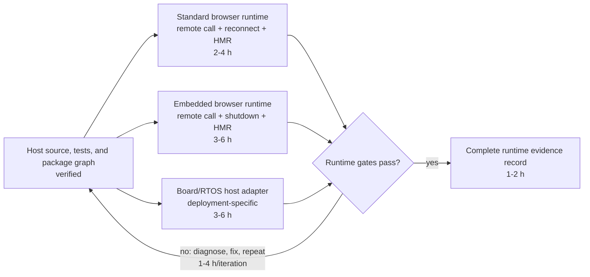

The critical path is browser runtime execution for both profiles and the
deployment-specific Embedded host adapter, followed by the runtime evidence
record. The loop converges only when every verification-matrix row has
target-appropriate evidence; reaching a time or iteration limit is not
convergence.

### Completion evidence record

When verification is authorized and executed, record the exact command,
toolchain identifier, Swift SDK identifier, target triple, platform
implementation, result, and relevant fixture in a durable verification record.
Do not replace this evidence with a statement that the package type-checks in an
editor or that generated strings look correct.

The project-specific build contract uses
`swift-6.4.x-DEVELOPMENT-SNAPSHOT-2026-08-14-a`, with `.swift-version` selecting
`6.4.x-snapshot-2026-08-14`. Any later baseline update must
advance the toolchain, standard WASM SDK, Embedded WASM SDK, generated package
defaults, documentation, and verification fixtures as one build contract.

The 2026-08-18 host verification built test products with the pinned `swift`
executable and executed each produced XCTest bundle through Xcode beta's
`xctest`, with the repository timeout guard set to 120 seconds. WASM verification
materialized the concrete CounterApp through `sweb prepare --runtime standard`
and `sweb prepare --runtime embedded`, then invoked `swift build --swift-sdk`
with the matching SDK identifier and an isolated scratch path. The Embedded
artifact is a WebAssembly MVP module and contains `swiftweb_alloc`,
`swiftweb_dealloc`, `swiftweb_bootstrap`, `swiftweb_start`,
`swiftweb_start_status`, `swiftweb_shutdown`, `swiftweb_shutdown_status`,
`swiftweb_dispatch_event`, `swiftweb_snapshot_state`,
`swiftweb_restore_state`, `swiftweb_response_len`, `swiftweb_response_copy`, and
`swiftweb_response_free`.

## Final Architecture

```text
Application source
    -> distributed actor declaration
        -> Native compiler implementation
        -> Embedded generated semantic twin
            -> ActorSystemCore
                -> local target directory
                -> ActorRouter
                    -> ActorTransport
```

This boundary preserves the Distributed Actor interface, removes RPC as the
public runtime abstraction, retains Codable-based Native authoring, enables an
Embedded-safe generated codec and dispatcher, and leaves a clean replacement
path when Swift eventually provides Distributed Actor support in Embedded
Swift.
