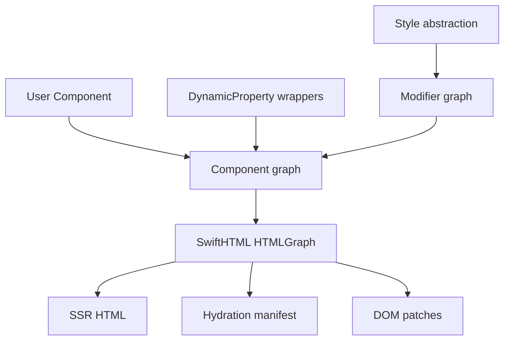
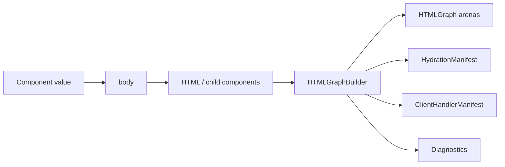
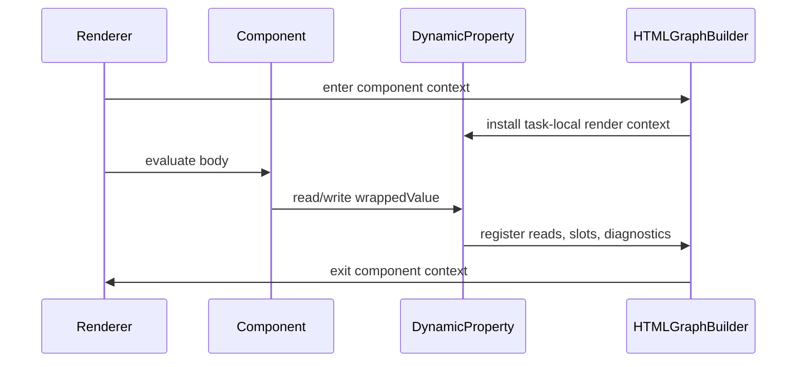
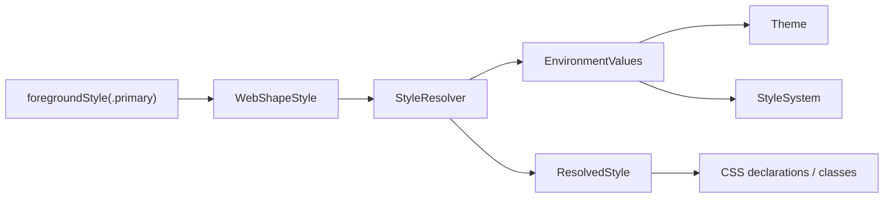
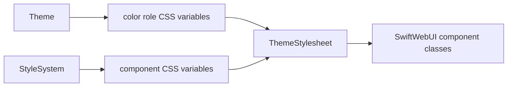

# SwiftWebUI Core Design

SwiftWebUI should follow SwiftUI's interface shape without copying platform-specific implementation details. The core model is a layered graph:



## Ownership

| Layer | Owner | Responsibility |
|---|---|---|
| Component graph | `SwiftHTML` | Component identity, child traversal, state slot registration, environment reads, hydration boundaries, diagnostics |
| DynamicProperty | `SwiftHTML` | Runtime-backed property wrappers used during render, hydration, and client updates |
| Modifier graph | `SwiftHTML` core + `SwiftWebUI` modifiers | Ordered modifier composition and lowering to attributes, wrappers, environment scopes, handlers, or layout metadata |
| Style abstraction | `SwiftWebUI` | SwiftUI-like style values resolved through `EnvironmentValues`, `Theme`, and `StyleSystem` into web-safe CSS output |

`SwiftWebUI` must not introduce a second renderer. It produces components and modifiers that lower into the existing `SwiftHTML` graph.

## Component Graph

The component graph is the semantic tree produced by `Component.body`. It is not the final DOM tree. The final render artifact remains the arena-backed `HTMLGraph`.



### Rules

| Rule | Design |
|---|---|
| `body` shape | `var body: some HTML { get }`; it is not a function |
| Identity | Component identity is derived from type, render path, and explicit keys |
| State lifetime | State is keyed by component identity plus property source location |
| Client boundary | `ClientComponent` owns state, event closures, and WASM hydration |
| Server boundary | `ServerComponent` may render inside a client boundary as a server slot |
| Diffing | Node fingerprints and keys drive graph diff; component identity drives state continuity |
| Output | Components lower to `HTMLGraph`; components do not render strings directly |

`HTMLNodeKind.component` is the hydration and diagnostic marker. It should not become a recursive public component tree.

## DynamicProperty

Dynamic properties are property wrappers whose value depends on the current render context. `@State`, `@Binding`, `@Environment`, `@Server`, and future runtime wrappers should share one lifecycle.



### Proposed protocol

```swift
public protocol DynamicProperty {
    mutating func update()
}
```

`update()` is the public lifecycle hook. Internal storage still comes from task-local render contexts because Swift cannot generally enumerate property wrappers on a component without macro assistance.

### Wrapper responsibilities

| Wrapper | Responsibility |
|---|---|
| `@State` | Owns client-local mutable state for `ClientComponent`; registers a state slot |
| `@Binding` | Provides explicit read/write projection into state or observable models |
| `@Environment` | Reads `EnvironmentValues`; records visibility for hydration diagnostics |
| `@Server` | Reads server-only capabilities; emits diagnostics if read inside client-owned render |

### Context model

| Context field | Purpose |
|---|---|
| `componentID` | Stable owner of state slots and dirty marking |
| `componentType` | Diagnostic readability |
| `path` | Render-path identity and diagnostics |
| `environment` | Current scoped values |
| `stateStore` | State slot storage |
| `phase` | Server render, client hydrate, or client update |
| `visibility` | Server-owned or client-owned evaluation |

Reading a dynamic property outside an installed render context should use a local fallback only where SwiftUI also permits detached construction. Development builds should emit diagnostics for unsafe reads.

## Modifier Graph

Modifiers must be ordered nodes. They are not just accumulated attributes on concrete component structs. This matters because SwiftUI modifier order is semantic:

```swift
Text("Title")
    .padding()
    .backgroundStyle(.surface)
```

is not equivalent to:

```swift
Text("Title")
    .backgroundStyle(.surface)
    .padding()
```

### Proposed types

```swift
public protocol ComponentModifier: Sendable {
    associatedtype Body: HTML

    @HTMLBuilder
    func body(content: ModifierContent) -> Body
}

public struct ModifiedContent<Content: HTML, Modifier: ComponentModifier>: HTML {
    public let content: Content
    public let modifier: Modifier
}

public struct ModifierContent: HTML {
    let build: @Sendable (inout HTMLGraphBuilder) -> HTMLNodeID
}
```

### Modifier categories

| Category | Lowering |
|---|---|
| Attribute | Merge into the nearest single element root when safe |
| Style | Resolve style values and emit CSS declarations or classes |
| Layout | Emit wrapper nodes when layout changes content geometry |
| Environment | Scope `EnvironmentValues` while building children |
| Event | Register handler records and emit hydration attributes |
| Accessibility | Emit semantic attributes, ARIA, or native HTML equivalents |
| Navigation | Bind route/history metadata to links or navigation containers |

`WebUIAttributeComponent` can remain as a low-level optimization, but public SwiftWebUI modifiers should work on any `HTML`, not only components that manually store `[HTMLAttribute]`.

## Style Abstraction

The detailed public style contract is defined in
[`SwiftWebUIStyleDesign.md`](SwiftWebUIStyleDesign.md). This section describes
the core primitives that support that contract.

SwiftUI has moved from color-specific APIs toward `ShapeStyle`. SwiftWebUI should do the same. `foregroundColor` should not be a new public API; `foregroundStyle` is the primary API.



### Proposed protocols

```swift
public protocol WebShapeStyle: Sendable {
    func resolve(in context: StyleResolutionContext) -> ResolvedStyle
}

public struct StyleResolutionContext: Sendable {
    public let theme: Theme
    public let styleSystem: StyleSystem
    public let colorScheme: ColorScheme
    public let layoutDirection: LayoutDirection
    public let controlState: ControlState
}

public struct ResolvedStyle: Sendable, Equatable {
    public var cssValue: String
    public var style: Style
    public var classNames: [String]
}
```

### Public API direction

| API | Notes |
|---|---|
| `.foregroundStyle(_:)` | Text/icon foreground style |
| `.backgroundStyle(_:)` | Background style |
| `.tint(_:)` | Accent style for controls |
| `.border(_:width:)` | Shape-style border |
| `.shadow(...)` | Effect style |
| `.font(_:)` | Typography abstraction, not raw CSS string |
| `.controlSize(_:)` | Environment-backed control sizing |
| `.buttonStyle(_:)` | Semantic button treatment selection resolved by the active stylesheet |
| `.textFieldStyle(_:)` | Future semantic field treatment selection resolved by the active stylesheet |

Raw CSS strings should remain low-level SwiftHTML escape hatches, not the SwiftWebUI API. When SwiftWebUI needs to emit concrete CSS properties, it should use SwiftHTML `Style` helpers so standard CSS property names remain autocompleteable and shared across atomic declarations and stylesheet rules.

## Environment, Theme, And StyleSystem

Theme is an environment value:

```swift
content.environment(ThemeEnvironmentKey.self, .system)
```

StyleSystem is also an environment value:

```swift
let style = StyleSystem(id: "brand") {
    .surface {
        .containerRadius(18)
        .containerShadow(.none)
    }
    .button {
        .radius(999)
    }
}

content
    .environment(ThemeEnvironmentKey.self, .system)
    .environment(StyleSystemEnvironmentKey.self, style)
```

There should be no `ThemeProvider`, `StyleSystemProvider`, or separate context modifier. Environment is the single propagation mechanism for values used by both server rendering and client hydration.

| Value | Responsibility | Defaulting model |
|---|---|---|
| `Theme` | Semantic color mode and color role values | Built-in `.system`, `.light`, and `.dark` values |
| `StyleSystem` | Component-wide shape, spacing, material, control, and motion values | Complete `.default`; third-party styles override only changed token groups |

`Theme` and `StyleSystem` are intentionally separate. Dark and light mode change color roles. StyleSystem changes component language, such as Material-like controls or glass-like surfaces. A custom StyleSystem must be built by overriding `StyleSystem.default`, so every component keeps a defined fallback token.



When both values are set through modifiers, place `styleSystem` outside the theme scope:

```swift
content
    .environment(ThemeEnvironmentKey.self, .dark)
    .environment(StyleSystemEnvironmentKey.self, .liquidGlass)
```

Modifier order is semantic. The stylesheet scope created by `theme` reads outer environment values, then renders the scoped content.

| Visibility | Use |
|---|---|
| `serverOnly` | Database handles, services, request-only values |
| `client` | Codable values that can enter hydration snapshots |
| `runtimeOnly` | Values supplied separately by browser runtime |

## Implementation Direction

1. Add `DynamicProperty` as the shared lifecycle marker in `SwiftHTML`.
2. Make `State`, `Environment`, and `Bindable` conform to it.
3. Introduce `ModifiedContent`, `ModifierContent`, and `ComponentModifier`.
4. Move public SwiftWebUI modifiers from attribute-only mutation toward modifier wrappers.
5. Add `WebShapeStyle`, `ResolvedStyle`, and `StyleResolutionContext`.
6. Replace public `foregroundColor` with `foregroundStyle`.
7. Keep raw `HTMLAttribute`, `Style.custom(_:_:)`, and `Stylesheet` APIs as escape hooks below the SwiftWebUI layer.
8. Keep `StyleSystem.default` complete and make presets or third-party styles override that default through the builder DSL.

## Current Implementation

| Area | Implemented |
|---|---|
| Modifier graph | `ComponentModifier`, `ModifierContent`, and `ModifiedContent` live in `SwiftHTML`. |
| Style abstraction | `WebShapeStyle`, `SemanticShapeStyle`, `CSSShapeStyle`, `ResolvedStyle`, and style modifiers live in `SwiftWebUI`. |
| Style modifiers | `foregroundStyle`, `backgroundStyle`, `tint`, and `border` are available on all `HTML`. |
| Stylesheet output | SwiftHTML owns `Style`, generated standard CSS property helpers, `Stylesheet`, `CSSRule`, and `@StylesheetBuilder`; SwiftWebUI uses them for typed theme CSS. |
| Style system | `StyleSystem`, built-in presets, environment propagation, and builder-based overrides live in `SwiftWebUI`. |
| Control environment | `isEnabled`, `controlSize`, `controlState`, `tint`, `buttonStyle`, and `pickerStyle` are environment values. |
| Control styles | `ButtonStyleKind` and `PickerStyleKind` select semantic treatments whose CSS lives in `ThemeStylesheet`. |
| Binding-first controls | `TextField`, `Toggle`, `Slider`, `Stepper`, and `Picker` accept `Binding` values. |
| Typography | `Font`, `FontWeight`, and `FontDesign` provide SwiftUI-style text modifiers. |
| Navigation | `NavigationStack`, `NavigationLink`, `NavigationPath`, and `navigationTitle` are graph-level hooks. |
| Accessibility | Common accessibility modifiers map to semantic/ARIA attributes. |
| Page layout | `GridSystem` and `Pane` own responsive inline inset, columns, gutters, pane spans, and page vertical rhythm; `.frame(maxWidth:)` owns outer width constraints. |

This keeps SwiftHTML responsible for rendering correctness and keeps SwiftWebUI responsible for developer-facing UI ergonomics.
