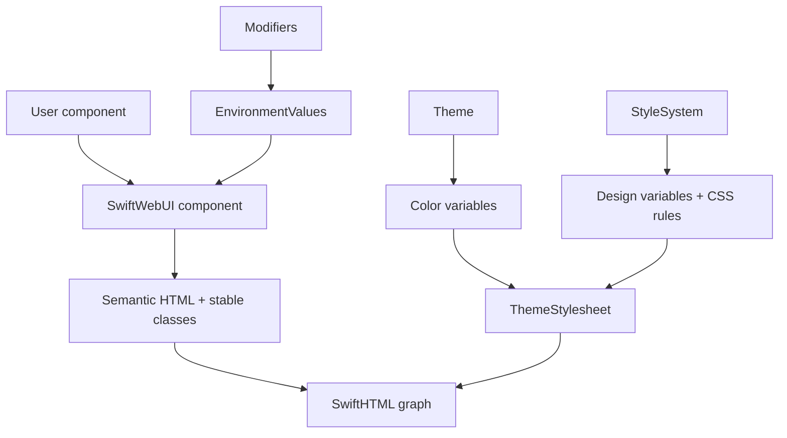
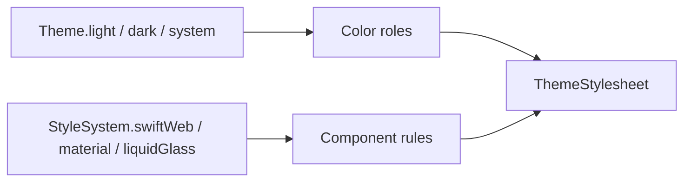
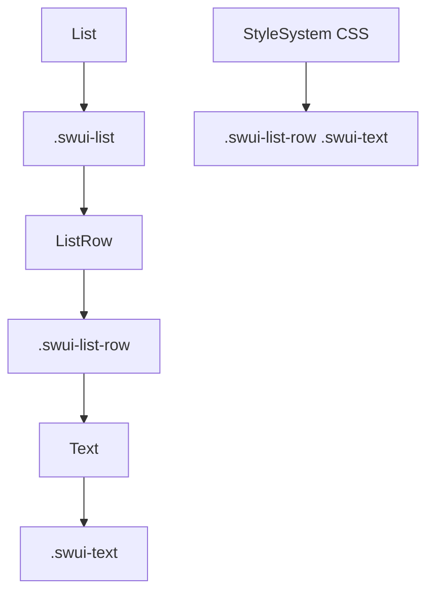
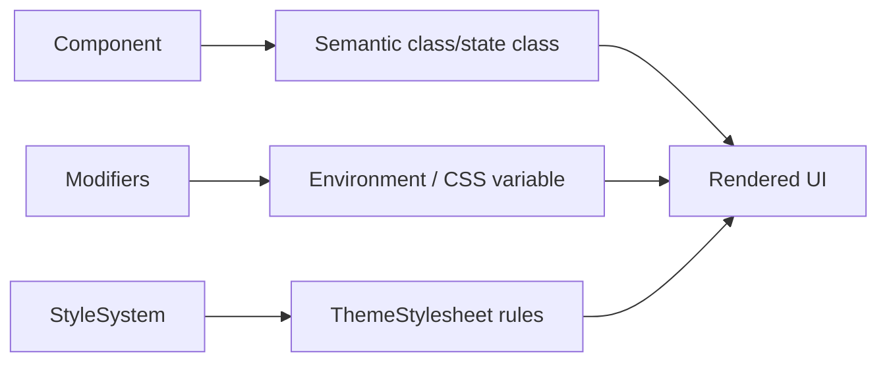

# SwiftWebUI Style Design

SwiftWebUI style is owned by `StyleSystem`. Components emit semantic HTML,
stable class names, state classes, and environment-derived CSS variables.
`StyleSystem` and `ThemeStylesheet` own the CSS rules that make those semantics
visible.

## Goals

| Goal | Requirement |
|---|---|
| Swift-like API | Public styling follows SwiftUI naming where it maps cleanly to the web. |
| CSS-owned design | Component appearance is declared in `StyleSystem`/`ThemeStylesheet`, not in component-local style implementations. |
| Contextual styling | A component can look different inside another component through CSS selectors and scoped environment values. |
| Complete fallback | `StyleSystem.default` defines every token required by built-in rules. |
| Third-party styles | Custom systems override default tokens and may provide additional rules without replacing component semantics. |
| Web correctness | Output remains semantic HTML with accessible native controls where possible. |
| Runtime safety | Environment values used during hydration are codable and registered. |

## Responsibility Boundaries

| Layer | Owns | Must not own |
|---|---|---|
| `Theme` | Color scheme and semantic color role values. | Component shape, spacing, density, material recipe. |
| `StyleSystem` | Global design tokens, component CSS variables, component CSS rules, and contextual selectors. | Component behavior, bindings, services, routing, or event execution. |
| `ThemeStylesheet` | Lowering `Theme` + `StyleSystem` into typed `Stylesheet` rules. | Per-instance state storage or component graph traversal. |
| Modifier | Scoped environment values, semantic variants, state, layout, and accessibility wrappers. | Hard-coded visual recipes that bypass `StyleSystem`. |
| Component | Semantic structure, stable classes, state classes, bindings, ARIA/native attributes, and action intent. | Design-system CSS rules for itself or descendants. |
| SwiftHTML | HTML graph, attributes, event contracts, diffing, escaping, and hydration metadata. | SwiftUI-style component semantics. |

Spacing follows the same boundary:

| Design concern | Public API | Token owner |
|---|---|---|
| Component-local gaps and padding | `Space` and spacing-taking modifiers/components | `Theme.spacing` |
| Default stack rhythm | `VStack(spacing: nil)`, `HStack(spacing: nil)`, lazy stacks | `StyleSystem` `.root { .stackSpacing(...) }` |
| Page inline margins and responsive grid inset | `GridSystem` | `StyleSystem` `.root { .pageInlinePadding(...) }` |
| Page width constraint | `.frame(maxWidth:)` | Explicit numeric value supplied by the caller |
| Browser safe-area compensation | `safeAreaPadding`, `safeAreaInset`, `ignoresSafeArea` | CSS `env(safe-area-inset-*)` plus explicit user length |

`Space` must stay an atomic spacing scale. It must not include page layout
concepts such as responsive inline margins.

`Theme` and `StyleSystem` are intentionally separate:

## Style Resolution Order

Style resolution is CSS-first. Components contribute selectors; the style
system contributes visual rules.

| Step | Input | Output |
|---|---|---|
| 1 | Component configuration | Semantic state such as `isEnabled`, `controlSize`, selected value, bounds, and roles. |
| 2 | Component body | Stable classes such as `swui-list-row`, `swui-text`, `swui-control-large`, `swui-control-disabled`. |
| 3 | Environment modifiers | Scoped values such as `theme`, `styleSystem`, `tint`, `controlSize`, and semantic style kinds. |
| 4 | `ThemeStylesheet` | CSS variables, base component rules, state rules, and contextual selectors. |
| 5 | SwiftHTML | HTML graph, stylesheet output, hydration metadata, and SSR output. |

The component body may set CSS custom properties only for per-instance values
that come from modifiers or data, such as `--swui-control-tint`. It must not
encode the component's design recipe inline.

## Contextual Styling

SwiftUI changes child appearance based on container context. SwiftWebUI should
do the same through stable parent/child selectors and, when needed, scoped
environment values.

| Context | Rule owner | Example selector |
|---|---|---|
| Text inside list row | `StyleSystem` CSS | `.swui-list-row .swui-text` |
| Muted text inside list row | `StyleSystem` CSS | `.swui-list-row .swui-text-muted` |
| Button inside toolbar | `StyleSystem` CSS | `.swui-toolbar .swui-button` |
| Field inside form section | `StyleSystem` CSS | `.swui-section .swui-field` |
| Navigation link inside sidebar | `StyleSystem` CSS | `.swui-sidebar .swui-navigation-link` |

This avoids pushing container-specific styling into `Text`, `Button`, or other
leaf components.

## Public Styling Surface

| API | Role |
|---|---|
| `.foregroundStyle(_:)` | Applies a semantic foreground style wrapper. |
| `.backgroundStyle(_:)` | Applies a semantic background style wrapper. |
| `.tint(_:)` | Sets a scoped control accent value. |
| `.controlSize(_:)` | Sets a scoped control size class/environment value. |
| `.buttonStyle(_:)` | Selects a semantic button treatment that CSS resolves. |
| `.pickerStyle(_:)` | Selects a semantic picker treatment that CSS resolves. |
| `.environment(\.theme, ...)` | Color-mode and color-role scope. |
| `.environment(\.styleSystem, ...)` | Component design-language and CSS-rule scope. |

Raw `HTMLAttribute`, `Style.custom`, and raw SwiftHTML elements remain escape
hatches below SwiftWebUI. They are not the default way to author application UI.

## Modifier Responsibility Map

| Modifier family | Examples | Design layer | Contract |
|---|---|---|---|
| Attribute escape hatches | `id`, `class`, `data`, `aria`, `role`, `style`, `webStyle` | SwiftHTML escape layer | Allowed for exact HTML control; not the primary SwiftWebUI styling path. |
| Layout and sizing | `padding`, `frame`, `fixedSize`, `layoutPriority`, `aspectRatio`, `containerRelativeFrame`, `alignmentGuide`, `offset`, `position`, `zIndex` | Layout geometry | `frame` uses SwiftUI-style numeric values; CSS-unit modifiers use `Length`; component-local spacing uses `Space`; page/grid inset belongs to `GridSystem`. |
| Page grid layout | `GridSystem`, `Pane` | Page/grid layout | Owns responsive inline inset, columns, gutters, pane spans, and page vertical rhythm; width caps stay in `.frame(maxWidth:)`. |
| Safe area | `ignoresSafeArea`, `safeAreaPadding`, `safeAreaInset` | Browser viewport compensation | Combines CSS safe-area environment values with explicit user lengths; does not consume `Space` as page margin. |
| Shape and style | `foregroundStyle`, `backgroundStyle`, `background(_:in:)`, `overlay`, `border`, `tint`, `background(_: Material)`, `glassEffect` | Theme and StyleSystem | Resolves semantic style values through environment and stylesheet tokens. |
| Visual effects | `opacity`, `shadow`, `cornerRadius`, `clipShape`, `clipped`, `blur`, `brightness`, `contrast`, `saturation`, `grayscale`, `hueRotation`, `colorInvert`, `colorMultiply`, `blendMode`, `rotationEffect`, `scaleEffect` | Per-instance visual effect | May emit inline CSS for an explicit effect; must not encode component design recipes. |
| Typography | `font`, `fontWeight`, `fontDesign`, `bold`, `italic`, `monospaced`, `lineLimit`, `multilineTextAlignment`, `lineSpacing`, `truncationMode`, `allowsTightening`, `minimumScaleFactor`, `textCase`, `fontWidth`, `kerning`, `tracking`, `baselineOffset`, `underline`, `strikethrough`, `textSelection` | Typography | Owns text presentation only; no layout container or page spacing responsibility. |
| Control state and style | `disabled`, `controlSize`, `buttonStyle`, `pickerStyle`, `toggleStyle`, `textFieldStyle`, `labelStyle`, `listStyle`, `formStyle`, `menuStyle`, `progressViewStyle`, `gaugeStyle`, `tabViewStyle` | Environment-driven component variants | Propagates semantic state/style; controls lower the environment to classes and native attributes. |
| Text input and form semantics | `keyboardType`, `textContentType`, `submitLabel`, `textInputAutocapitalization`, `autocorrectionDisabled`, `focused`, `onSubmit`, `submitScope`, `onChange`, `focusable`, `searchable`, `searchSuggestions`, `searchScopes`, `searchTokens`, `searchCompletion` | Native form semantics | Lowers to HTML attributes, bindings, search scopes, and semantic data; no visual recipe ownership. |
| Events and lifecycle | `onAppear`, `onDisappear`, `task`, `onTapGesture`, `onLongPressGesture`, `onHover`, `onContinuousHover`, raw DOM event helpers | Behavior/runtime semantics | Attaches event contracts and runtime hooks; no design token ownership. |
| Accessibility | `accessibilityLabel`, `accessibilityHint`, `accessibilityValue`, `accessibilityHidden`, `accessibilityRole`, traits, actions, drag/drop points, `help` | Semantic accessibility | Maps intent to ARIA, role, title, and data attributes; no visual styling ownership. |
| Navigation and presentation | `navigationTitle`, `interactiveDismissDisabled`, presentation modifiers | Graph/presentation semantics | Records navigation or presentation intent; styling remains in components and stylesheet rules. |

## Component Taxonomy

SwiftWebUI components are grouped by user intent, not by implementation
convenience.

| Taxonomy | Components | Style contract |
|---|---|---|
| Layout | `GridSystem`, `Pane`, `VStack`, `HStack`, `ZStack`, `Grid`, lazy stacks, `ScrollView`, `Spacer`, `Divider` | Stable layout classes and spacing variables. |
| Text | `Text`, semantic `Text.as`, `Label`, code-oriented text | Stable text classes; contextual typography comes from CSS. |
| Controls | `Button`, `TextField`, `SecureField`, `TextEditor`, `Toggle`, `Slider`, `Stepper`, `Picker`, date/color pickers | Native attributes, state classes, and CSS variables for per-instance values. |
| Containers | `GroupBox`, `Section`, `List`, `ListRow`, `DisclosureGroup`, `Toolbar`, `Badge` | Parent context classes and surface/material classes. |
| Navigation | `NavigationStack`, `NavigationLink`, `TabView`, future split navigation | Route semantics, selected state, transition hooks, and context classes. |
| Presentation | Dialog, sheet, popover, alert, toast | Overlay semantics, focus hooks, dismissal state, and layering classes. |
| Status | `ProgressView`, `Gauge`, future skeleton/empty/error views | Progress semantics, state classes, and CSS variables. |
| Media | `Image` and future media controls | Sizing classes, fitting classes, alt text, and loading policy. |

Components created only to make a demo or Storyboard easier must live outside
the core public component set. If a component is public, it needs a stable
semantic purpose and a CSS contract.

## StyleSystem Rule Contract

Each styleable component follows this pattern:

| Contract part | Responsibility |
|---|---|
| Base class | Identifies the component, such as `swui-button` or `swui-stepper`. |
| Part class | Identifies component parts, such as `swui-stepper-value`. |
| State class | Identifies semantic state, such as `swui-control-disabled`. |
| Context class | Parent class that enables contextual selectors, such as `swui-list-row`. |
| CSS variable | Carries per-instance values, such as `--swui-control-tint`. |
| Stylesheet rule | Defines visual output using `StyleSystem` tokens and CSS selectors. |

The stylesheet is the source of truth for component appearance. A component
may select semantic classes, but it must not own a visual recipe object for its
own CSS.

## Token Model

The default token scale is rhythm-first:

| Semantic token | Default px alias | Primary use |
|---|---:|---|
| `Space.xsmall` | 4 | Optical half-step adjustments. |
| `Space.small` | 8 | Dense internal gaps. |
| `Space.medium` | 12 | Default stack and control-local gaps. |
| `Space.large` | 16 | Form, container, and readable group gaps. |
| `Space.xlarge` | 24 | Section and page vertical rhythm. |
| `StyleSystem` `.root { .pageInlinePadding(...) }` | `clamp(16px, 4vw, 24px)` | Responsive page inline inset through `GridSystem`; combine with `.frame(maxWidth:)` for capped layouts. |

Component tokens map semantic tiers to CSS variables. One-off raw values
require a component-specific reason and should live in stylesheet rules rather
than component bodies.

## Styling Gates

Every new or changed public component must pass these gates:

| Gate | Check |
|---|---|
| Semantic gate | The rendered HTML uses native elements and ARIA only where needed. |
| CSS ownership gate | Visual rules live in `ThemeStylesheet`/`StyleSystem`, not component-local style objects. |
| Context gate | Container-specific child styling is expressed through selectors or scoped environment values. |
| Theme gate | The component works in light, dark, and system themes. |
| StyleSystem gate | The component has defined fallback behavior under every built-in `StyleSystem`. |
| Control gate | Disabled, focus-visible, hover, and active states are legible. |
| Hydration gate | Client-visible environment values are registered in `ClientEnvironmentRegistry.swiftWebUI`. |
| Storyboard gate | Storyboard examples dogfood public SwiftWebUI APIs and do not add special styling paths. |

## Implementation Priorities

| Priority | Work |
|---|---|
| P0 | Ensure controls emit semantic classes/state classes and move visual recipes into stylesheet rules. |
| P0 | Add contextual rules for common combinations such as `Text` in `ListRow`. |
| P0 | Keep `StyleSystem.default` complete and ensure every built-in rule resolves without optional tokens. |
| P1 | Continue migrating control treatment names so they describe semantic variants rather than CSS ownership. |
| P1 | Classify public components and move demo-only helpers out of the core API. |
| P2 | Add presentation and navigation contextual rules for dialogs, sheets, tabs, split navigation, and sidebars. |
| P2 | Add visual regression coverage for Storyboard entries across built-in style systems and container contexts. |

This document is the contract for SwiftWebUI style work. Component-specific
implementation details can evolve, but component appearance remains owned by
the active `StyleSystem`.
