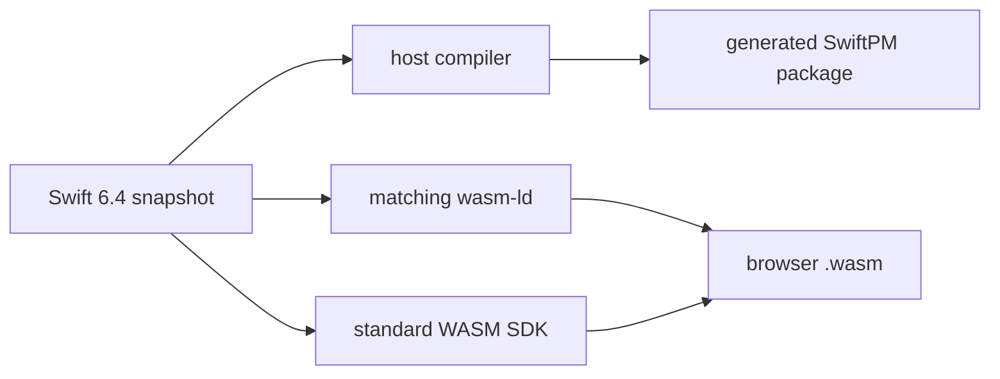

# Toolchain

SwiftWeb uses one pinned Swift snapshot for host builds and standard browser
WASM builds. The compiler, SDK, linker, and generated package layout are one
versioned contract.

## Version Contract

| Item | Required value |
|---|---|
| `Package.swift` tools version | `6.4` |
| `.swift-version` selector | `6.4.x-snapshot-2026-08-14` |
| Toolchain tag | `swift-6.4.x-DEVELOPMENT-SNAPSHOT-2026-08-14-a` |
| Xcode toolchain identifier | `org.swift.64202608141a` |
| Swift compiler commit | `424cae54c1a10da` |
| Standard WASM SDK | `swift-6.4.x-DEVELOPMENT-SNAPSHOT-2026-08-14-a_wasm` |
| Embedded WASM SDK | `swift-6.4.x-DEVELOPMENT-SNAPSHOT-2026-08-14-a_wasm-embedded` |

Embedded WASM is installed for capability validation. SwiftWeb's public browser
runtime uses the standard WASM SDK only.

## Generated Embedded verification

SwiftHTML 0.16.1 fixes the former Debug `StateStore.install` Optional SIL
verifier failure without changing `Optional<String>` state or invalidation
semantics. Its Native, Standard-WASM, and Embedded-WASM owner probes retain the
common Mutex contract on this pinned snapshot.

SwiftWeb 0.13.0 separately retains Debug Standard/Embedded Chromium execution
of the controlled Actor HTTP transport ABI and a production-generated Embedded
page-worker running through local workerd to a Native Actor. These prove their
specific ownership, failure, cancellation, deadline, and shutdown boundaries;
they are not a full Embedded browser gate, release-profile gate, or deployment.
See the [package verification matrix](../DESIGN.md#verification-and-change-impact)
and [ClientRuntime evidence](../Sources/SwiftWebBrowser/ClientRuntime/DESIGN.md#verification-and-change-impact).



## Automatic discovery

Select the pinned compiler for `swift` and install the matching SDK. For a
standard macOS installation, no SwiftWeb environment variables are required.

```text
sweb -> pinned compiler in ~/Library/Developer/Toolchains
     -> matching WASM SDK (default identifier above)
```

Host compiler discovery checks the pinned user-toolchain directory, then
`xcrun`, then `PATH`, validating the compiler against the pinned snapshot.
WASM discovery checks the pinned user-toolchain directory, then the matching
SDK's bundled toolchain; both `swift` and `wasm-ld` must be available.

`.swift-version` selects the compiler through Swiftly; it does not install the
WASM SDK. To inspect your installation, use `swift --version` and `swift sdk list`.

## Optional overrides

For a nonstandard installation, override only the paths that automatic discovery
cannot find. These settings are not part of the normal startup procedure.

| Variable | Override |
|---|---|
| `SWIFT_WEB_HOST_SWIFT` | Host Swift executable |
| `SWIFT_WEB_HOST_TOOLCHAIN_BIN` | Host toolchain directory, when no executable override is set |
| `SWIFT_WEB_WASM_SWIFT` | WASM Swift executable, with `wasm-ld` in the same directory |
| `SWIFT_WEB_WASM_TOOLCHAIN_BIN` | WASM toolchain directory, when no executable override is set |
| `SWIFT_WEB_WASM_SDK` | Supported SDK identifier; defaults to the pinned standard SDK |

Use real toolchain paths for overrides. A Swiftly shim directory does not contain
`wasm-ld`. Explicit invalid overrides fail rather than falling back silently.

## Validation

Validate every supported manifest mode:

```bash
swift package dump-package
SWIFTWEB_CORE_ONLY=1 swift package dump-package
SWIFTWEB_HOSTED_APPLICATION=1 swift package dump-package
```

Build the CLI:

```bash
swift build --product sweb --jobs 2
```

Validate the Embedded capability surface without the browser-only or external
actor runtime graph:

```bash
SWIFTWEB_CORE_ONLY=1 swift build \
  --swift-sdk swift-6.4.x-DEVELOPMENT-SNAPSHOT-2026-08-14-a_wasm-embedded \
  --product SwiftWebCore \
  --disable-default-traits \
  --jobs 2
```

The public browser runtime remains Standard WASM. The Embedded command checks
the shared core capability contract; disabling default traits intentionally
keeps the Foundation-dependent external actor runtime outside that graph.

Build and process a real browser runtime:

```bash
swift run sweb build \
  --package-path Examples/CounterApp \
  --environment local
```

SwiftPM 6.4 writes release WASM products under:

```text
.swiftweb/generated/.build/wasm/
└─ out/Products/Release-webassembly-wasm32/
   ├─ <product>.wasm
   ├─ <product>.wasm.size.json
   ├─ <product>.wasm.compression.json
   ├─ <product>.wasm.gz
   └─ <product>.wasm.br
```

## Updating the Snapshot

Update these values together:

1. `Package.swift` tools version and platform requirements.
2. `.swift-version`.
3. Toolchain and SDK defaults in package-generation and development sources.
4. CLI templates and generated manifest fixtures.
5. `AGENTS.md`, this document, and executable verification commands.
6. Native tests, standard WASM build/link, and browser E2E evidence.

Do not change only the host compiler or only the WASM SDK. A mixed snapshot is
an unsupported build configuration.
