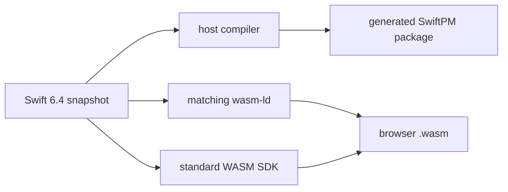

# Toolchain

SwiftWeb uses one pinned Swift snapshot for host builds and standard browser
WASM builds. The compiler, SDK, linker, and generated package layout are one
versioned contract.

## Version Contract

| Item | Required value |
|---|---|
| `Package.swift` tools version | `6.4` |
| `.swift-version` selector | `6.4.x-snapshot-2026-08-14` |
| Toolchain tag | `swift-6.4.x-DEVELOPMENT-SNAPSHOT-2026-08-14-a` |
| Xcode toolchain identifier | `org.swift.64202608141a` |
| Swift compiler commit | `424cae54c1a10da` |
| Standard WASM SDK | `swift-6.4.x-DEVELOPMENT-SNAPSHOT-2026-08-14-a_wasm` |
| Embedded WASM SDK | `swift-6.4.x-DEVELOPMENT-SNAPSHOT-2026-08-14-a_wasm-embedded` |

Embedded WASM is installed for capability validation. SwiftWeb's public browser
runtime uses the standard WASM SDK only.

## Generated Embedded verification

The generated CounterApp Embedded package is a profile-specific compile/link
gate, separate from the standard browser E2E and the standalone Actor runtime
execution. With this pinned snapshot and the `_wasm-embedded` SDK, the 0.12.0
candidate compiles and links its generated `ActorSystemCore` plus
`ActorSystemEmbedded` runtime in `-c release` while preserving the
application's `Optional<String>` failure state.

The same source in `-c debug` reaches a Swift 6.4 SIL verifier diagnostic in
SwiftHTML's `StateStore.install` Optional specialization (`Ill formed
store_borrow scope`). This is recorded as snapshot/compiler triage evidence;
application failure-state semantics must not be changed to hide it. Release
compile/link does not claim Embedded browser execution.



## Environment

Use the actual snapshot toolchain directory for WASM builds. Do not set
`SWIFT_WEB_WASM_SWIFT` to `~/.swiftly/bin/swift`; the shim directory does not
contain `wasm-ld`.

```bash
export SWIFT_WEB_TOOLCHAIN_BIN="$HOME/Library/Developer/Toolchains/swift-6.4.x-DEVELOPMENT-SNAPSHOT-2026-08-14-a.xctoolchain/usr/bin"
export SWIFT_WEB_HOST_SWIFT="$SWIFT_WEB_TOOLCHAIN_BIN/swift"
export SWIFT_WEB_WASM_SWIFT="$SWIFT_WEB_TOOLCHAIN_BIN/swift"
export SWIFT_WEB_WASM_TOOLCHAIN_BIN="$SWIFT_WEB_TOOLCHAIN_BIN"
export SWIFT_WEB_WASM_SDK="swift-6.4.x-DEVELOPMENT-SNAPSHOT-2026-08-14-a_wasm"
```

Verify the complete contract before building:

```bash
"$SWIFT_WEB_HOST_SWIFT" --version
test -x "$SWIFT_WEB_WASM_TOOLCHAIN_BIN/wasm-ld"
"$SWIFT_WEB_WASM_SWIFT" sdk list | \
  rg 'swift-6.4.x-DEVELOPMENT-SNAPSHOT-2026-08-14-a_wasm(-embedded)?'
```

## Validation

Validate every supported manifest mode:

```bash
"$SWIFT_WEB_HOST_SWIFT" package dump-package
SWIFTWEB_CORE_ONLY=1 "$SWIFT_WEB_HOST_SWIFT" package dump-package
SWIFTWEB_HOSTED_APPLICATION=1 "$SWIFT_WEB_HOST_SWIFT" package dump-package
```

Build the CLI:

```bash
"$SWIFT_WEB_HOST_SWIFT" build --product sweb --jobs 2
```

Validate the Embedded capability surface without the browser-only or external
actor runtime graph:

```bash
SWIFTWEB_CORE_ONLY=1 "$SWIFT_WEB_HOST_SWIFT" build \
  --swift-sdk swift-6.4.x-DEVELOPMENT-SNAPSHOT-2026-08-14-a_wasm-embedded \
  --product SwiftWebCore \
  --disable-default-traits \
  --jobs 2
```

The public browser runtime remains Standard WASM. The Embedded command checks
the shared core capability contract; disabling default traits intentionally
keeps the Foundation-dependent external actor runtime outside that graph.

Build and process a real browser runtime:

```bash
"$SWIFT_WEB_HOST_SWIFT" run sweb build \
  --package-path Examples/CounterApp \
  --environment local
```

SwiftPM 6.4 writes release WASM products under:

```text
.swiftweb/generated/.build/wasm/
└─ out/Products/Release-webassembly-wasm32/
   ├─ <product>.wasm
   ├─ <product>.wasm.size.json
   ├─ <product>.wasm.compression.json
   ├─ <product>.wasm.gz
   └─ <product>.wasm.br
```

## Updating the Snapshot

Update these values together:

1. `Package.swift` tools version and platform requirements.
2. `.swift-version`.
3. Toolchain and SDK defaults in package-generation and development sources.
4. CLI templates and generated manifest fixtures.
5. `AGENTS.md`, this document, and executable verification commands.
6. Native tests, standard WASM build/link, and browser E2E evidence.

Do not change only the host compiler or only the WASM SDK. A mixed snapshot is
an unsupported build configuration.
