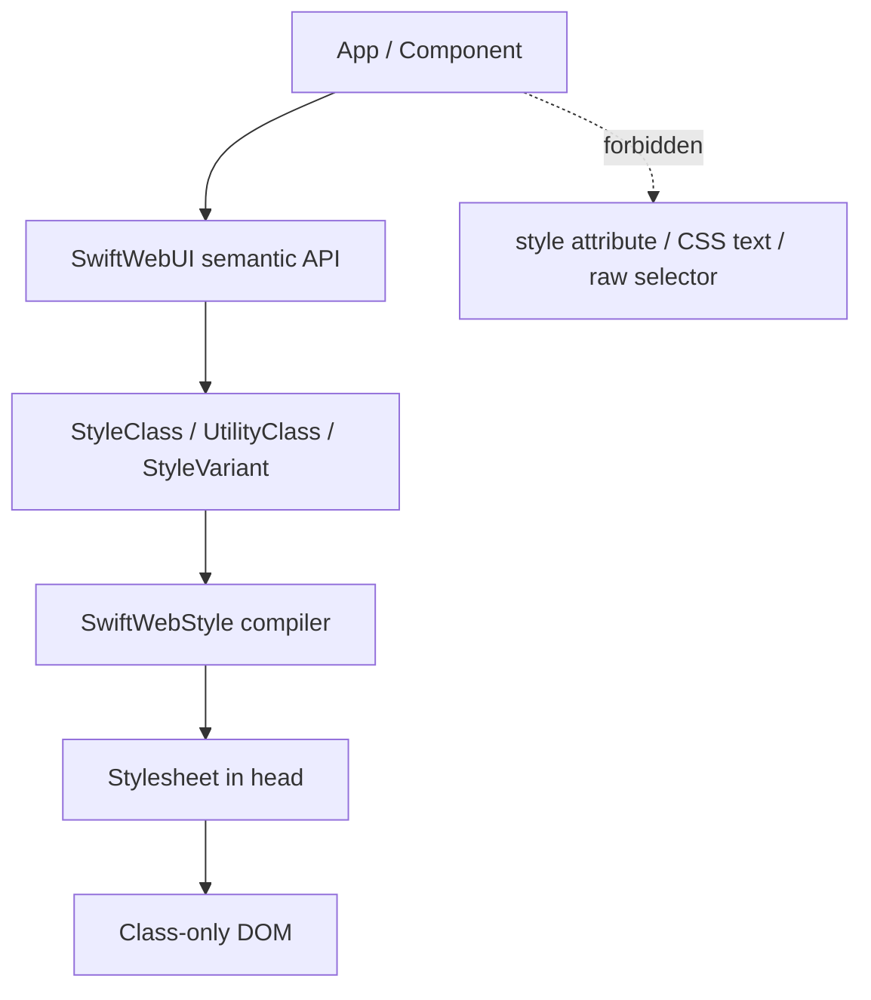

# SwiftWeb Utility Styling — Work Plan And Goal State

## Decision

SwiftWeb uses `SwiftWebStyle` as the styling framework.

Tailwind is a product reference for utility and variant semantics, not a
dependency. SwiftWeb must provide the same class-first workflow through Swift
types, deterministic generation, and render-scoped stylesheet emission.

Direct CSS is not an authoring surface. Components, apps, Storyboard examples,
and SwiftWebUI modifiers must not write CSS text or inline style attributes.
Only the `SwiftWebStyle` emitter may turn typed style structures into CSS text.



## Goal State

| Area | Goal |
|---|---|
| DOM output | Server output, action fragments, stream output, Storyboard rendered HTML, and client-reconciled DOM contain no `style` attributes. |
| CSS ownership | `SwiftWebStyle` is the only layer that emits stylesheet text. Other layers only provide semantic classes, utility tokens, typed declarations, or style-system values. |
| Utility API | Tailwind-like utility tokens are parsed into typed utility and variant structures before CSS is emitted. |
| Variant behavior | `hover:`, `focus:`, `active:`, `disabled:`, responsive variants, dark mode, group, peer, data, aria, and container variants lower to selectors or at-rules with the expected conditional behavior. |
| Static utilities | Finite framework classes such as stack gaps, alignment, padding, color roles, typography roles, materials, and control states are emitted once in the base stylesheet. |
| Atomic utilities | Unbounded values lower to deterministic, deduplicated atomic classes registered during render. |
| Safety | CSS values and selectors are validated from typed data. CSS text is never parsed back into structure. Unsafe declarations fail loudly. |
| Documentation | Public docs describe SwiftWebStyle APIs and class-only output. They do not recommend raw CSS, inline style, or selector strings. |

## Framework Boundaries

| Layer | Required framework | Owns | Must not do |
|---|---|---|---|
| User app | `SwiftWebUI` | Components, modifiers, environment, semantic styling choices. | Write CSS text, inline styles, or raw selectors. |
| SwiftWebUI components | `SwiftWebUI` + `SwiftWebStyle` | Semantic class hooks, state classes, style-system scopes, utility tokens. | Store component-local visual recipes as CSS text. |
| Utility compiler | `SwiftWebStyle` | Utility grammar, variant grammar, selector composition, at-rule composition, validation. | Depend on app code or SwiftWebUI component internals. |
| Style registry | `SwiftWebStyle` | Atomic class names, declaration validation, render-scoped rule collection, client rule flush. | Parse `cssText` or accept raw style strings. |
| Design system | `StyleSystem` + `ColorScheme` | Tokens, component visual language, color roles, material/motion/control values. | Emit CSS directly outside the SwiftWebStyle emitter. |
| HTML graph | `SwiftHTML` | HTML nodes, attributes, typed `Style` payloads, escaping, rendering hooks. | Own atomic styling policy or SwiftWebUI visual semantics. |
| Runtime | `SwiftWeb` + `SwiftWebUIRuntime` | Registry binding, head injection, client stylesheet flush. | Introduce inline style fallback paths. |
| Storyboard | `SwiftWebStoryboard` | Visual verification of public APIs and rendered output. | Add private styling paths or raw CSS examples. |

## Direct CSS Definition

Direct CSS means author-controlled CSS text or selector text that bypasses the
SwiftWebStyle compiler.

| Pattern | Status | Replacement |
|---|---|---|
| `style="..."` | Forbidden | `StyleRegistry` atomic class. |
| `HTMLAttribute("style", ...)` | Forbidden in SwiftWeb render scopes | Typed modifier or utility class. |
| `Style.custom(...)` outside a compiler-owned path | Forbidden | Typed SwiftHTML property helper or utility token. |
| `rule("...")` in SwiftWebUI, Storyboard, app code, or docs | Forbidden | Typed selector builder or `rule(StyleClass)`. |
| `CSSSelector("...")` outside SwiftWebStyle internals | Forbidden | Typed selector and variant structures. |
| `cssText` parsing | Forbidden | `Style.declarations` typed access. |
| CSS snippets in public examples | Forbidden | SwiftWebUI or SwiftWebStyle API examples. |

Low-level SwiftHTML may still store typed `Style` payloads so SwiftWeb can
atomize them during render. That is structural transport, not a public styling
API.

## Required Work

| Priority | Work | Completion condition |
|---|---|---|
| P0 | Add a typed selector builder in `SwiftWebStyle`. | Root and component rules can be written without raw selector strings. |
| P0 | Add `StyleVariant` and variant composition. | `hover:bg-accent` emits a class selector with `:hover`, not an always-on class rule. |
| P0 | Add state variants. | `hover:`, `focus:`, `focus-visible:`, `active:`, `disabled:`, `checked:`, `invalid:`, and `open:` are tested. |
| P0 | Add responsive and dark variants. | `md:*`, `max-md:*`, range variants, and `dark:*` lower through typed at-rules or root scopes. |
| P0 | Move `RootStylesheet` and component rules to typed selectors. | No `rule("...")` remains outside SwiftWebStyle-owned internals and tests for the selector builder. |
| P0 | Enforce zero inline style. | Server, action, stream, Storyboard, and client update tests assert no `style=` in rendered markup. |
| P0 | Add forbidden-pattern tests. | CI rejects new raw style, raw selector, and `cssText` parsing paths outside allowlisted compiler internals. |
| P1 | Add relationship variants. | `group-*`, named `group-*/name`, `peer-*`, and named `peer-*/name` lower to parent and sibling selector templates. |
| P1 | Add attribute variants. | Boolean `data-*`, valued `data-[name=value]`, true-valued `aria-*`, and valued `aria-[name=value]` variants are validated and emitted. |
| P1 | Add structural variants. | `has-*`, `not-*`, child, descendant, pseudo-element, and validated arbitrary selector variants have typed emitters. |
| P1 | Add container query variants. | Container names, `@container`, min, max, default breakpoints, and bracket width variants work without raw CSS. |
| P1 | Add arbitrary values. | Bracket values are accepted only through a validated value grammar. |
| P1 | Add utility registry. | Framework and user utilities can register static and functional utilities without writing CSS text. |
| P2 | Generate token utilities from `StyleSystem`. | Token namespaces produce predictable utility classes and default rules. |
| P2 | Add layer ordering. | Base, component, utility, and atomic output order is explicit and tested. |
| P2 | Update Storyboard coverage. | Every public component entry dogfoods class-only styling and variant examples. |
| P2 | Update public documentation. | Docs describe the SwiftWebStyle workflow and contain no raw CSS recommendations. |

## Tailwind Gap Table

| Tailwind capability | SwiftWeb goal | Current status | Required layer |
|---|---|---|---|
| Plain utilities | Typed utility classes such as spacing, color, display, sizing, typography. | Implemented through `StyleClass`, `StyleUtilityRegistry`, static `RootStylesheet` utility rules, and SwiftWebUI token utilities. | `SwiftWebStyle` + `SwiftWebUI` |
| Pseudo-class variants | Conditional selectors for interaction and form state. | Implemented for hover, focus, focus-visible, focus-within, active, visited, disabled, checked, invalid, open, first, last, empty, placeholder, selection, before, and after. | `StyleVariant` |
| Stacked variants | Ordered composition such as dark + responsive + hover. | Implemented; variants compose selectors and wrap media/container at-rules in token order. | Variant compiler |
| Responsive variants | Breakpoint and range media queries. | Implemented for default min/max breakpoints and arbitrary bracket widths. | Variant compiler |
| Dark mode | Color-scheme-scoped utility variants. | Implemented through `.swui-root[data-color-scheme="dark"]` scoping. | Variant compiler + `ColorScheme` |
| Group and peer | Parent and sibling state selectors. | Implemented for basic and named scopes. | Relationship variants |
| Attribute variants | Data, ARIA, and arbitrary attribute matching. | Implemented for boolean data, valued data, true-valued ARIA, and valued ARIA. | Attribute variants |
| Structural variants | `has`, `not`, child, descendant, pseudo-element selectors. | Implemented for typed pseudo states and validated arbitrary selector fragments. | Selector builder |
| Container queries | Container utility and query variants. | Implemented for default breakpoints, max breakpoints, named containers, and bracket width variants. | At-rule builder |
| Arbitrary values | Validated bracket values. | Implemented for common layout, color, display, grid, spacing, and opacity utilities. | Utility parser + validator |
| Functional utilities | Parameterized utilities and modifiers. | Implemented for built-in arbitrary-value utilities and typed third-party static/functional definitions. | Utility registry |
| StyleSystem-generated utilities | Token namespaces generate utility classes. | Implemented as SwiftWebUI `StyleSystemUtility` defaults and `.swiftWebUI` utility registry definitions. | StyleSystem integration |

## Current Inventory

This snapshot identifies the first work items to remove. It is not an
allowlist for the final state.

| Evidence | Location | Meaning | Required work |
|---|---|---|---|
| `StyleClass.selector` is now a token selector, while `rule(StyleClass)` uses variant-aware stylesheet emission. | `Sources/SwiftWebStyle/StyleClass.swift` | State, dark, breakpoint, group, peer, data, aria, structural, container, arbitrary selector, and arbitrary value paths have compiler coverage. | Keep coverage in `StyleRegistryTests`. |
| Utility tests now expect conditional selectors and at-rules. | `Tests/SwiftWebUITests/StyleRegistryTests.swift` | The previous always-on `hover:*` behavior is no longer accepted; custom registry and SwiftWebUI token registry paths are covered. | Add utilities as new typed definitions, not CSS text. |
| `RootStylesheet` now routes component selectors and at-rule conditions through typed APIs. | `Sources/SwiftWebUI/Styling/RootStylesheet.swift` | `rule("...")`, multiline raw selectors, `media("...")`, `supports("...")`, and `container("...")` are rejected by static policy tests in SwiftWebUI and Storyboard. | Keep the static policy test enforcing this. |
| `RootStylesheet` has explicit stylesheet layers. | `Sources/SwiftWebUI/Styling/RootStylesheet.swift` | Base tokens, component rules, utility rules, material rules, and at-rules are emitted in a fixed order; head assets emit `swui-base` before `swui-atomic`. | Preserve order with tests. |
| The button tint rendering test now checks atomic class output instead of inline style. | `Tests/SwiftWebUITests/SwiftWebUIRenderingTests.swift` | Representative rendering paths assert no `style="` in emitted markup. | Expand only when a new render path is added. |
| Rejection tests use `Style.custom(...)`. | `Tests/SwiftWebUITests/StyleRegistryTests.swift` | This is valid only as a rejection/validation fixture. | Keep only in explicit compiler safety tests. |

## Acceptance Gates

| Gate | Required check |
|---|---|
| Hover semantics | A `hover:*` utility emits a `:hover` selector and does not apply when the element is not hovered. |
| Class-only DOM | Representative pages contain no `style=`, and Storyboard's DOM Contract panel shows only stable semantic/utility class hooks. |
| Head-owned CSS | Base, component, utility, and atomic rules are emitted before styled content. |
| Server/client parity | SSR and WASM reconcile compute the same class names for the same declarations. |
| Injection safety | Semicolon, brace, comment, control-character, and selector-injection attempts are rejected. |
| Raw CSS ban | Static checks fail on raw style attributes, raw selectors, and `cssText` parsing outside allowlisted SwiftWebStyle internals. |
| Docs consistency | Public docs and examples use SwiftWebUI or SwiftWebStyle APIs, not CSS snippets. |
| Storyboard visibility | Storyboard shows the class-only DOM contract and includes utility variant examples. |

## Suggested Static Checks

These checks are implementation guidance for tests or CI scripts. Each check
needs an allowlist for compiler internals and test fixtures that intentionally
exercise rejection paths.

```bash
rg 'style="' Sources Tests docs
rg 'HTMLAttribute\("style"' Sources Tests
rg 'rule\(\s*#*"' Sources Tests docs
rg 'CSSSelector\("' Sources Tests
rg 'Style\.custom' Sources/SwiftWebUI Sources/SwiftWebStoryboard
rg 'cssText.*split|split\(separator: *";"' Sources Tests
```

## Definition Of Done

The work is done when SwiftWebUI developers can build styled, interactive UI
with semantic modifiers and Tailwind-like utility classes, while rendered HTML
remains class-only and all CSS text is generated by `SwiftWebStyle`.

The final implementation must make the invalid path difficult to write:
components should naturally select classes and typed utilities, while direct
CSS requires entering SwiftWebStyle compiler internals or an explicit rejection
test.
