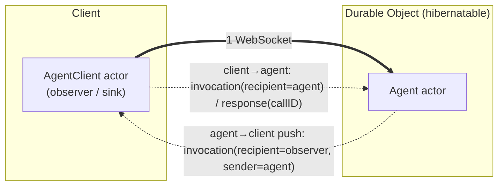

# WebSocket Actor Transport Design

This document specifies a **bidirectional, multiplexed WebSocket transport** for SwiftWeb's
distributed actor system. It enables **agents hosted in Cloudflare Durable Objects** to push
streaming output to clients over a single persistent connection, while keeping the calls
type-safe through Swift's distributed actor model.

## Status

| Field | Value |
|---|---|
| Status | Proposed design |
| Decision date | 2026-07-06 |
| Primary goal | Server → client **push / streaming** for agents, over one persistent WebSocket. |
| Motivating use case | `Agent` actors running inside Durable Objects, streaming tokens / tool-calls / status to browser clients. |
| Current transport | `JavaScriptKitWebActorTransport` — HTTP `fetch`, **unary, client-initiated only**. |
| Wire model | Reuses `swift-actor-runtime`'s `Envelope` (`invocation` / `response`, with `callID` + `senderID`). |

## Motivation

The only `WebActorTransport` today is `fetch`-based and unary:

```swift
public protocol WebActorTransport: Sendable {
    func call(_ envelope: InvocationEnvelope) async throws -> ResponseEnvelope   // one request → one response
}
```

`JavaScriptKitWebActorTransport.call` does a single `fetch(POST /_swiftweb/actors/invoke)`.
It is **client-initiated request/response** — it cannot express:

- **server → client push** (an agent emitting tokens/events without a client request),
- **streaming** (an agent producing many outputs for one request),
- a **client-hosted actor** the server can call back.

Agents need all three, and they need a low-latency, persistent, bidirectional channel: a
**WebSocket**, held by the agent's Durable Object.

**The wire model is already bidirectional-capable.** `swift-actor-runtime` defines:

```swift
enum Envelope { case invocation(InvocationEnvelope); case response(ResponseEnvelope) }

struct InvocationEnvelope {
    let callID: String        // correlation id → multiplexing
    let recipientID: String   // target actor
    let senderID: String?     // caller → reply / bidirectional addressing
    let target: String        // method
    let arguments: [Data]
    let metadata: Metadata    // timestamp, version, headers
}
struct ResponseEnvelope { let callID: String; let result: InvocationResult; /* … */ }
```

`callID` gives multiplexing, `senderID` gives reply addressing, `metadata.headers` gives an
extension point. What is missing is a transport that streams these frames over a WebSocket in
**both directions**, plus **client-side inbound dispatch**.

## Core design

One WebSocket per `client ↔ agent(DO)` session. Each WS message carries exactly one
`Envelope`. Either peer may send an `invocation`; responses are matched by `callID`. The
channel is a **symmetric actor message bus**.



## Wire protocol

- **Framing**: each WebSocket message = one JSON-encoded `Envelope`. (Binary framing is a
  later optimization — see Open questions.)
- **Multiplexing**: many in-flight calls share one WS, keyed by `callID`.
- **Direction is symmetric**: `recipientID` names the target actor; `senderID` names the
  caller so the receiver can address replies/pushes.

| Direction | Frame | Notes |
|---|---|---|
| client → agent | `invocation(recipientID = agentID, senderID = observerID)` | a `distributed func` call on the agent |
| agent → client | `response(callID)` | reply to the above |
| **agent → client (push)** | `invocation(recipientID = observerID, senderID = agentID)` | agent calls the client-hosted observer actor |
| client → agent (push ack) | `response(callID)` *(optional)* | omitted for one-way pushes |

## Connection & observer registration

1. Client opens the WebSocket (auth carried on connect — see Open questions).
2. Client **registers its observer actor id** so the agent knows where to push. Either:
   - a `hello` frame (a first invocation to a well-known `session` actor carrying the
     observer id), or
   - `metadata.headers["reply-to"] = observerID` on the first invocation.
3. The agent resolves `AgentClient(id: observerID)` and pushes to it.

## Push / streaming model

`remoteCall` is request/response, so **streaming is modeled as repeated one-way push
invocations** to the observer, not as a single streaming return:

- `observer.token("…")`, `observer.toolCall(…)`, `observer.finished(…)` — each is its own
  `invocation` frame.
- **Ordering is preserved**: the Durable Object is single-threaded and the WebSocket is
  ordered, so pushes arrive in emission order.
- **Pushes should be one-way (`Void`, no awaited response).** This matters for hibernation
  (below): an awaited round-trip from the DO to the client holds an in-memory continuation
  that does not survive a DO eviction.

## Durable Object lifecycle

- The DO holds the server end of the WebSocket via the **hibernatable WebSocket API**
  (`state.acceptWebSocket(ws)` + a `webSocketMessage(ws, message)` handler), so many idle
  connections don't keep the DO resident.
- On `webSocketMessage`: decode the `Envelope` →
  - `invocation` → dispatch to the local `Agent` actor,
  - `response` → resume the pending call by `callID`.
- The agent pushes with `ws.send(Envelope.invocation(...))`.
- **Hibernation constraint**: the DO may be evicted while the WebSocket stays open; it wakes
  on the next message and re-instantiates the agent (state rehydrated from DO storage).
  In-memory pending continuations do **not** survive a wake — therefore:
  - agent → client pushes are **one-way**, and
  - anything that must outlive a wake is persisted to DO storage, not kept only in memory.

## Client-side inbound dispatch (new capability)

Today the client only *sends* (fetch). The WebSocket transport must additionally run an
**inbound read loop**:

- `invocation` → dispatch to the local actor system (client-hosted actors such as
  `AgentClient`),
- `response` → resume the awaiting `call` keyed by `callID`.

The server already dispatches inbound invocations (`SwiftWebActorBinding` /
`SwiftWebVaporWebActors`); the client needs the mirror of that machinery.

## Programming model

```swift
// Client hosts the observer; the agent pushes to it. Fully type-safe.
distributed actor AgentClient {
    distributed func token(_ text: String)
    distributed func toolCall(_ call: ToolCall)
    distributed func finished(_ result: RunResult)
}

// Agent runs inside the Durable Object.
distributed actor Agent {
    distributed func send(_ message: UserMessage) async throws -> Ack   // client → agent (unary)

    // agent → client push: repeated one-way calls on the observer
    func run(reportingTo client: AgentClient) async {
        for await token in model.stream(...) {
            try? await client.token(token)          // push frame
        }
        try? await client.finished(result)          // push frame
    }
}
```

The transport is selected where the actor system is configured:

```swift
let transport = WebSocketActorTransport(url: "/_swiftweb/actors/ws")   // instead of the fetch transport
let system = WebActorSystem(transport: transport)
```

`WebSocketActorTransport` conforms to `WebActorTransport` (so `call` keeps working) **and**
adds inbound dispatch + push. It is a superset of the fetch transport.

## What to build

1. **`WebSocketActorTransport`** — opens/holds one WS; implements `call` with `callID`
   correlation; runs the inbound read loop; exposes push sending.
2. **Client-side inbound invocation dispatch** — route server-initiated `invocation`s to
   local (client-hosted) actors.
3. **Observer registration / reply-to** — establish the client observer id on connect.
4. **Durable Object WS host** — hibernatable accept, `Envelope` framing on
   `webSocketMessage`, `ws.send` for push (JavaScriptKit binding to the DO WebSocket API).
5. **Agent runtime inside the DO** — dispatch inbound invocations to the agent; drive
   outbound pushes to the observer.
6. **Serialization** — JSON `Envelope` first; binary framing later.
7. **Lifecycle** — reconnect, connection limits, backpressure for high-rate token streams.

## Relationship to other designs

- Superset of the existing `fetch` `WebActorTransport`; both satisfy the same seam, so apps
  choose per need (unary-only → fetch; agents/push → WebSocket).
- This is the **primary** transport for the Durable-Object agent architecture; it provides
  the realtime path that the REST/`fetch` data path cannot.
- Consistent with `PlatformHostArchitecture.md` (host-neutral core, Cloudflare as an
  adapter).

## Non-goals

- Not replacing the `fetch` transport for simple unary calls.
- Not adding first-class `AsyncSequence` streaming *return values* to the actor system; the
  push-invocation model covers streaming for now (a streaming-return API could come later).
- Not the data / gRPC path (Firestore access is a separate concern).

## Open questions

- **Binary framing / compression** for high-throughput token streams (vs JSON).
- **Backpressure & buffering**: bounding a fast producing agent against a slow client.
- **Reconnect & resume**: `callID` continuity and missed-push replay across a dropped WS.
- **Auth on the WebSocket**: verify the Firebase ID token at connect (first frame / query),
  then bind the session to the observer.
- **Fan-out**: multiple observers per agent, and multiple client connections per DO.
- **Hibernation vs awaited round-trips**: formalize the "pushes are one-way" rule and decide
  whether any DO → client call is ever allowed to await.
